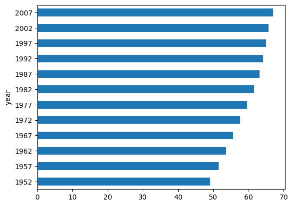
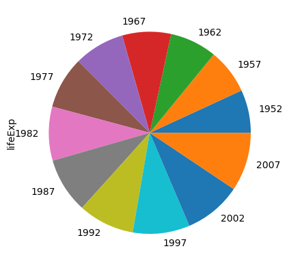

```python
import pandas as pd
```


```python
df = pd.read_csv('data/gapminder.tsv', sep='\t')
```


```python
type(df)
```


    pandas.core.frame.DataFrame


```python
print(df.head())
```

           country continent  year  lifeExp       pop   gdpPercap
    0  Afghanistan      Asia  1952   28.801   8425333  779.445314
    1  Afghanistan      Asia  1957   30.332   9240934  820.853030
    2  Afghanistan      Asia  1962   31.997  10267083  853.100710
    3  Afghanistan      Asia  1967   34.020  11537966  836.197138
    4  Afghanistan      Asia  1972   36.088  13079460  739.981106
    


```python
df.head()
```


<div>
<style scoped>
    .dataframe tbody tr th:only-of-type {
        vertical-align: middle;
    }

    .dataframe tbody tr th {
        vertical-align: top;
    }

    .dataframe thead th {
        text-align: right;
    }
</style>
<table border="1" class="dataframe">
  <thead>
    <tr style="text-align: right;">
      <th></th>
      <th>country</th>
      <th>continent</th>
      <th>year</th>
      <th>lifeExp</th>
      <th>pop</th>
      <th>gdpPercap</th>
    </tr>
  </thead>
  <tbody>
    <tr>
      <th>0</th>
      <td>Afghanistan</td>
      <td>Asia</td>
      <td>1952</td>
      <td>28.801</td>
      <td>8425333</td>
      <td>779.445314</td>
    </tr>
    <tr>
      <th>1</th>
      <td>Afghanistan</td>
      <td>Asia</td>
      <td>1957</td>
      <td>30.332</td>
      <td>9240934</td>
      <td>820.853030</td>
    </tr>
    <tr>
      <th>2</th>
      <td>Afghanistan</td>
      <td>Asia</td>
      <td>1962</td>
      <td>31.997</td>
      <td>10267083</td>
      <td>853.100710</td>
    </tr>
    <tr>
      <th>3</th>
      <td>Afghanistan</td>
      <td>Asia</td>
      <td>1967</td>
      <td>34.020</td>
      <td>11537966</td>
      <td>836.197138</td>
    </tr>
    <tr>
      <th>4</th>
      <td>Afghanistan</td>
      <td>Asia</td>
      <td>1972</td>
      <td>36.088</td>
      <td>13079460</td>
      <td>739.981106</td>
    </tr>
  </tbody>
</table>
</div>


```python
df.tail()
```


<div>
<style scoped>
    .dataframe tbody tr th:only-of-type {
        vertical-align: middle;
    }

    .dataframe tbody tr th {
        vertical-align: top;
    }

    .dataframe thead th {
        text-align: right;
    }
</style>
<table border="1" class="dataframe">
  <thead>
    <tr style="text-align: right;">
      <th></th>
      <th>country</th>
      <th>continent</th>
      <th>year</th>
      <th>lifeExp</th>
      <th>pop</th>
      <th>gdpPercap</th>
    </tr>
  </thead>
  <tbody>
    <tr>
      <th>1699</th>
      <td>Zimbabwe</td>
      <td>Africa</td>
      <td>1987</td>
      <td>62.351</td>
      <td>9216418</td>
      <td>706.157306</td>
    </tr>
    <tr>
      <th>1700</th>
      <td>Zimbabwe</td>
      <td>Africa</td>
      <td>1992</td>
      <td>60.377</td>
      <td>10704340</td>
      <td>693.420786</td>
    </tr>
    <tr>
      <th>1701</th>
      <td>Zimbabwe</td>
      <td>Africa</td>
      <td>1997</td>
      <td>46.809</td>
      <td>11404948</td>
      <td>792.449960</td>
    </tr>
    <tr>
      <th>1702</th>
      <td>Zimbabwe</td>
      <td>Africa</td>
      <td>2002</td>
      <td>39.989</td>
      <td>11926563</td>
      <td>672.038623</td>
    </tr>
    <tr>
      <th>1703</th>
      <td>Zimbabwe</td>
      <td>Africa</td>
      <td>2007</td>
      <td>43.487</td>
      <td>12311143</td>
      <td>469.709298</td>
    </tr>
  </tbody>
</table>
</div>


```python
df.sample(5)
```


<div>
<style scoped>
    .dataframe tbody tr th:only-of-type {
        vertical-align: middle;
    }

    .dataframe tbody tr th {
        vertical-align: top;
    }

    .dataframe thead th {
        text-align: right;
    }
</style>
<table border="1" class="dataframe">
  <thead>
    <tr style="text-align: right;">
      <th></th>
      <th>country</th>
      <th>continent</th>
      <th>year</th>
      <th>lifeExp</th>
      <th>pop</th>
      <th>gdpPercap</th>
    </tr>
  </thead>
  <tbody>
    <tr>
      <th>784</th>
      <td>Jamaica</td>
      <td>Americas</td>
      <td>1972</td>
      <td>69.000</td>
      <td>1997616</td>
      <td>7433.889293</td>
    </tr>
    <tr>
      <th>971</th>
      <td>Mauritania</td>
      <td>Africa</td>
      <td>2007</td>
      <td>64.164</td>
      <td>3270065</td>
      <td>1803.151496</td>
    </tr>
    <tr>
      <th>652</th>
      <td>Honduras</td>
      <td>Americas</td>
      <td>1972</td>
      <td>53.884</td>
      <td>2965146</td>
      <td>2529.842345</td>
    </tr>
    <tr>
      <th>173</th>
      <td>Brazil</td>
      <td>Americas</td>
      <td>1977</td>
      <td>61.489</td>
      <td>114313951</td>
      <td>6660.118654</td>
    </tr>
    <tr>
      <th>100</th>
      <td>Bangladesh</td>
      <td>Asia</td>
      <td>1972</td>
      <td>45.252</td>
      <td>70759295</td>
      <td>630.233627</td>
    </tr>
  </tbody>
</table>
</div>


```python
df.shape
```


    (1704, 6)


```python
df.size
```


    10224


```python
df.ndim
```


    2


```python
df.columns
```


    Index(['country', 'continent', 'year', 'lifeExp', 'pop', 'gdpPercap'], dtype='object')


```python
df.index
```


    RangeIndex(start=0, stop=1704, step=1)


```python
df.values
```


    array([['Afghanistan', 'Asia', 1952, 28.801, 8425333, 779.4453145],
           ['Afghanistan', 'Asia', 1957, 30.332, 9240934, 820.8530296],
           ['Afghanistan', 'Asia', 1962, 31.997, 10267083, 853.10071],
           ...,
           ['Zimbabwe', 'Africa', 1997, 46.809, 11404948, 792.4499603],
           ['Zimbabwe', 'Africa', 2002, 39.989, 11926563, 672.0386227],
           ['Zimbabwe', 'Africa', 2007, 43.487, 12311143, 469.7092981]],
          dtype=object)


```python
df.dtypes
```


    country       object
    continent     object
    year           int64
    lifeExp      float64
    pop            int64
    gdpPercap    float64
    dtype: object


# pandas 구조
---
판다스의 기본 구조  
판다스 데이터 프레임
> 인용문
* 목록
* 리스트

- 링크  
[판다스](https://pandas.pydata.org/)  

```python
print(df)

```


```python
df.info()
```

    <class 'pandas.core.frame.DataFrame'>
    RangeIndex: 1704 entries, 0 to 1703
    Data columns (total 6 columns):
     #   Column     Non-Null Count  Dtype  
    ---  ------     --------------  -----  
     0   country    1704 non-null   object 
     1   continent  1704 non-null   object 
     2   year       1704 non-null   int64  
     3   lifeExp    1704 non-null   float64
     4   pop        1704 non-null   int64  
     5   gdpPercap  1704 non-null   float64
    dtypes: float64(2), int64(2), object(2)
    memory usage: 80.0+ KB
    


```python
df['country']
```


    0       Afghanistan
    1       Afghanistan
    2       Afghanistan
    3       Afghanistan
    4       Afghanistan
               ...     
    1699       Zimbabwe
    1700       Zimbabwe
    1701       Zimbabwe
    1702       Zimbabwe
    1703       Zimbabwe
    Name: country, Length: 1704, dtype: object


```python
type(df['country'])
```


    pandas.core.series.Series


```python
df['country'].head()
```


    0    Afghanistan
    1    Afghanistan
    2    Afghanistan
    3    Afghanistan
    4    Afghanistan
    Name: country, dtype: object


```python
df[['country', 'continent']]
```


<div>
<style scoped>
    .dataframe tbody tr th:only-of-type {
        vertical-align: middle;
    }

    .dataframe tbody tr th {
        vertical-align: top;
    }

    .dataframe thead th {
        text-align: right;
    }
</style>
<table border="1" class="dataframe">
  <thead>
    <tr style="text-align: right;">
      <th></th>
      <th>country</th>
      <th>continent</th>
    </tr>
  </thead>
  <tbody>
    <tr>
      <th>0</th>
      <td>Afghanistan</td>
      <td>Asia</td>
    </tr>
    <tr>
      <th>1</th>
      <td>Afghanistan</td>
      <td>Asia</td>
    </tr>
    <tr>
      <th>2</th>
      <td>Afghanistan</td>
      <td>Asia</td>
    </tr>
    <tr>
      <th>3</th>
      <td>Afghanistan</td>
      <td>Asia</td>
    </tr>
    <tr>
      <th>4</th>
      <td>Afghanistan</td>
      <td>Asia</td>
    </tr>
    <tr>
      <th>...</th>
      <td>...</td>
      <td>...</td>
    </tr>
    <tr>
      <th>1699</th>
      <td>Zimbabwe</td>
      <td>Africa</td>
    </tr>
    <tr>
      <th>1700</th>
      <td>Zimbabwe</td>
      <td>Africa</td>
    </tr>
    <tr>
      <th>1701</th>
      <td>Zimbabwe</td>
      <td>Africa</td>
    </tr>
    <tr>
      <th>1702</th>
      <td>Zimbabwe</td>
      <td>Africa</td>
    </tr>
    <tr>
      <th>1703</th>
      <td>Zimbabwe</td>
      <td>Africa</td>
    </tr>
  </tbody>
</table>
<p>1704 rows × 2 columns</p>
</div>


```python
type(df[['country', 'continent']])
```


    pandas.core.frame.DataFrame


```python
df.loc[2]
```


    country      Afghanistan
    continent           Asia
    year                1962
    lifeExp           31.997
    pop             10267083
    gdpPercap      853.10071
    Name: 2, dtype: object


```python
df.loc[2:5]
```


<div>
<style scoped>
    .dataframe tbody tr th:only-of-type {
        vertical-align: middle;
    }

    .dataframe tbody tr th {
        vertical-align: top;
    }

    .dataframe thead th {
        text-align: right;
    }
</style>
<table border="1" class="dataframe">
  <thead>
    <tr style="text-align: right;">
      <th></th>
      <th>country</th>
      <th>continent</th>
      <th>year</th>
      <th>lifeExp</th>
      <th>pop</th>
      <th>gdpPercap</th>
    </tr>
  </thead>
  <tbody>
    <tr>
      <th>2</th>
      <td>Afghanistan</td>
      <td>Asia</td>
      <td>1962</td>
      <td>31.997</td>
      <td>10267083</td>
      <td>853.100710</td>
    </tr>
    <tr>
      <th>3</th>
      <td>Afghanistan</td>
      <td>Asia</td>
      <td>1967</td>
      <td>34.020</td>
      <td>11537966</td>
      <td>836.197138</td>
    </tr>
    <tr>
      <th>4</th>
      <td>Afghanistan</td>
      <td>Asia</td>
      <td>1972</td>
      <td>36.088</td>
      <td>13079460</td>
      <td>739.981106</td>
    </tr>
    <tr>
      <th>5</th>
      <td>Afghanistan</td>
      <td>Asia</td>
      <td>1977</td>
      <td>38.438</td>
      <td>14880372</td>
      <td>786.113360</td>
    </tr>
  </tbody>
</table>
</div>


```python
df.loc[[1,5,10]]
```


<div>
<style scoped>
    .dataframe tbody tr th:only-of-type {
        vertical-align: middle;
    }

    .dataframe tbody tr th {
        vertical-align: top;
    }

    .dataframe thead th {
        text-align: right;
    }
</style>
<table border="1" class="dataframe">
  <thead>
    <tr style="text-align: right;">
      <th></th>
      <th>country</th>
      <th>continent</th>
      <th>year</th>
      <th>lifeExp</th>
      <th>pop</th>
      <th>gdpPercap</th>
    </tr>
  </thead>
  <tbody>
    <tr>
      <th>1</th>
      <td>Afghanistan</td>
      <td>Asia</td>
      <td>1957</td>
      <td>30.332</td>
      <td>9240934</td>
      <td>820.853030</td>
    </tr>
    <tr>
      <th>5</th>
      <td>Afghanistan</td>
      <td>Asia</td>
      <td>1977</td>
      <td>38.438</td>
      <td>14880372</td>
      <td>786.113360</td>
    </tr>
    <tr>
      <th>10</th>
      <td>Afghanistan</td>
      <td>Asia</td>
      <td>2002</td>
      <td>42.129</td>
      <td>25268405</td>
      <td>726.734055</td>
    </tr>
  </tbody>
</table>
</div>


```python
df.loc[1:6, 'country':'year']
```


<div>
<style scoped>
    .dataframe tbody tr th:only-of-type {
        vertical-align: middle;
    }

    .dataframe tbody tr th {
        vertical-align: top;
    }

    .dataframe thead th {
        text-align: right;
    }
</style>
<table border="1" class="dataframe">
  <thead>
    <tr style="text-align: right;">
      <th></th>
      <th>country</th>
      <th>continent</th>
      <th>year</th>
    </tr>
  </thead>
  <tbody>
    <tr>
      <th>1</th>
      <td>Afghanistan</td>
      <td>Asia</td>
      <td>1957</td>
    </tr>
    <tr>
      <th>2</th>
      <td>Afghanistan</td>
      <td>Asia</td>
      <td>1962</td>
    </tr>
    <tr>
      <th>3</th>
      <td>Afghanistan</td>
      <td>Asia</td>
      <td>1967</td>
    </tr>
    <tr>
      <th>4</th>
      <td>Afghanistan</td>
      <td>Asia</td>
      <td>1972</td>
    </tr>
    <tr>
      <th>5</th>
      <td>Afghanistan</td>
      <td>Asia</td>
      <td>1977</td>
    </tr>
    <tr>
      <th>6</th>
      <td>Afghanistan</td>
      <td>Asia</td>
      <td>1982</td>
    </tr>
  </tbody>
</table>
</div>


```python
df.loc[[1,6], ['country','year']]
```


<div>
<style scoped>
    .dataframe tbody tr th:only-of-type {
        vertical-align: middle;
    }

    .dataframe tbody tr th {
        vertical-align: top;
    }

    .dataframe thead th {
        text-align: right;
    }
</style>
<table border="1" class="dataframe">
  <thead>
    <tr style="text-align: right;">
      <th></th>
      <th>country</th>
      <th>year</th>
    </tr>
  </thead>
  <tbody>
    <tr>
      <th>1</th>
      <td>Afghanistan</td>
      <td>1957</td>
    </tr>
    <tr>
      <th>6</th>
      <td>Afghanistan</td>
      <td>1982</td>
    </tr>
  </tbody>
</table>
</div>


```python
df.iloc[0,0]
```


    'Afghanistan'


```python
df.iloc[0:1,0:3]
```


<div>
<style scoped>
    .dataframe tbody tr th:only-of-type {
        vertical-align: middle;
    }

    .dataframe tbody tr th {
        vertical-align: top;
    }

    .dataframe thead th {
        text-align: right;
    }
</style>
<table border="1" class="dataframe">
  <thead>
    <tr style="text-align: right;">
      <th></th>
      <th>country</th>
      <th>continent</th>
      <th>year</th>
    </tr>
  </thead>
  <tbody>
    <tr>
      <th>0</th>
      <td>Afghanistan</td>
      <td>Asia</td>
      <td>1952</td>
    </tr>
  </tbody>
</table>
</div>


```python
df.iloc[-1]
```


    country        Zimbabwe
    continent        Africa
    year               2007
    lifeExp          43.487
    pop            12311143
    gdpPercap    469.709298
    Name: 1703, dtype: object


```python
df.mean(numeric_only=True)
```


    year         1.979500e+03
    lifeExp      5.947444e+01
    pop          2.960121e+07
    gdpPercap    7.215327e+03
    dtype: float64


```python
df.groupby('year')['lifeExp'].mean()
```


    year
    1952    49.057620
    1957    51.507401
    1962    53.609249
    1967    55.678290
    1972    57.647386
    1977    59.570157
    1982    61.533197
    1987    63.212613
    1992    64.160338
    1997    65.014676
    2002    65.694923
    2007    67.007423
    Name: lifeExp, dtype: float64


```python
df.groupby(['year','continent'])['lifeExp'].mean()
```


    year  continent
    1952  Africa       39.135500
          Americas     53.279840
          Asia         46.314394
          Europe       64.408500
          Oceania      69.255000
    1957  Africa       41.266346
          Americas     55.960280
          Asia         49.318544
          Europe       66.703067
          Oceania      70.295000
    1962  Africa       43.319442
          Americas     58.398760
          Asia         51.563223
          Europe       68.539233
          Oceania      71.085000
    1967  Africa       45.334538
          Americas     60.410920
          Asia         54.663640
          Europe       69.737600
          Oceania      71.310000
    1972  Africa       47.450942
          Americas     62.394920
          Asia         57.319269
          Europe       70.775033
          Oceania      71.910000
    1977  Africa       49.580423
          Americas     64.391560
          Asia         59.610556
          Europe       71.937767
          Oceania      72.855000
    1982  Africa       51.592865
          Americas     66.228840
          Asia         62.617939
          Europe       72.806400
          Oceania      74.290000
    1987  Africa       53.344788
          Americas     68.090720
          Asia         64.851182
          Europe       73.642167
          Oceania      75.320000
    1992  Africa       53.629577
          Americas     69.568360
          Asia         66.537212
          Europe       74.440100
          Oceania      76.945000
    1997  Africa       53.598269
          Americas     71.150480
          Asia         68.020515
          Europe       75.505167
          Oceania      78.190000
    2002  Africa       53.325231
          Americas     72.422040
          Asia         69.233879
          Europe       76.700600
          Oceania      79.740000
    2007  Africa       54.806038
          Americas     73.608120
          Asia         70.728485
          Europe       77.648600
          Oceania      80.719500
    Name: lifeExp, dtype: float64


```python
df.groupby(['year','continent'])['lifeExp', 'gdpPercap'].mean()
```

    C:\Users\user\AppData\Local\Temp\ipykernel_13664\465277574.py:1: FutureWarning: Indexing with multiple keys (implicitly converted to a tuple of keys) will be deprecated, use a list instead.
      df.groupby(['year','continent'])['lifeExp', 'gdpPercap'].mean()
    


<div>
<style scoped>
    .dataframe tbody tr th:only-of-type {
        vertical-align: middle;
    }

    .dataframe tbody tr th {
        vertical-align: top;
    }

    .dataframe thead th {
        text-align: right;
    }
</style>
<table border="1" class="dataframe">
  <thead>
    <tr style="text-align: right;">
      <th></th>
      <th></th>
      <th>lifeExp</th>
      <th>gdpPercap</th>
    </tr>
    <tr>
      <th>year</th>
      <th>continent</th>
      <th></th>
      <th></th>
    </tr>
  </thead>
  <tbody>
    <tr>
      <th rowspan="5" valign="top">1952</th>
      <th>Africa</th>
      <td>39.135500</td>
      <td>1252.572466</td>
    </tr>
    <tr>
      <th>Americas</th>
      <td>53.279840</td>
      <td>4079.062552</td>
    </tr>
    <tr>
      <th>Asia</th>
      <td>46.314394</td>
      <td>5195.484004</td>
    </tr>
    <tr>
      <th>Europe</th>
      <td>64.408500</td>
      <td>5661.057435</td>
    </tr>
    <tr>
      <th>Oceania</th>
      <td>69.255000</td>
      <td>10298.085650</td>
    </tr>
    <tr>
      <th rowspan="5" valign="top">1957</th>
      <th>Africa</th>
      <td>41.266346</td>
      <td>1385.236062</td>
    </tr>
    <tr>
      <th>Americas</th>
      <td>55.960280</td>
      <td>4616.043733</td>
    </tr>
    <tr>
      <th>Asia</th>
      <td>49.318544</td>
      <td>5787.732940</td>
    </tr>
    <tr>
      <th>Europe</th>
      <td>66.703067</td>
      <td>6963.012816</td>
    </tr>
    <tr>
      <th>Oceania</th>
      <td>70.295000</td>
      <td>11598.522455</td>
    </tr>
    <tr>
      <th rowspan="5" valign="top">1962</th>
      <th>Africa</th>
      <td>43.319442</td>
      <td>1598.078825</td>
    </tr>
    <tr>
      <th>Americas</th>
      <td>58.398760</td>
      <td>4901.541870</td>
    </tr>
    <tr>
      <th>Asia</th>
      <td>51.563223</td>
      <td>5729.369625</td>
    </tr>
    <tr>
      <th>Europe</th>
      <td>68.539233</td>
      <td>8365.486814</td>
    </tr>
    <tr>
      <th>Oceania</th>
      <td>71.085000</td>
      <td>12696.452430</td>
    </tr>
    <tr>
      <th rowspan="5" valign="top">1967</th>
      <th>Africa</th>
      <td>45.334538</td>
      <td>2050.363801</td>
    </tr>
    <tr>
      <th>Americas</th>
      <td>60.410920</td>
      <td>5668.253496</td>
    </tr>
    <tr>
      <th>Asia</th>
      <td>54.663640</td>
      <td>5971.173374</td>
    </tr>
    <tr>
      <th>Europe</th>
      <td>69.737600</td>
      <td>10143.823757</td>
    </tr>
    <tr>
      <th>Oceania</th>
      <td>71.310000</td>
      <td>14495.021790</td>
    </tr>
    <tr>
      <th rowspan="5" valign="top">1972</th>
      <th>Africa</th>
      <td>47.450942</td>
      <td>2339.615674</td>
    </tr>
    <tr>
      <th>Americas</th>
      <td>62.394920</td>
      <td>6491.334139</td>
    </tr>
    <tr>
      <th>Asia</th>
      <td>57.319269</td>
      <td>8187.468699</td>
    </tr>
    <tr>
      <th>Europe</th>
      <td>70.775033</td>
      <td>12479.575246</td>
    </tr>
    <tr>
      <th>Oceania</th>
      <td>71.910000</td>
      <td>16417.333380</td>
    </tr>
    <tr>
      <th rowspan="5" valign="top">1977</th>
      <th>Africa</th>
      <td>49.580423</td>
      <td>2585.938508</td>
    </tr>
    <tr>
      <th>Americas</th>
      <td>64.391560</td>
      <td>7352.007126</td>
    </tr>
    <tr>
      <th>Asia</th>
      <td>59.610556</td>
      <td>7791.314020</td>
    </tr>
    <tr>
      <th>Europe</th>
      <td>71.937767</td>
      <td>14283.979110</td>
    </tr>
    <tr>
      <th>Oceania</th>
      <td>72.855000</td>
      <td>17283.957605</td>
    </tr>
    <tr>
      <th rowspan="5" valign="top">1982</th>
      <th>Africa</th>
      <td>51.592865</td>
      <td>2481.592960</td>
    </tr>
    <tr>
      <th>Americas</th>
      <td>66.228840</td>
      <td>7506.737088</td>
    </tr>
    <tr>
      <th>Asia</th>
      <td>62.617939</td>
      <td>7434.135157</td>
    </tr>
    <tr>
      <th>Europe</th>
      <td>72.806400</td>
      <td>15617.896551</td>
    </tr>
    <tr>
      <th>Oceania</th>
      <td>74.290000</td>
      <td>18554.709840</td>
    </tr>
    <tr>
      <th rowspan="5" valign="top">1987</th>
      <th>Africa</th>
      <td>53.344788</td>
      <td>2282.668991</td>
    </tr>
    <tr>
      <th>Americas</th>
      <td>68.090720</td>
      <td>7793.400261</td>
    </tr>
    <tr>
      <th>Asia</th>
      <td>64.851182</td>
      <td>7608.226508</td>
    </tr>
    <tr>
      <th>Europe</th>
      <td>73.642167</td>
      <td>17214.310727</td>
    </tr>
    <tr>
      <th>Oceania</th>
      <td>75.320000</td>
      <td>20448.040160</td>
    </tr>
    <tr>
      <th rowspan="5" valign="top">1992</th>
      <th>Africa</th>
      <td>53.629577</td>
      <td>2281.810333</td>
    </tr>
    <tr>
      <th>Americas</th>
      <td>69.568360</td>
      <td>8044.934406</td>
    </tr>
    <tr>
      <th>Asia</th>
      <td>66.537212</td>
      <td>8639.690248</td>
    </tr>
    <tr>
      <th>Europe</th>
      <td>74.440100</td>
      <td>17061.568084</td>
    </tr>
    <tr>
      <th>Oceania</th>
      <td>76.945000</td>
      <td>20894.045885</td>
    </tr>
    <tr>
      <th rowspan="5" valign="top">1997</th>
      <th>Africa</th>
      <td>53.598269</td>
      <td>2378.759555</td>
    </tr>
    <tr>
      <th>Americas</th>
      <td>71.150480</td>
      <td>8889.300863</td>
    </tr>
    <tr>
      <th>Asia</th>
      <td>68.020515</td>
      <td>9834.093295</td>
    </tr>
    <tr>
      <th>Europe</th>
      <td>75.505167</td>
      <td>19076.781802</td>
    </tr>
    <tr>
      <th>Oceania</th>
      <td>78.190000</td>
      <td>24024.175170</td>
    </tr>
    <tr>
      <th rowspan="5" valign="top">2002</th>
      <th>Africa</th>
      <td>53.325231</td>
      <td>2599.385159</td>
    </tr>
    <tr>
      <th>Americas</th>
      <td>72.422040</td>
      <td>9287.677107</td>
    </tr>
    <tr>
      <th>Asia</th>
      <td>69.233879</td>
      <td>10174.090397</td>
    </tr>
    <tr>
      <th>Europe</th>
      <td>76.700600</td>
      <td>21711.732422</td>
    </tr>
    <tr>
      <th>Oceania</th>
      <td>79.740000</td>
      <td>26938.778040</td>
    </tr>
    <tr>
      <th rowspan="5" valign="top">2007</th>
      <th>Africa</th>
      <td>54.806038</td>
      <td>3089.032605</td>
    </tr>
    <tr>
      <th>Americas</th>
      <td>73.608120</td>
      <td>11003.031625</td>
    </tr>
    <tr>
      <th>Asia</th>
      <td>70.728485</td>
      <td>12473.026870</td>
    </tr>
    <tr>
      <th>Europe</th>
      <td>77.648600</td>
      <td>25054.481636</td>
    </tr>
    <tr>
      <th>Oceania</th>
      <td>80.719500</td>
      <td>29810.188275</td>
    </tr>
  </tbody>
</table>
</div>


```python
df.nunique()
```


    country       142
    continent       5
    year           12
    lifeExp      1626
    pop          1704
    gdpPercap    1704
    dtype: int64


```python
df.groupby('continent')['country'].nunique()
```


    continent
    Africa      52
    Americas    25
    Asia        33
    Europe      30
    Oceania      2
    Name: country, dtype: int64


```python
data = df.groupby('year')['lifeExp'].mean()
```


```python
data
```


    year
    1952    49.057620
    1957    51.507401
    1962    53.609249
    1967    55.678290
    1972    57.647386
    1977    59.570157
    1982    61.533197
    1987    63.212613
    1992    64.160338
    1997    65.014676
    2002    65.694923
    2007    67.007423
    Name: lifeExp, dtype: float64


```python
data.plot(kind='barh')
```


    <AxesSubplot:ylabel='year'>


    

    


```python
data.plot(kind='pie')
```


    <AxesSubplot:ylabel='lifeExp'>


    

    


```python

```


```python

```
