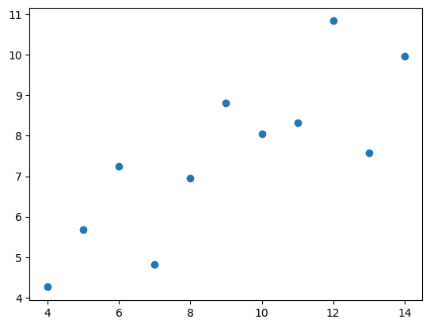
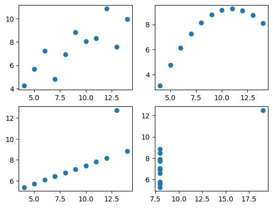
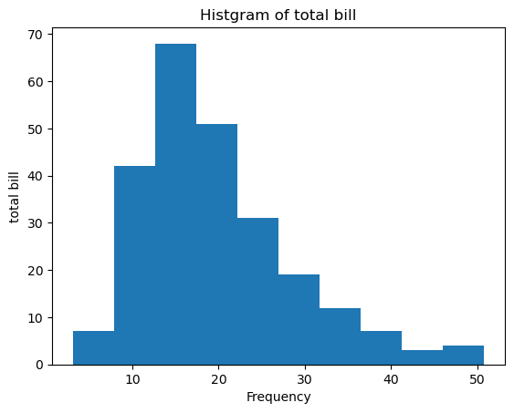
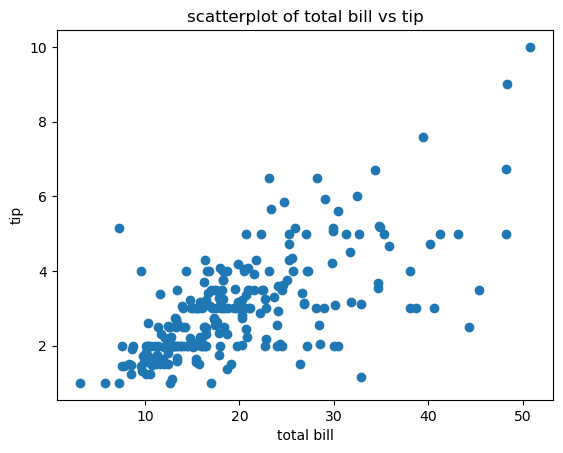
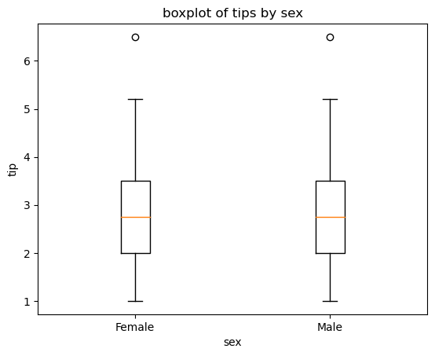
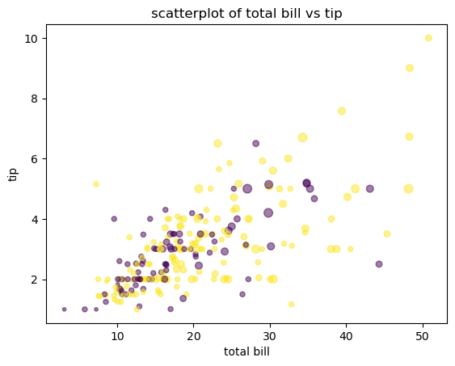
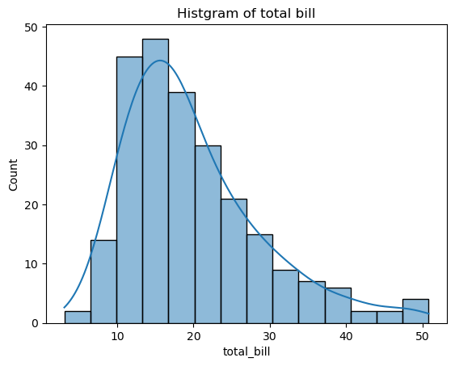
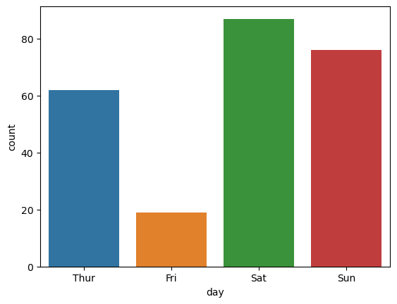
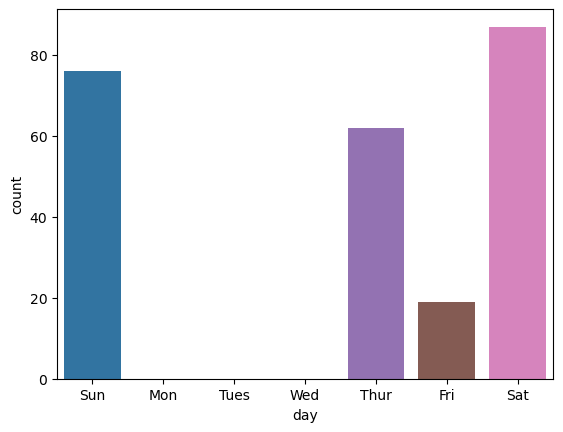

```python
import seaborn as sns
```


```python
df = sns.load_dataset('anscombe')
```


```python
type(df)
```


    pandas.core.frame.DataFrame


```python
df['dataset'].unique()
```


    array(['I', 'II', 'III', 'IV'], dtype=object)


```python
dataset1 = df[df['dataset']=='I']
dataset2 = df[df['dataset']=='II']
dataset3 = df[df['dataset']=='III']
dataset4 = df[df['dataset']=='IV']
```


```python
array['1, '2,' i\]
```


```python
import matplotlib.pyplot as plt
```


```python
plt.plot(dataset1['x'], dataset1['y'],'o')
```


    [<matplotlib.lines.Line2D at 0x2bab49ac520>]


    

    


```python
fig = plt.figure()
a1 = fig.add_subplot(2,2,1)
a2 = fig.add_subplot(2,2,2)
a3 = fig.add_subplot(2,2,3)
a4 = fig.add_subplot(2,2,4)
a1.plot(dataset1['x'], dataset1['y'],'o')
a2.plot(dataset2['x'], dataset2['y'],'o')
a3.plot(dataset3['x'], dataset3['y'],'o')
a4.plot(dataset4['x'], dataset4['y'],'o')
```


    [<matplotlib.lines.Line2D at 0x2bab4b9ecd0>]


    

    


```python
dataset1.mean()
```

    C:\Users\user\AppData\Local\Temp\ipykernel_10564\148656524.py:1: FutureWarning: Dropping of nuisance columns in DataFrame reductions (with 'numeric_only=None') is deprecated; in a future version this will raise TypeError.  Select only valid columns before calling the reduction.
      dataset1.mean()
    


    x    9.000000
    y    7.500909
    dtype: float64


```python
dataset2.mean()
```

    C:\Users\user\AppData\Local\Temp\ipykernel_10564\3349088152.py:1: FutureWarning: Dropping of nuisance columns in DataFrame reductions (with 'numeric_only=None') is deprecated; in a future version this will raise TypeError.  Select only valid columns before calling the reduction.
      dataset2.mean()
    


    x    9.000000
    y    7.500909
    dtype: float64


```python
dataset3.mean()
```

    C:\Users\user\AppData\Local\Temp\ipykernel_10564\2152253674.py:1: FutureWarning: Dropping of nuisance columns in DataFrame reductions (with 'numeric_only=None') is deprecated; in a future version this will raise TypeError.  Select only valid columns before calling the reduction.
      dataset3.mean()
    


    x    9.0
    y    7.5
    dtype: float64


```python
dataset4.mean()
```

    C:\Users\user\AppData\Local\Temp\ipykernel_10564\1693280217.py:1: FutureWarning: Dropping of nuisance columns in DataFrame reductions (with 'numeric_only=None') is deprecated; in a future version this will raise TypeError.  Select only valid columns before calling the reduction.
      dataset4.mean()
    


    x    9.000000
    y    7.500909
    dtype: float64


```python
dataset1.std()
```

    C:\Users\user\AppData\Local\Temp\ipykernel_10564\3261936497.py:1: FutureWarning: Dropping of nuisance columns in DataFrame reductions (with 'numeric_only=None') is deprecated; in a future version this will raise TypeError.  Select only valid columns before calling the reduction.
      dataset1.std()
    


    x    3.316625
    y    2.031568
    dtype: float64


```python
dataset2.std()
```

    C:\Users\user\AppData\Local\Temp\ipykernel_10564\3942917409.py:1: FutureWarning: Dropping of nuisance columns in DataFrame reductions (with 'numeric_only=None') is deprecated; in a future version this will raise TypeError.  Select only valid columns before calling the reduction.
      dataset2.std()
    


    x    3.316625
    y    2.031657
    dtype: float64


```python
dataset3.std()
```

    C:\Users\user\AppData\Local\Temp\ipykernel_10564\29971814.py:1: FutureWarning: Dropping of nuisance columns in DataFrame reductions (with 'numeric_only=None') is deprecated; in a future version this will raise TypeError.  Select only valid columns before calling the reduction.
      dataset3.std()
    


    x    3.316625
    y    2.030424
    dtype: float64


```python
dataset4.std()
```

    C:\Users\user\AppData\Local\Temp\ipykernel_10564\3961378170.py:1: FutureWarning: Dropping of nuisance columns in DataFrame reductions (with 'numeric_only=None') is deprecated; in a future version this will raise TypeError.  Select only valid columns before calling the reduction.
      dataset4.std()
    


    x    3.316625
    y    2.030579
    dtype: float64


```python
dataset1.corr()
```


<div>
<style scoped>
    .dataframe tbody tr th:only-of-type {
        vertical-align: middle;
    }

    .dataframe tbody tr th {
        vertical-align: top;
    }

    .dataframe thead th {
        text-align: right;
    }
</style>
<table border="1" class="dataframe">
  <thead>
    <tr style="text-align: right;">
      <th></th>
      <th>x</th>
      <th>y</th>
    </tr>
  </thead>
  <tbody>
    <tr>
      <th>x</th>
      <td>1.000000</td>
      <td>0.816421</td>
    </tr>
    <tr>
      <th>y</th>
      <td>0.816421</td>
      <td>1.000000</td>
    </tr>
  </tbody>
</table>
</div>


```python
dataset2.corr()
```


<div>
<style scoped>
    .dataframe tbody tr th:only-of-type {
        vertical-align: middle;
    }

    .dataframe tbody tr th {
        vertical-align: top;
    }

    .dataframe thead th {
        text-align: right;
    }
</style>
<table border="1" class="dataframe">
  <thead>
    <tr style="text-align: right;">
      <th></th>
      <th>x</th>
      <th>y</th>
    </tr>
  </thead>
  <tbody>
    <tr>
      <th>x</th>
      <td>1.000000</td>
      <td>0.816237</td>
    </tr>
    <tr>
      <th>y</th>
      <td>0.816237</td>
      <td>1.000000</td>
    </tr>
  </tbody>
</table>
</div>


```python
dataset3.corr()
```


<div>
<style scoped>
    .dataframe tbody tr th:only-of-type {
        vertical-align: middle;
    }

    .dataframe tbody tr th {
        vertical-align: top;
    }

    .dataframe thead th {
        text-align: right;
    }
</style>
<table border="1" class="dataframe">
  <thead>
    <tr style="text-align: right;">
      <th></th>
      <th>x</th>
      <th>y</th>
    </tr>
  </thead>
  <tbody>
    <tr>
      <th>x</th>
      <td>1.000000</td>
      <td>0.816287</td>
    </tr>
    <tr>
      <th>y</th>
      <td>0.816287</td>
      <td>1.000000</td>
    </tr>
  </tbody>
</table>
</div>


```python
dataset4.corr()
```


<div>
<style scoped>
    .dataframe tbody tr th:only-of-type {
        vertical-align: middle;
    }

    .dataframe tbody tr th {
        vertical-align: top;
    }

    .dataframe thead th {
        text-align: right;
    }
</style>
<table border="1" class="dataframe">
  <thead>
    <tr style="text-align: right;">
      <th></th>
      <th>x</th>
      <th>y</th>
    </tr>
  </thead>
  <tbody>
    <tr>
      <th>x</th>
      <td>1.000000</td>
      <td>0.816521</td>
    </tr>
    <tr>
      <th>y</th>
      <td>0.816521</td>
      <td>1.000000</td>
    </tr>
  </tbody>
</table>
</div>


```python
tips = sns.load_dataset('tips')
tips.head(2)
```


<div>
<style scoped>
    .dataframe tbody tr th:only-of-type {
        vertical-align: middle;
    }

    .dataframe tbody tr th {
        vertical-align: top;
    }

    .dataframe thead th {
        text-align: right;
    }
</style>
<table border="1" class="dataframe">
  <thead>
    <tr style="text-align: right;">
      <th></th>
      <th>total_bill</th>
      <th>tip</th>
      <th>sex</th>
      <th>smoker</th>
      <th>day</th>
      <th>time</th>
      <th>size</th>
    </tr>
  </thead>
  <tbody>
    <tr>
      <th>0</th>
      <td>16.99</td>
      <td>1.01</td>
      <td>Female</td>
      <td>No</td>
      <td>Sun</td>
      <td>Dinner</td>
      <td>2</td>
    </tr>
    <tr>
      <th>1</th>
      <td>10.34</td>
      <td>1.66</td>
      <td>Male</td>
      <td>No</td>
      <td>Sun</td>
      <td>Dinner</td>
      <td>3</td>
    </tr>
  </tbody>
</table>
</div>


```python
tips.info()
```

    <class 'pandas.core.frame.DataFrame'>
    RangeIndex: 244 entries, 0 to 243
    Data columns (total 7 columns):
     #   Column      Non-Null Count  Dtype   
    ---  ------      --------------  -----   
     0   total_bill  244 non-null    float64 
     1   tip         244 non-null    float64 
     2   sex         244 non-null    category
     3   smoker      244 non-null    category
     4   day         244 non-null    category
     5   time        244 non-null    category
     6   size        244 non-null    int64   
    dtypes: category(4), float64(2), int64(1)
    memory usage: 7.4 KB
    


```python
fig = plt.figure()
a1 = fig.add_subplot(1,1,1)
a1.hist(tips['total_bill'])
a1.set_title('Histgram of total bill')
a1.set_xlabel('Frequency')
a1.set_ylabel('total bill')
```


    Text(0, 0.5, 'total bill')


    

    


```python
fig1 = plt.figure()
a1 = fig1.add_subplot(1,1,1)
a1.scatter(tips['total_bill'],tips['tip'])
a1.set_title('scatterplot of total bill vs tip')
a1.set_xlabel('total bill')
a1.set_ylabel('tip')
```


    Text(0, 0.5, 'tip')


    

    


```python
fig2 = plt.figure()
a1 = fig2.add_subplot(1,1,1)
a1.boxplot([tips[tips['sex'] == 'Female']['tip'], 
            tips[tips['sex'] == 'Female']['tip']], 
            labels = ['Female','Male'])
a1.set_title('boxplot of tips by sex')
a1.set_xlabel('sex')
a1.set_ylabel('tip')
```


    Text(0, 0.5, 'tip')


    

    


```python
# 다변량 그래프 그리기
def recode_sex(sex):
    if sex == 'Female':
        return 0
    else:
        return 1
```


```python
tips['sex_color']=tips['sex'].apply(recode_sex)
```


```python
tips
```


<div>
<style scoped>
    .dataframe tbody tr th:only-of-type {
        vertical-align: middle;
    }

    .dataframe tbody tr th {
        vertical-align: top;
    }

    .dataframe thead th {
        text-align: right;
    }
</style>
<table border="1" class="dataframe">
  <thead>
    <tr style="text-align: right;">
      <th></th>
      <th>total_bill</th>
      <th>tip</th>
      <th>sex</th>
      <th>smoker</th>
      <th>day</th>
      <th>time</th>
      <th>size</th>
      <th>sex_color</th>
    </tr>
  </thead>
  <tbody>
    <tr>
      <th>0</th>
      <td>16.99</td>
      <td>1.01</td>
      <td>Female</td>
      <td>No</td>
      <td>Sun</td>
      <td>Dinner</td>
      <td>2</td>
      <td>0</td>
    </tr>
    <tr>
      <th>1</th>
      <td>10.34</td>
      <td>1.66</td>
      <td>Male</td>
      <td>No</td>
      <td>Sun</td>
      <td>Dinner</td>
      <td>3</td>
      <td>1</td>
    </tr>
    <tr>
      <th>2</th>
      <td>21.01</td>
      <td>3.50</td>
      <td>Male</td>
      <td>No</td>
      <td>Sun</td>
      <td>Dinner</td>
      <td>3</td>
      <td>1</td>
    </tr>
    <tr>
      <th>3</th>
      <td>23.68</td>
      <td>3.31</td>
      <td>Male</td>
      <td>No</td>
      <td>Sun</td>
      <td>Dinner</td>
      <td>2</td>
      <td>1</td>
    </tr>
    <tr>
      <th>4</th>
      <td>24.59</td>
      <td>3.61</td>
      <td>Female</td>
      <td>No</td>
      <td>Sun</td>
      <td>Dinner</td>
      <td>4</td>
      <td>0</td>
    </tr>
    <tr>
      <th>...</th>
      <td>...</td>
      <td>...</td>
      <td>...</td>
      <td>...</td>
      <td>...</td>
      <td>...</td>
      <td>...</td>
      <td>...</td>
    </tr>
    <tr>
      <th>239</th>
      <td>29.03</td>
      <td>5.92</td>
      <td>Male</td>
      <td>No</td>
      <td>Sat</td>
      <td>Dinner</td>
      <td>3</td>
      <td>1</td>
    </tr>
    <tr>
      <th>240</th>
      <td>27.18</td>
      <td>2.00</td>
      <td>Female</td>
      <td>Yes</td>
      <td>Sat</td>
      <td>Dinner</td>
      <td>2</td>
      <td>0</td>
    </tr>
    <tr>
      <th>241</th>
      <td>22.67</td>
      <td>2.00</td>
      <td>Male</td>
      <td>Yes</td>
      <td>Sat</td>
      <td>Dinner</td>
      <td>2</td>
      <td>1</td>
    </tr>
    <tr>
      <th>242</th>
      <td>17.82</td>
      <td>1.75</td>
      <td>Male</td>
      <td>No</td>
      <td>Sat</td>
      <td>Dinner</td>
      <td>2</td>
      <td>1</td>
    </tr>
    <tr>
      <th>243</th>
      <td>18.78</td>
      <td>3.00</td>
      <td>Female</td>
      <td>No</td>
      <td>Thur</td>
      <td>Dinner</td>
      <td>2</td>
      <td>0</td>
    </tr>
  </tbody>
</table>
<p>244 rows × 8 columns</p>
</div>


```python
fig3 = plt.figure()
a1 = fig3.add_subplot(1,1,1)
a1.scatter(tips['total_bill'],
           tips['tip'],s=tips['size']*10,c=tips['sex_color'],
          alpha=0.5)
a1.set_title('scatterplot of total bill vs tip')
a1.set_xlabel('total bill')
a1.set_ylabel('tip')
```


    Text(0, 0.5, 'tip')


    

    


```python
ax = plt.subplots()
ax = sns.histplot(tips['total_bill'],kde=True)
ax.set_title('Histgram of total bill')
# ax = sns.histplot(tips['total_bill'],kde=True)
# ax.set_title('total bill histgram')
```


    Text(0.5, 1.0, 'Histgram of total bill')


    

    


```python
sns.countplot(data=tips,x='day')
```


    <AxesSubplot:xlabel='day', ylabel='count'>


    

    


```python
tips['day'].unique()
```


    ['Sun', 'Sat', 'Thur', 'Fri']
    Categories (4, object): ['Thur', 'Fri', 'Sat', 'Sun']


```python
day_list = ['Sun', 'Mon', 'Tues', 'Wed', 'Thur', 'Fri', 'Sat']
```


```python
sns.countplot(data=tips, x='day', order=day_list)
```


    <AxesSubplot:xlabel='day', ylabel='count'>


    

    


```python

```


```python

```


```python

```


```python

```
