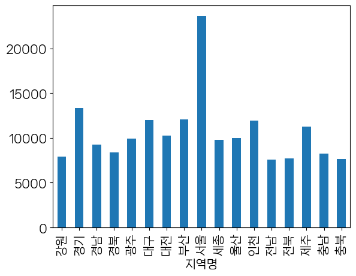

```python
import pandas as pd
```


```python
pd.read_csv('전국_평균_분양가격(2013년_9월부터_2015년_8월까지).csv', encoding = 'cp949')
# 보통 한글폰트가 깨지는데 뒤에 인코딩 cp94를 넣으면 대부분 해결된다.
```


<div>
<style scoped>
    .dataframe tbody tr th:only-of-type {
        vertical-align: middle;
    }

    .dataframe tbody tr th {
        vertical-align: top;
    }

    .dataframe thead th {
        text-align: right;
    }
</style>
<table border="1" class="dataframe">
  <thead>
    <tr style="text-align: right;">
      <th></th>
      <th>지역</th>
      <th>2013년12월</th>
      <th>2014년1월</th>
      <th>2014년2월</th>
      <th>2014년3월</th>
      <th>2014년4월</th>
      <th>2014년5월</th>
      <th>2014년6월</th>
      <th>2014년7월</th>
      <th>2014년8월</th>
      <th>...</th>
      <th>2014년11월</th>
      <th>2014년12월</th>
      <th>2015년1월</th>
      <th>2015년2월</th>
      <th>2015년3월</th>
      <th>2015년4월</th>
      <th>2015년5월</th>
      <th>2015년6월</th>
      <th>2015년7월</th>
      <th>2015년8월</th>
    </tr>
  </thead>
  <tbody>
    <tr>
      <th>0</th>
      <td>서울</td>
      <td>18189</td>
      <td>17925</td>
      <td>17925</td>
      <td>18016</td>
      <td>18098</td>
      <td>19446</td>
      <td>18867</td>
      <td>18742</td>
      <td>19274</td>
      <td>...</td>
      <td>20242</td>
      <td>20269</td>
      <td>20670</td>
      <td>20670</td>
      <td>19415</td>
      <td>18842</td>
      <td>18367</td>
      <td>18374</td>
      <td>18152</td>
      <td>18443</td>
    </tr>
    <tr>
      <th>1</th>
      <td>부산</td>
      <td>8111</td>
      <td>8111</td>
      <td>9078</td>
      <td>8965</td>
      <td>9402</td>
      <td>9501</td>
      <td>9453</td>
      <td>9457</td>
      <td>9411</td>
      <td>...</td>
      <td>9208</td>
      <td>9208</td>
      <td>9204</td>
      <td>9235</td>
      <td>9279</td>
      <td>9327</td>
      <td>9345</td>
      <td>9515</td>
      <td>9559</td>
      <td>9581</td>
    </tr>
    <tr>
      <th>2</th>
      <td>대구</td>
      <td>8080</td>
      <td>8080</td>
      <td>8077</td>
      <td>8101</td>
      <td>8267</td>
      <td>8274</td>
      <td>8360</td>
      <td>8360</td>
      <td>8370</td>
      <td>...</td>
      <td>8439</td>
      <td>8253</td>
      <td>8327</td>
      <td>8416</td>
      <td>8441</td>
      <td>8446</td>
      <td>8568</td>
      <td>8542</td>
      <td>8542</td>
      <td>8795</td>
    </tr>
    <tr>
      <th>3</th>
      <td>인천</td>
      <td>10204</td>
      <td>10204</td>
      <td>10408</td>
      <td>10408</td>
      <td>10000</td>
      <td>9844</td>
      <td>10058</td>
      <td>9974</td>
      <td>9973</td>
      <td>...</td>
      <td>10020</td>
      <td>10020</td>
      <td>10017</td>
      <td>9876</td>
      <td>9876</td>
      <td>9938</td>
      <td>10551</td>
      <td>10443</td>
      <td>10443</td>
      <td>10449</td>
    </tr>
    <tr>
      <th>4</th>
      <td>광주</td>
      <td>6098</td>
      <td>7326</td>
      <td>7611</td>
      <td>7346</td>
      <td>7346</td>
      <td>7523</td>
      <td>7659</td>
      <td>7612</td>
      <td>7622</td>
      <td>...</td>
      <td>7752</td>
      <td>7748</td>
      <td>7752</td>
      <td>7756</td>
      <td>7861</td>
      <td>7914</td>
      <td>7877</td>
      <td>7881</td>
      <td>8089</td>
      <td>8231</td>
    </tr>
    <tr>
      <th>5</th>
      <td>대전</td>
      <td>8321</td>
      <td>8321</td>
      <td>8321</td>
      <td>8341</td>
      <td>8341</td>
      <td>8341</td>
      <td>8333</td>
      <td>8333</td>
      <td>8333</td>
      <td>...</td>
      <td>8067</td>
      <td>8067</td>
      <td>8067</td>
      <td>8067</td>
      <td>8067</td>
      <td>8145</td>
      <td>8272</td>
      <td>8079</td>
      <td>8079</td>
      <td>8079</td>
    </tr>
    <tr>
      <th>6</th>
      <td>울산</td>
      <td>8090</td>
      <td>8090</td>
      <td>8090</td>
      <td>8153</td>
      <td>8153</td>
      <td>8153</td>
      <td>8153</td>
      <td>8153</td>
      <td>8493</td>
      <td>...</td>
      <td>8891</td>
      <td>8891</td>
      <td>8526</td>
      <td>8526</td>
      <td>8629</td>
      <td>9380</td>
      <td>9192</td>
      <td>9190</td>
      <td>9190</td>
      <td>9215</td>
    </tr>
    <tr>
      <th>7</th>
      <td>경기</td>
      <td>10855</td>
      <td>10855</td>
      <td>10791</td>
      <td>10784</td>
      <td>10876</td>
      <td>10646</td>
      <td>10266</td>
      <td>10124</td>
      <td>10134</td>
      <td>...</td>
      <td>10356</td>
      <td>10379</td>
      <td>10391</td>
      <td>10355</td>
      <td>10469</td>
      <td>10684</td>
      <td>10685</td>
      <td>10573</td>
      <td>10518</td>
      <td>10573</td>
    </tr>
    <tr>
      <th>8</th>
      <td>세종</td>
      <td>7601</td>
      <td>7600</td>
      <td>7532</td>
      <td>7814</td>
      <td>7908</td>
      <td>7934</td>
      <td>8067</td>
      <td>8067</td>
      <td>8141</td>
      <td>...</td>
      <td>8592</td>
      <td>8560</td>
      <td>8560</td>
      <td>8560</td>
      <td>8555</td>
      <td>8546</td>
      <td>8546</td>
      <td>8671</td>
      <td>8669</td>
      <td>8695</td>
    </tr>
    <tr>
      <th>9</th>
      <td>강원</td>
      <td>6230</td>
      <td>6230</td>
      <td>6230</td>
      <td>6141</td>
      <td>6373</td>
      <td>6350</td>
      <td>6350</td>
      <td>6268</td>
      <td>6268</td>
      <td>...</td>
      <td>6365</td>
      <td>6365</td>
      <td>6348</td>
      <td>6350</td>
      <td>6182</td>
      <td>6924</td>
      <td>6846</td>
      <td>6986</td>
      <td>7019</td>
      <td>7008</td>
    </tr>
    <tr>
      <th>10</th>
      <td>충북</td>
      <td>6589</td>
      <td>6589</td>
      <td>6611</td>
      <td>6625</td>
      <td>6678</td>
      <td>6598</td>
      <td>6587</td>
      <td>6586</td>
      <td>6586</td>
      <td>...</td>
      <td>6724</td>
      <td>6743</td>
      <td>6749</td>
      <td>6747</td>
      <td>6783</td>
      <td>6790</td>
      <td>6805</td>
      <td>6682</td>
      <td>6601</td>
      <td>6603</td>
    </tr>
    <tr>
      <th>11</th>
      <td>충남</td>
      <td>6365</td>
      <td>6365</td>
      <td>6379</td>
      <td>6287</td>
      <td>6552</td>
      <td>6591</td>
      <td>6644</td>
      <td>6805</td>
      <td>6914</td>
      <td>...</td>
      <td>6940</td>
      <td>6989</td>
      <td>6976</td>
      <td>6980</td>
      <td>7161</td>
      <td>7017</td>
      <td>6975</td>
      <td>6939</td>
      <td>6935</td>
      <td>6942</td>
    </tr>
    <tr>
      <th>12</th>
      <td>전북</td>
      <td>6282</td>
      <td>6281</td>
      <td>5946</td>
      <td>5966</td>
      <td>6277</td>
      <td>6306</td>
      <td>6351</td>
      <td>6319</td>
      <td>6436</td>
      <td>...</td>
      <td>6583</td>
      <td>6583</td>
      <td>6583</td>
      <td>6583</td>
      <td>6542</td>
      <td>6551</td>
      <td>6556</td>
      <td>6601</td>
      <td>6750</td>
      <td>6580</td>
    </tr>
    <tr>
      <th>13</th>
      <td>전남</td>
      <td>5678</td>
      <td>5678</td>
      <td>5678</td>
      <td>5696</td>
      <td>5736</td>
      <td>5656</td>
      <td>5609</td>
      <td>5780</td>
      <td>5685</td>
      <td>...</td>
      <td>5768</td>
      <td>5784</td>
      <td>5784</td>
      <td>5833</td>
      <td>5825</td>
      <td>5940</td>
      <td>6050</td>
      <td>6243</td>
      <td>6286</td>
      <td>6289</td>
    </tr>
    <tr>
      <th>14</th>
      <td>경북</td>
      <td>6168</td>
      <td>6168</td>
      <td>6234</td>
      <td>6317</td>
      <td>6412</td>
      <td>6409</td>
      <td>6554</td>
      <td>6556</td>
      <td>6563</td>
      <td>...</td>
      <td>6881</td>
      <td>6989</td>
      <td>6992</td>
      <td>6953</td>
      <td>6997</td>
      <td>7006</td>
      <td>6966</td>
      <td>6887</td>
      <td>7035</td>
      <td>7037</td>
    </tr>
    <tr>
      <th>15</th>
      <td>경남</td>
      <td>6473</td>
      <td>6485</td>
      <td>6502</td>
      <td>6610</td>
      <td>6599</td>
      <td>6610</td>
      <td>6615</td>
      <td>6613</td>
      <td>6606</td>
      <td>...</td>
      <td>7125</td>
      <td>7332</td>
      <td>7592</td>
      <td>7588</td>
      <td>7668</td>
      <td>7683</td>
      <td>7717</td>
      <td>7715</td>
      <td>7723</td>
      <td>7665</td>
    </tr>
    <tr>
      <th>16</th>
      <td>제주</td>
      <td>7674</td>
      <td>7900</td>
      <td>7900</td>
      <td>7900</td>
      <td>7900</td>
      <td>7900</td>
      <td>7914</td>
      <td>7914</td>
      <td>7914</td>
      <td>...</td>
      <td>7724</td>
      <td>7739</td>
      <td>7739</td>
      <td>7739</td>
      <td>7826</td>
      <td>7285</td>
      <td>7285</td>
      <td>7343</td>
      <td>7343</td>
      <td>7343</td>
    </tr>
  </tbody>
</table>
<p>17 rows × 22 columns</p>
</div>


```python
first_df = pd.read_csv('전국_평균_분양가격(2013년_9월부터_2015년_8월까지).csv', encoding = 'cp949')
```


```python
first_df.head(2)
```


<div>
<style scoped>
    .dataframe tbody tr th:only-of-type {
        vertical-align: middle;
    }

    .dataframe tbody tr th {
        vertical-align: top;
    }

    .dataframe thead th {
        text-align: right;
    }
</style>
<table border="1" class="dataframe">
  <thead>
    <tr style="text-align: right;">
      <th></th>
      <th>지역</th>
      <th>2013년12월</th>
      <th>2014년1월</th>
      <th>2014년2월</th>
      <th>2014년3월</th>
      <th>2014년4월</th>
      <th>2014년5월</th>
      <th>2014년6월</th>
      <th>2014년7월</th>
      <th>2014년8월</th>
      <th>...</th>
      <th>2014년11월</th>
      <th>2014년12월</th>
      <th>2015년1월</th>
      <th>2015년2월</th>
      <th>2015년3월</th>
      <th>2015년4월</th>
      <th>2015년5월</th>
      <th>2015년6월</th>
      <th>2015년7월</th>
      <th>2015년8월</th>
    </tr>
  </thead>
  <tbody>
    <tr>
      <th>0</th>
      <td>서울</td>
      <td>18189</td>
      <td>17925</td>
      <td>17925</td>
      <td>18016</td>
      <td>18098</td>
      <td>19446</td>
      <td>18867</td>
      <td>18742</td>
      <td>19274</td>
      <td>...</td>
      <td>20242</td>
      <td>20269</td>
      <td>20670</td>
      <td>20670</td>
      <td>19415</td>
      <td>18842</td>
      <td>18367</td>
      <td>18374</td>
      <td>18152</td>
      <td>18443</td>
    </tr>
    <tr>
      <th>1</th>
      <td>부산</td>
      <td>8111</td>
      <td>8111</td>
      <td>9078</td>
      <td>8965</td>
      <td>9402</td>
      <td>9501</td>
      <td>9453</td>
      <td>9457</td>
      <td>9411</td>
      <td>...</td>
      <td>9208</td>
      <td>9208</td>
      <td>9204</td>
      <td>9235</td>
      <td>9279</td>
      <td>9327</td>
      <td>9345</td>
      <td>9515</td>
      <td>9559</td>
      <td>9581</td>
    </tr>
  </tbody>
</table>
<p>2 rows × 22 columns</p>
</div>


```python
first_df.info()
```

    <class 'pandas.core.frame.DataFrame'>
    RangeIndex: 17 entries, 0 to 16
    Data columns (total 22 columns):
     #   Column    Non-Null Count  Dtype 
    ---  ------    --------------  ----- 
     0   지역        17 non-null     object
     1   2013년12월  17 non-null     int64 
     2   2014년1월   17 non-null     int64 
     3   2014년2월   17 non-null     int64 
     4   2014년3월   17 non-null     int64 
     5   2014년4월   17 non-null     int64 
     6   2014년5월   17 non-null     int64 
     7   2014년6월   17 non-null     int64 
     8   2014년7월   17 non-null     int64 
     9   2014년8월   17 non-null     int64 
     10  2014년9월   17 non-null     int64 
     11  2014년10월  17 non-null     int64 
     12  2014년11월  17 non-null     int64 
     13  2014년12월  17 non-null     int64 
     14  2015년1월   17 non-null     int64 
     15  2015년2월   17 non-null     int64 
     16  2015년3월   17 non-null     int64 
     17  2015년4월   17 non-null     int64 
     18  2015년5월   17 non-null     int64 
     19  2015년6월   17 non-null     int64 
     20  2015년7월   17 non-null     int64 
     21  2015년8월   17 non-null     int64 
    dtypes: int64(21), object(1)
    memory usage: 3.0+ KB
    


```python
pd.read_csv('주택도시보증공사_전국_평균_분양가격(2019년_12월).csv', encoding = 'cp949')
```


<div>
<style scoped>
    .dataframe tbody tr th:only-of-type {
        vertical-align: middle;
    }

    .dataframe tbody tr th {
        vertical-align: top;
    }

    .dataframe thead th {
        text-align: right;
    }
</style>
<table border="1" class="dataframe">
  <thead>
    <tr style="text-align: right;">
      <th></th>
      <th>지역명</th>
      <th>규모구분</th>
      <th>연도</th>
      <th>월</th>
      <th>분양가격(㎡)</th>
    </tr>
  </thead>
  <tbody>
    <tr>
      <th>0</th>
      <td>서울</td>
      <td>전체</td>
      <td>2015</td>
      <td>10</td>
      <td>5841</td>
    </tr>
    <tr>
      <th>1</th>
      <td>서울</td>
      <td>전용면적 60㎡이하</td>
      <td>2015</td>
      <td>10</td>
      <td>5652</td>
    </tr>
    <tr>
      <th>2</th>
      <td>서울</td>
      <td>전용면적 60㎡초과 85㎡이하</td>
      <td>2015</td>
      <td>10</td>
      <td>5882</td>
    </tr>
    <tr>
      <th>3</th>
      <td>서울</td>
      <td>전용면적 85㎡초과 102㎡이하</td>
      <td>2015</td>
      <td>10</td>
      <td>5721</td>
    </tr>
    <tr>
      <th>4</th>
      <td>서울</td>
      <td>전용면적 102㎡초과</td>
      <td>2015</td>
      <td>10</td>
      <td>5879</td>
    </tr>
    <tr>
      <th>...</th>
      <td>...</td>
      <td>...</td>
      <td>...</td>
      <td>...</td>
      <td>...</td>
    </tr>
    <tr>
      <th>4330</th>
      <td>제주</td>
      <td>전체</td>
      <td>2019</td>
      <td>12</td>
      <td>3882</td>
    </tr>
    <tr>
      <th>4331</th>
      <td>제주</td>
      <td>전용면적 60㎡이하</td>
      <td>2019</td>
      <td>12</td>
      <td>NaN</td>
    </tr>
    <tr>
      <th>4332</th>
      <td>제주</td>
      <td>전용면적 60㎡초과 85㎡이하</td>
      <td>2019</td>
      <td>12</td>
      <td>3898</td>
    </tr>
    <tr>
      <th>4333</th>
      <td>제주</td>
      <td>전용면적 85㎡초과 102㎡이하</td>
      <td>2019</td>
      <td>12</td>
      <td>NaN</td>
    </tr>
    <tr>
      <th>4334</th>
      <td>제주</td>
      <td>전용면적 102㎡초과</td>
      <td>2019</td>
      <td>12</td>
      <td>3601</td>
    </tr>
  </tbody>
</table>
<p>4335 rows × 5 columns</p>
</div>


```python
last_df = pd.read_csv('주택도시보증공사_전국_평균_분양가격(2019년_12월).csv', encoding = 'cp949')
```


```python
last_df.info()
```

    <class 'pandas.core.frame.DataFrame'>
    RangeIndex: 4335 entries, 0 to 4334
    Data columns (total 5 columns):
     #   Column   Non-Null Count  Dtype 
    ---  ------   --------------  ----- 
     0   지역명      4335 non-null   object
     1   규모구분     4335 non-null   object
     2   연도       4335 non-null   int64 
     3   월        4335 non-null   int64 
     4   분양가격(㎡)  4058 non-null   object
    dtypes: int64(2), object(3)
    memory usage: 169.5+ KB
    


```python
last_df.isna().sum()
```


    지역명          0
    규모구분         0
    연도           0
    월            0
    분양가격(㎡)    277
    dtype: int64


```python
pd.to_numeric(last_df['분양가격(㎡)'])
```


    ---------------------------------------------------------------------------

    ValueError                                Traceback (most recent call last)

    ~\anaconda3\lib\site-packages\pandas\_libs\lib.pyx in pandas._libs.lib.maybe_convert_numeric()
    

    ValueError: Unable to parse string "  "

    
    During handling of the above exception, another exception occurred:
    

    ValueError                                Traceback (most recent call last)

    ~\AppData\Local\Temp\ipykernel_4668\3953485802.py in <module>
    ----> 1 pd.to_numeric(last_df['분양가격(㎡)'])
    

    ~\anaconda3\lib\site-packages\pandas\core\tools\numeric.py in to_numeric(arg, errors, downcast)
        182         coerce_numeric = errors not in ("ignore", "raise")
        183         try:
    --> 184             values, _ = lib.maybe_convert_numeric(
        185                 values, set(), coerce_numeric=coerce_numeric
        186             )
    

    ~\anaconda3\lib\site-packages\pandas\_libs\lib.pyx in pandas._libs.lib.maybe_convert_numeric()
    

    ValueError: Unable to parse string "  " at position 28


```python
from numpy import nan
```


```python
type(nan)
```


    float


```python
pd.to_numeric(last_df['분양가격(㎡)'],errors='coerce')
```


    0       5841.0
    1       5652.0
    2       5882.0
    3       5721.0
    4       5879.0
             ...  
    4330    3882.0
    4331       NaN
    4332    3898.0
    4333       NaN
    4334    3601.0
    Name: 분양가격(㎡), Length: 4335, dtype: float64


```python
last_df['분양가격'] = pd.to_numeric(last_df['분양가격(㎡)'],errors='coerce')
```


```python
last_df.info()
```

    <class 'pandas.core.frame.DataFrame'>
    RangeIndex: 4335 entries, 0 to 4334
    Data columns (total 6 columns):
     #   Column   Non-Null Count  Dtype  
    ---  ------   --------------  -----  
     0   지역명      4335 non-null   object 
     1   규모구분     4335 non-null   object 
     2   연도       4335 non-null   int64  
     3   월        4335 non-null   int64  
     4   분양가격(㎡)  4058 non-null   object 
     5   분양가격     3957 non-null   float64
    dtypes: float64(1), int64(2), object(3)
    memory usage: 203.3+ KB
    


```python
last_df['분양가격']*3.3
```


    0       19275.3
    1       18651.6
    2       19410.6
    3       18879.3
    4       19400.7
             ...   
    4330    12810.6
    4331        NaN
    4332    12863.4
    4333        NaN
    4334    11883.3
    Name: 분양가격, Length: 4335, dtype: float64


```python
last_df['평당분양가격'] = last_df['분양가격']*3.3
```


```python
last_df['평당분양가격'].describe()
```


    count     3957.000000
    mean     10685.824488
    std       4172.222780
    min       6164.400000
    25%       8055.300000
    50%       9484.200000
    75%      11751.300000
    max      42002.400000
    Name: 평당분양가격, dtype: float64


```python
last_df
```


<div>
<style scoped>
    .dataframe tbody tr th:only-of-type {
        vertical-align: middle;
    }

    .dataframe tbody tr th {
        vertical-align: top;
    }

    .dataframe thead th {
        text-align: right;
    }
</style>
<table border="1" class="dataframe">
  <thead>
    <tr style="text-align: right;">
      <th></th>
      <th>지역명</th>
      <th>규모구분</th>
      <th>연도</th>
      <th>월</th>
      <th>분양가격(㎡)</th>
      <th>분양가격</th>
      <th>평당분양가격</th>
    </tr>
  </thead>
  <tbody>
    <tr>
      <th>0</th>
      <td>서울</td>
      <td>전체</td>
      <td>2015</td>
      <td>10</td>
      <td>5841</td>
      <td>5841.0</td>
      <td>19275.3</td>
    </tr>
    <tr>
      <th>1</th>
      <td>서울</td>
      <td>전용면적 60㎡이하</td>
      <td>2015</td>
      <td>10</td>
      <td>5652</td>
      <td>5652.0</td>
      <td>18651.6</td>
    </tr>
    <tr>
      <th>2</th>
      <td>서울</td>
      <td>전용면적 60㎡초과 85㎡이하</td>
      <td>2015</td>
      <td>10</td>
      <td>5882</td>
      <td>5882.0</td>
      <td>19410.6</td>
    </tr>
    <tr>
      <th>3</th>
      <td>서울</td>
      <td>전용면적 85㎡초과 102㎡이하</td>
      <td>2015</td>
      <td>10</td>
      <td>5721</td>
      <td>5721.0</td>
      <td>18879.3</td>
    </tr>
    <tr>
      <th>4</th>
      <td>서울</td>
      <td>전용면적 102㎡초과</td>
      <td>2015</td>
      <td>10</td>
      <td>5879</td>
      <td>5879.0</td>
      <td>19400.7</td>
    </tr>
    <tr>
      <th>...</th>
      <td>...</td>
      <td>...</td>
      <td>...</td>
      <td>...</td>
      <td>...</td>
      <td>...</td>
      <td>...</td>
    </tr>
    <tr>
      <th>4330</th>
      <td>제주</td>
      <td>전체</td>
      <td>2019</td>
      <td>12</td>
      <td>3882</td>
      <td>3882.0</td>
      <td>12810.6</td>
    </tr>
    <tr>
      <th>4331</th>
      <td>제주</td>
      <td>전용면적 60㎡이하</td>
      <td>2019</td>
      <td>12</td>
      <td>NaN</td>
      <td>NaN</td>
      <td>NaN</td>
    </tr>
    <tr>
      <th>4332</th>
      <td>제주</td>
      <td>전용면적 60㎡초과 85㎡이하</td>
      <td>2019</td>
      <td>12</td>
      <td>3898</td>
      <td>3898.0</td>
      <td>12863.4</td>
    </tr>
    <tr>
      <th>4333</th>
      <td>제주</td>
      <td>전용면적 85㎡초과 102㎡이하</td>
      <td>2019</td>
      <td>12</td>
      <td>NaN</td>
      <td>NaN</td>
      <td>NaN</td>
    </tr>
    <tr>
      <th>4334</th>
      <td>제주</td>
      <td>전용면적 102㎡초과</td>
      <td>2019</td>
      <td>12</td>
      <td>3601</td>
      <td>3601.0</td>
      <td>11883.3</td>
    </tr>
  </tbody>
</table>
<p>4335 rows × 7 columns</p>
</div>


```python
last_df.규모구분.unique()
```


    array(['전체', '전용면적 60㎡이하', '전용면적 60㎡초과 85㎡이하', '전용면적 85㎡초과 102㎡이하',
           '전용면적 102㎡초과'], dtype=object)


```python
last_df.규모구분.str.replace('전용면적','')
```


    0                  전체
    1               60㎡이하
    2         60㎡초과 85㎡이하
    3        85㎡초과 102㎡이하
    4              102㎡초과
                ...      
    4330               전체
    4331            60㎡이하
    4332      60㎡초과 85㎡이하
    4333     85㎡초과 102㎡이하
    4334           102㎡초과
    Name: 규모구분, Length: 4335, dtype: object


```python
last_df['전용면적'] = last_df.규모구분.str.replace('전용면적','')
```


```python
last_df['전용면적'] = last_df['전용면적'].str.replace('초과','~')
```


```python
last_df['전용면적'] = last_df['전용면적'].str.replace('이하','')
```


```python
last_df['전용면적'] = last_df['전용면적'].str.replace(' ','').str.strip()
```


```python
last_df
```


<div>
<style scoped>
    .dataframe tbody tr th:only-of-type {
        vertical-align: middle;
    }

    .dataframe tbody tr th {
        vertical-align: top;
    }

    .dataframe thead th {
        text-align: right;
    }
</style>
<table border="1" class="dataframe">
  <thead>
    <tr style="text-align: right;">
      <th></th>
      <th>지역명</th>
      <th>규모구분</th>
      <th>연도</th>
      <th>월</th>
      <th>분양가격(㎡)</th>
      <th>분양가격</th>
      <th>평당분양가격</th>
      <th>전용면적</th>
    </tr>
  </thead>
  <tbody>
    <tr>
      <th>0</th>
      <td>서울</td>
      <td>전체</td>
      <td>2015</td>
      <td>10</td>
      <td>5841</td>
      <td>5841.0</td>
      <td>19275.3</td>
      <td>전체</td>
    </tr>
    <tr>
      <th>1</th>
      <td>서울</td>
      <td>전용면적 60㎡이하</td>
      <td>2015</td>
      <td>10</td>
      <td>5652</td>
      <td>5652.0</td>
      <td>18651.6</td>
      <td>60㎡</td>
    </tr>
    <tr>
      <th>2</th>
      <td>서울</td>
      <td>전용면적 60㎡초과 85㎡이하</td>
      <td>2015</td>
      <td>10</td>
      <td>5882</td>
      <td>5882.0</td>
      <td>19410.6</td>
      <td>60㎡~85㎡</td>
    </tr>
    <tr>
      <th>3</th>
      <td>서울</td>
      <td>전용면적 85㎡초과 102㎡이하</td>
      <td>2015</td>
      <td>10</td>
      <td>5721</td>
      <td>5721.0</td>
      <td>18879.3</td>
      <td>85㎡~102㎡</td>
    </tr>
    <tr>
      <th>4</th>
      <td>서울</td>
      <td>전용면적 102㎡초과</td>
      <td>2015</td>
      <td>10</td>
      <td>5879</td>
      <td>5879.0</td>
      <td>19400.7</td>
      <td>102㎡~</td>
    </tr>
    <tr>
      <th>...</th>
      <td>...</td>
      <td>...</td>
      <td>...</td>
      <td>...</td>
      <td>...</td>
      <td>...</td>
      <td>...</td>
      <td>...</td>
    </tr>
    <tr>
      <th>4330</th>
      <td>제주</td>
      <td>전체</td>
      <td>2019</td>
      <td>12</td>
      <td>3882</td>
      <td>3882.0</td>
      <td>12810.6</td>
      <td>전체</td>
    </tr>
    <tr>
      <th>4331</th>
      <td>제주</td>
      <td>전용면적 60㎡이하</td>
      <td>2019</td>
      <td>12</td>
      <td>NaN</td>
      <td>NaN</td>
      <td>NaN</td>
      <td>60㎡</td>
    </tr>
    <tr>
      <th>4332</th>
      <td>제주</td>
      <td>전용면적 60㎡초과 85㎡이하</td>
      <td>2019</td>
      <td>12</td>
      <td>3898</td>
      <td>3898.0</td>
      <td>12863.4</td>
      <td>60㎡~85㎡</td>
    </tr>
    <tr>
      <th>4333</th>
      <td>제주</td>
      <td>전용면적 85㎡초과 102㎡이하</td>
      <td>2019</td>
      <td>12</td>
      <td>NaN</td>
      <td>NaN</td>
      <td>NaN</td>
      <td>85㎡~102㎡</td>
    </tr>
    <tr>
      <th>4334</th>
      <td>제주</td>
      <td>전용면적 102㎡초과</td>
      <td>2019</td>
      <td>12</td>
      <td>3601</td>
      <td>3601.0</td>
      <td>11883.3</td>
      <td>102㎡~</td>
    </tr>
  </tbody>
</table>
<p>4335 rows × 8 columns</p>
</div>


```python
last_df.columns
```


    Index(['지역명', '규모구분', '연도', '월', '분양가격(㎡)', '분양가격', '평당분양가격', '전용면적'], dtype='object')


```python
last_df.drop(columns=['규모구분', '분양가격(㎡)'],inplace=True)
```


```python
last_df
```


<div>
<style scoped>
    .dataframe tbody tr th:only-of-type {
        vertical-align: middle;
    }

    .dataframe tbody tr th {
        vertical-align: top;
    }

    .dataframe thead th {
        text-align: right;
    }
</style>
<table border="1" class="dataframe">
  <thead>
    <tr style="text-align: right;">
      <th></th>
      <th>지역명</th>
      <th>연도</th>
      <th>월</th>
      <th>분양가격</th>
      <th>평당분양가격</th>
      <th>전용면적</th>
    </tr>
  </thead>
  <tbody>
    <tr>
      <th>0</th>
      <td>서울</td>
      <td>2015</td>
      <td>10</td>
      <td>5841.0</td>
      <td>19275.3</td>
      <td>전체</td>
    </tr>
    <tr>
      <th>1</th>
      <td>서울</td>
      <td>2015</td>
      <td>10</td>
      <td>5652.0</td>
      <td>18651.6</td>
      <td>60㎡</td>
    </tr>
    <tr>
      <th>2</th>
      <td>서울</td>
      <td>2015</td>
      <td>10</td>
      <td>5882.0</td>
      <td>19410.6</td>
      <td>60㎡~85㎡</td>
    </tr>
    <tr>
      <th>3</th>
      <td>서울</td>
      <td>2015</td>
      <td>10</td>
      <td>5721.0</td>
      <td>18879.3</td>
      <td>85㎡~102㎡</td>
    </tr>
    <tr>
      <th>4</th>
      <td>서울</td>
      <td>2015</td>
      <td>10</td>
      <td>5879.0</td>
      <td>19400.7</td>
      <td>102㎡~</td>
    </tr>
    <tr>
      <th>...</th>
      <td>...</td>
      <td>...</td>
      <td>...</td>
      <td>...</td>
      <td>...</td>
      <td>...</td>
    </tr>
    <tr>
      <th>4330</th>
      <td>제주</td>
      <td>2019</td>
      <td>12</td>
      <td>3882.0</td>
      <td>12810.6</td>
      <td>전체</td>
    </tr>
    <tr>
      <th>4331</th>
      <td>제주</td>
      <td>2019</td>
      <td>12</td>
      <td>NaN</td>
      <td>NaN</td>
      <td>60㎡</td>
    </tr>
    <tr>
      <th>4332</th>
      <td>제주</td>
      <td>2019</td>
      <td>12</td>
      <td>3898.0</td>
      <td>12863.4</td>
      <td>60㎡~85㎡</td>
    </tr>
    <tr>
      <th>4333</th>
      <td>제주</td>
      <td>2019</td>
      <td>12</td>
      <td>NaN</td>
      <td>NaN</td>
      <td>85㎡~102㎡</td>
    </tr>
    <tr>
      <th>4334</th>
      <td>제주</td>
      <td>2019</td>
      <td>12</td>
      <td>3601.0</td>
      <td>11883.3</td>
      <td>102㎡~</td>
    </tr>
  </tbody>
</table>
<p>4335 rows × 6 columns</p>
</div>


```python
last_df.groupby(['지역명'])['평당분양가격'].mean()
```


    지역명
    강원     7890.750000
    경기    13356.895200
    경남     9268.778138
    경북     8376.536515
    광주     9951.535821
    대구    11980.895455
    대전    10253.333333
    부산    12087.121200
    서울    23599.976400
    세종     9796.516456
    울산    10014.902013
    인천    11915.320732
    전남     7565.316532
    전북     7724.235484
    제주    11241.276712
    충남     8233.651883
    충북     7634.655600
    Name: 평당분양가격, dtype: float64


```python
last_df.groupby(['지역명'])['평당분양가격'].mean().plot(kind='bar')
```


    <AxesSubplot:xlabel='지역명'>


    

    


```python
last_df.groupby(['지역명'])['평당분양가격'].mean().plot(kind='barh')
```


    <AxesSubplot:ylabel='지역명'>


    

    


```python
last_df.groupby(['전용면적'])['평당분양가격'].mean()
```


    전용면적
    102㎡~       11517.705634
    60㎡         10375.137421
    60㎡~85㎡     10271.040071
    85㎡~102㎡    11097.599573
    전체          10276.086207
    Name: 평당분양가격, dtype: float64


```python
last_df.groupby(['전용면적','지역명'])['평당분양가격'].mean()
```


    전용면적   지역명
    102㎡~  강원      8311.380000
           경기     14771.790000
           경남     10358.363265
           경북      9157.302000
           광주     11041.532432
                      ...     
    전체     전남      7283.562000
           전북      7292.604000
           제주     10784.994000
           충남      7815.324000
           충북      7219.014000
    Name: 평당분양가격, Length: 85, dtype: float64


```python
last_df.groupby(['전용면적','지역명'])['평당분양가격'].mean().reset_index()
```


<div>
<style scoped>
    .dataframe tbody tr th:only-of-type {
        vertical-align: middle;
    }

    .dataframe tbody tr th {
        vertical-align: top;
    }

    .dataframe thead th {
        text-align: right;
    }
</style>
<table border="1" class="dataframe">
  <thead>
    <tr style="text-align: right;">
      <th></th>
      <th>전용면적</th>
      <th>지역명</th>
      <th>평당분양가격</th>
    </tr>
  </thead>
  <tbody>
    <tr>
      <th>0</th>
      <td>102㎡~</td>
      <td>강원</td>
      <td>8311.380000</td>
    </tr>
    <tr>
      <th>1</th>
      <td>102㎡~</td>
      <td>경기</td>
      <td>14771.790000</td>
    </tr>
    <tr>
      <th>2</th>
      <td>102㎡~</td>
      <td>경남</td>
      <td>10358.363265</td>
    </tr>
    <tr>
      <th>3</th>
      <td>102㎡~</td>
      <td>경북</td>
      <td>9157.302000</td>
    </tr>
    <tr>
      <th>4</th>
      <td>102㎡~</td>
      <td>광주</td>
      <td>11041.532432</td>
    </tr>
    <tr>
      <th>...</th>
      <td>...</td>
      <td>...</td>
      <td>...</td>
    </tr>
    <tr>
      <th>80</th>
      <td>전체</td>
      <td>전남</td>
      <td>7283.562000</td>
    </tr>
    <tr>
      <th>81</th>
      <td>전체</td>
      <td>전북</td>
      <td>7292.604000</td>
    </tr>
    <tr>
      <th>82</th>
      <td>전체</td>
      <td>제주</td>
      <td>10784.994000</td>
    </tr>
    <tr>
      <th>83</th>
      <td>전체</td>
      <td>충남</td>
      <td>7815.324000</td>
    </tr>
    <tr>
      <th>84</th>
      <td>전체</td>
      <td>충북</td>
      <td>7219.014000</td>
    </tr>
  </tbody>
</table>
<p>85 rows × 3 columns</p>
</div>


```python
data = last_df.groupby(['전용면적','지역명'])['평당분양가격'].mean().reset_index()
```


```python
data.round()
```


<div>
<style scoped>
    .dataframe tbody tr th:only-of-type {
        vertical-align: middle;
    }

    .dataframe tbody tr th {
        vertical-align: top;
    }

    .dataframe thead th {
        text-align: right;
    }
</style>
<table border="1" class="dataframe">
  <thead>
    <tr style="text-align: right;">
      <th></th>
      <th>전용면적</th>
      <th>지역명</th>
      <th>평당분양가격</th>
    </tr>
  </thead>
  <tbody>
    <tr>
      <th>0</th>
      <td>102㎡~</td>
      <td>강원</td>
      <td>8311.0</td>
    </tr>
    <tr>
      <th>1</th>
      <td>102㎡~</td>
      <td>경기</td>
      <td>14772.0</td>
    </tr>
    <tr>
      <th>2</th>
      <td>102㎡~</td>
      <td>경남</td>
      <td>10358.0</td>
    </tr>
    <tr>
      <th>3</th>
      <td>102㎡~</td>
      <td>경북</td>
      <td>9157.0</td>
    </tr>
    <tr>
      <th>4</th>
      <td>102㎡~</td>
      <td>광주</td>
      <td>11042.0</td>
    </tr>
    <tr>
      <th>...</th>
      <td>...</td>
      <td>...</td>
      <td>...</td>
    </tr>
    <tr>
      <th>80</th>
      <td>전체</td>
      <td>전남</td>
      <td>7284.0</td>
    </tr>
    <tr>
      <th>81</th>
      <td>전체</td>
      <td>전북</td>
      <td>7293.0</td>
    </tr>
    <tr>
      <th>82</th>
      <td>전체</td>
      <td>제주</td>
      <td>10785.0</td>
    </tr>
    <tr>
      <th>83</th>
      <td>전체</td>
      <td>충남</td>
      <td>7815.0</td>
    </tr>
    <tr>
      <th>84</th>
      <td>전체</td>
      <td>충북</td>
      <td>7219.0</td>
    </tr>
  </tbody>
</table>
<p>85 rows × 3 columns</p>
</div>


```python
data.round(-1)
```


<div>
<style scoped>
    .dataframe tbody tr th:only-of-type {
        vertical-align: middle;
    }

    .dataframe tbody tr th {
        vertical-align: top;
    }

    .dataframe thead th {
        text-align: right;
    }
</style>
<table border="1" class="dataframe">
  <thead>
    <tr style="text-align: right;">
      <th></th>
      <th>전용면적</th>
      <th>지역명</th>
      <th>평당분양가격</th>
    </tr>
  </thead>
  <tbody>
    <tr>
      <th>0</th>
      <td>102㎡~</td>
      <td>강원</td>
      <td>8310.0</td>
    </tr>
    <tr>
      <th>1</th>
      <td>102㎡~</td>
      <td>경기</td>
      <td>14770.0</td>
    </tr>
    <tr>
      <th>2</th>
      <td>102㎡~</td>
      <td>경남</td>
      <td>10360.0</td>
    </tr>
    <tr>
      <th>3</th>
      <td>102㎡~</td>
      <td>경북</td>
      <td>9160.0</td>
    </tr>
    <tr>
      <th>4</th>
      <td>102㎡~</td>
      <td>광주</td>
      <td>11040.0</td>
    </tr>
    <tr>
      <th>...</th>
      <td>...</td>
      <td>...</td>
      <td>...</td>
    </tr>
    <tr>
      <th>80</th>
      <td>전체</td>
      <td>전남</td>
      <td>7280.0</td>
    </tr>
    <tr>
      <th>81</th>
      <td>전체</td>
      <td>전북</td>
      <td>7290.0</td>
    </tr>
    <tr>
      <th>82</th>
      <td>전체</td>
      <td>제주</td>
      <td>10780.0</td>
    </tr>
    <tr>
      <th>83</th>
      <td>전체</td>
      <td>충남</td>
      <td>7820.0</td>
    </tr>
    <tr>
      <th>84</th>
      <td>전체</td>
      <td>충북</td>
      <td>7220.0</td>
    </tr>
  </tbody>
</table>
<p>85 rows × 3 columns</p>
</div>


```python
pd.pivot_table(last_df,index=['전용면적','지역명'],values=['평당분양가격']).reset_index().round()
```


<div>
<style scoped>
    .dataframe tbody tr th:only-of-type {
        vertical-align: middle;
    }

    .dataframe tbody tr th {
        vertical-align: top;
    }

    .dataframe thead th {
        text-align: right;
    }
</style>
<table border="1" class="dataframe">
  <thead>
    <tr style="text-align: right;">
      <th></th>
      <th>전용면적</th>
      <th>지역명</th>
      <th>평당분양가격</th>
    </tr>
  </thead>
  <tbody>
    <tr>
      <th>0</th>
      <td>102㎡~</td>
      <td>강원</td>
      <td>8311.0</td>
    </tr>
    <tr>
      <th>1</th>
      <td>102㎡~</td>
      <td>경기</td>
      <td>14772.0</td>
    </tr>
    <tr>
      <th>2</th>
      <td>102㎡~</td>
      <td>경남</td>
      <td>10358.0</td>
    </tr>
    <tr>
      <th>3</th>
      <td>102㎡~</td>
      <td>경북</td>
      <td>9157.0</td>
    </tr>
    <tr>
      <th>4</th>
      <td>102㎡~</td>
      <td>광주</td>
      <td>11042.0</td>
    </tr>
    <tr>
      <th>...</th>
      <td>...</td>
      <td>...</td>
      <td>...</td>
    </tr>
    <tr>
      <th>80</th>
      <td>전체</td>
      <td>전남</td>
      <td>7284.0</td>
    </tr>
    <tr>
      <th>81</th>
      <td>전체</td>
      <td>전북</td>
      <td>7293.0</td>
    </tr>
    <tr>
      <th>82</th>
      <td>전체</td>
      <td>제주</td>
      <td>10785.0</td>
    </tr>
    <tr>
      <th>83</th>
      <td>전체</td>
      <td>충남</td>
      <td>7815.0</td>
    </tr>
    <tr>
      <th>84</th>
      <td>전체</td>
      <td>충북</td>
      <td>7219.0</td>
    </tr>
  </tbody>
</table>
<p>85 rows × 3 columns</p>
</div>


```python
data = last_df.groupby(['지역명'])['평당분양가격'].mean()
```


```python
data.sort_values(ascending=False).plot(kind='barh')
```


    <AxesSubplot:ylabel='지역명'>


    

    


```python
# 전용면적별 분양가격
```


```python
last_df.groupby(['전용면적'])['평당분양가격'].mean().sort_index().plot(kind='bar')
```


    <AxesSubplot:xlabel='전용면적'>


    

    


```python
# 연도별 분양가격
```


```python
last_df.groupby(['연도'])['평당분양가격'].mean().plot(kind='bar')
```


    <AxesSubplot:xlabel='연도'>


    

    


```python
last_df.columns
```


    Index(['지역명', '연도', '월', '분양가격', '평당분양가격', '전용면적'], dtype='object')


```python
data = last_df.groupby(['연도'])['평당분양가격'].mean()
data
```


    연도
    2015     9202.735802
    2016     9683.025000
    2017    10360.487653
    2018    10978.938411
    2019    12188.293092
    Name: 평당분양가격, dtype: float64


```python
data.plot(kind='box')
```


    <AxesSubplot:>


    

    


```python
data = last_df.pivot_table(index='월', columns='연도', values='평당분양가격')
data
```


<div>
<style scoped>
    .dataframe tbody tr th:only-of-type {
        vertical-align: middle;
    }

    .dataframe tbody tr th {
        vertical-align: top;
    }

    .dataframe thead th {
        text-align: right;
    }
</style>
<table border="1" class="dataframe">
  <thead>
    <tr style="text-align: right;">
      <th>연도</th>
      <th>2015</th>
      <th>2016</th>
      <th>2017</th>
      <th>2018</th>
      <th>2019</th>
    </tr>
    <tr>
      <th>월</th>
      <th></th>
      <th></th>
      <th></th>
      <th></th>
      <th></th>
    </tr>
  </thead>
  <tbody>
    <tr>
      <th>1</th>
      <td>NaN</td>
      <td>9334.029630</td>
      <td>10095.132143</td>
      <td>10719.148000</td>
      <td>11535.540789</td>
    </tr>
    <tr>
      <th>2</th>
      <td>NaN</td>
      <td>9361.440000</td>
      <td>10110.885714</td>
      <td>10766.668000</td>
      <td>11574.793421</td>
    </tr>
    <tr>
      <th>3</th>
      <td>NaN</td>
      <td>9423.276923</td>
      <td>10107.428571</td>
      <td>10905.488000</td>
      <td>11610.094737</td>
    </tr>
    <tr>
      <th>4</th>
      <td>NaN</td>
      <td>9601.993902</td>
      <td>10217.232143</td>
      <td>10920.728571</td>
      <td>11777.876000</td>
    </tr>
    <tr>
      <th>5</th>
      <td>NaN</td>
      <td>9602.396341</td>
      <td>10358.819277</td>
      <td>11087.485714</td>
      <td>11976.394737</td>
    </tr>
    <tr>
      <th>6</th>
      <td>NaN</td>
      <td>9676.042683</td>
      <td>10431.618072</td>
      <td>10921.928571</td>
      <td>12401.884000</td>
    </tr>
    <tr>
      <th>7</th>
      <td>NaN</td>
      <td>9700.551220</td>
      <td>10549.536585</td>
      <td>10868.376316</td>
      <td>12424.852000</td>
    </tr>
    <tr>
      <th>8</th>
      <td>NaN</td>
      <td>9719.023171</td>
      <td>10564.869512</td>
      <td>10811.147368</td>
      <td>12523.896000</td>
    </tr>
    <tr>
      <th>9</th>
      <td>NaN</td>
      <td>9737.656098</td>
      <td>10583.601266</td>
      <td>10915.257692</td>
      <td>12527.571429</td>
    </tr>
    <tr>
      <th>10</th>
      <td>9086.488889</td>
      <td>9924.225882</td>
      <td>10399.845570</td>
      <td>11133.269231</td>
      <td>12619.073077</td>
    </tr>
    <tr>
      <th>11</th>
      <td>9218.122222</td>
      <td>9972.757143</td>
      <td>NaN</td>
      <td>11224.762025</td>
      <td>12647.785714</td>
    </tr>
    <tr>
      <th>12</th>
      <td>9303.596296</td>
      <td>10092.264286</td>
      <td>10597.620000</td>
      <td>11453.822368</td>
      <td>12622.847368</td>
    </tr>
  </tbody>
</table>
</div>


```python
data.plot(kind='box')
```


    <AxesSubplot:>


    

    


```python
import seaborn as sns
```


```python
sns.boxplot(data=last_df,x='연도',y='평당분양가격')
```


    <AxesSubplot:xlabel='연도', ylabel='평당분양가격'>


    

    


```python
sns.boxplot(data=last_df,x='연도',y='평당분양가격',hue='전용면적')
```


    <AxesSubplot:xlabel='연도', ylabel='평당분양가격'>


    

    


```python
sns.violinplot(data=last_df,x='연도',y='평당분양가격',hue='전용면적')
```


    <AxesSubplot:xlabel='연도', ylabel='평당분양가격'>


    

    


```python
sns.boxenplot(data=last_df,x='연도',y='평당분양가격',hue='전용면적')
```


    <AxesSubplot:xlabel='연도', ylabel='평당분양가격'>


    

    


```python
first_df
```


<div>
<style scoped>
    .dataframe tbody tr th:only-of-type {
        vertical-align: middle;
    }

    .dataframe tbody tr th {
        vertical-align: top;
    }

    .dataframe thead th {
        text-align: right;
    }
</style>
<table border="1" class="dataframe">
  <thead>
    <tr style="text-align: right;">
      <th></th>
      <th>지역</th>
      <th>2013년12월</th>
      <th>2014년1월</th>
      <th>2014년2월</th>
      <th>2014년3월</th>
      <th>2014년4월</th>
      <th>2014년5월</th>
      <th>2014년6월</th>
      <th>2014년7월</th>
      <th>2014년8월</th>
      <th>...</th>
      <th>2014년11월</th>
      <th>2014년12월</th>
      <th>2015년1월</th>
      <th>2015년2월</th>
      <th>2015년3월</th>
      <th>2015년4월</th>
      <th>2015년5월</th>
      <th>2015년6월</th>
      <th>2015년7월</th>
      <th>2015년8월</th>
    </tr>
  </thead>
  <tbody>
    <tr>
      <th>0</th>
      <td>서울</td>
      <td>18189</td>
      <td>17925</td>
      <td>17925</td>
      <td>18016</td>
      <td>18098</td>
      <td>19446</td>
      <td>18867</td>
      <td>18742</td>
      <td>19274</td>
      <td>...</td>
      <td>20242</td>
      <td>20269</td>
      <td>20670</td>
      <td>20670</td>
      <td>19415</td>
      <td>18842</td>
      <td>18367</td>
      <td>18374</td>
      <td>18152</td>
      <td>18443</td>
    </tr>
    <tr>
      <th>1</th>
      <td>부산</td>
      <td>8111</td>
      <td>8111</td>
      <td>9078</td>
      <td>8965</td>
      <td>9402</td>
      <td>9501</td>
      <td>9453</td>
      <td>9457</td>
      <td>9411</td>
      <td>...</td>
      <td>9208</td>
      <td>9208</td>
      <td>9204</td>
      <td>9235</td>
      <td>9279</td>
      <td>9327</td>
      <td>9345</td>
      <td>9515</td>
      <td>9559</td>
      <td>9581</td>
    </tr>
    <tr>
      <th>2</th>
      <td>대구</td>
      <td>8080</td>
      <td>8080</td>
      <td>8077</td>
      <td>8101</td>
      <td>8267</td>
      <td>8274</td>
      <td>8360</td>
      <td>8360</td>
      <td>8370</td>
      <td>...</td>
      <td>8439</td>
      <td>8253</td>
      <td>8327</td>
      <td>8416</td>
      <td>8441</td>
      <td>8446</td>
      <td>8568</td>
      <td>8542</td>
      <td>8542</td>
      <td>8795</td>
    </tr>
    <tr>
      <th>3</th>
      <td>인천</td>
      <td>10204</td>
      <td>10204</td>
      <td>10408</td>
      <td>10408</td>
      <td>10000</td>
      <td>9844</td>
      <td>10058</td>
      <td>9974</td>
      <td>9973</td>
      <td>...</td>
      <td>10020</td>
      <td>10020</td>
      <td>10017</td>
      <td>9876</td>
      <td>9876</td>
      <td>9938</td>
      <td>10551</td>
      <td>10443</td>
      <td>10443</td>
      <td>10449</td>
    </tr>
    <tr>
      <th>4</th>
      <td>광주</td>
      <td>6098</td>
      <td>7326</td>
      <td>7611</td>
      <td>7346</td>
      <td>7346</td>
      <td>7523</td>
      <td>7659</td>
      <td>7612</td>
      <td>7622</td>
      <td>...</td>
      <td>7752</td>
      <td>7748</td>
      <td>7752</td>
      <td>7756</td>
      <td>7861</td>
      <td>7914</td>
      <td>7877</td>
      <td>7881</td>
      <td>8089</td>
      <td>8231</td>
    </tr>
    <tr>
      <th>5</th>
      <td>대전</td>
      <td>8321</td>
      <td>8321</td>
      <td>8321</td>
      <td>8341</td>
      <td>8341</td>
      <td>8341</td>
      <td>8333</td>
      <td>8333</td>
      <td>8333</td>
      <td>...</td>
      <td>8067</td>
      <td>8067</td>
      <td>8067</td>
      <td>8067</td>
      <td>8067</td>
      <td>8145</td>
      <td>8272</td>
      <td>8079</td>
      <td>8079</td>
      <td>8079</td>
    </tr>
    <tr>
      <th>6</th>
      <td>울산</td>
      <td>8090</td>
      <td>8090</td>
      <td>8090</td>
      <td>8153</td>
      <td>8153</td>
      <td>8153</td>
      <td>8153</td>
      <td>8153</td>
      <td>8493</td>
      <td>...</td>
      <td>8891</td>
      <td>8891</td>
      <td>8526</td>
      <td>8526</td>
      <td>8629</td>
      <td>9380</td>
      <td>9192</td>
      <td>9190</td>
      <td>9190</td>
      <td>9215</td>
    </tr>
    <tr>
      <th>7</th>
      <td>경기</td>
      <td>10855</td>
      <td>10855</td>
      <td>10791</td>
      <td>10784</td>
      <td>10876</td>
      <td>10646</td>
      <td>10266</td>
      <td>10124</td>
      <td>10134</td>
      <td>...</td>
      <td>10356</td>
      <td>10379</td>
      <td>10391</td>
      <td>10355</td>
      <td>10469</td>
      <td>10684</td>
      <td>10685</td>
      <td>10573</td>
      <td>10518</td>
      <td>10573</td>
    </tr>
    <tr>
      <th>8</th>
      <td>세종</td>
      <td>7601</td>
      <td>7600</td>
      <td>7532</td>
      <td>7814</td>
      <td>7908</td>
      <td>7934</td>
      <td>8067</td>
      <td>8067</td>
      <td>8141</td>
      <td>...</td>
      <td>8592</td>
      <td>8560</td>
      <td>8560</td>
      <td>8560</td>
      <td>8555</td>
      <td>8546</td>
      <td>8546</td>
      <td>8671</td>
      <td>8669</td>
      <td>8695</td>
    </tr>
    <tr>
      <th>9</th>
      <td>강원</td>
      <td>6230</td>
      <td>6230</td>
      <td>6230</td>
      <td>6141</td>
      <td>6373</td>
      <td>6350</td>
      <td>6350</td>
      <td>6268</td>
      <td>6268</td>
      <td>...</td>
      <td>6365</td>
      <td>6365</td>
      <td>6348</td>
      <td>6350</td>
      <td>6182</td>
      <td>6924</td>
      <td>6846</td>
      <td>6986</td>
      <td>7019</td>
      <td>7008</td>
    </tr>
    <tr>
      <th>10</th>
      <td>충북</td>
      <td>6589</td>
      <td>6589</td>
      <td>6611</td>
      <td>6625</td>
      <td>6678</td>
      <td>6598</td>
      <td>6587</td>
      <td>6586</td>
      <td>6586</td>
      <td>...</td>
      <td>6724</td>
      <td>6743</td>
      <td>6749</td>
      <td>6747</td>
      <td>6783</td>
      <td>6790</td>
      <td>6805</td>
      <td>6682</td>
      <td>6601</td>
      <td>6603</td>
    </tr>
    <tr>
      <th>11</th>
      <td>충남</td>
      <td>6365</td>
      <td>6365</td>
      <td>6379</td>
      <td>6287</td>
      <td>6552</td>
      <td>6591</td>
      <td>6644</td>
      <td>6805</td>
      <td>6914</td>
      <td>...</td>
      <td>6940</td>
      <td>6989</td>
      <td>6976</td>
      <td>6980</td>
      <td>7161</td>
      <td>7017</td>
      <td>6975</td>
      <td>6939</td>
      <td>6935</td>
      <td>6942</td>
    </tr>
    <tr>
      <th>12</th>
      <td>전북</td>
      <td>6282</td>
      <td>6281</td>
      <td>5946</td>
      <td>5966</td>
      <td>6277</td>
      <td>6306</td>
      <td>6351</td>
      <td>6319</td>
      <td>6436</td>
      <td>...</td>
      <td>6583</td>
      <td>6583</td>
      <td>6583</td>
      <td>6583</td>
      <td>6542</td>
      <td>6551</td>
      <td>6556</td>
      <td>6601</td>
      <td>6750</td>
      <td>6580</td>
    </tr>
    <tr>
      <th>13</th>
      <td>전남</td>
      <td>5678</td>
      <td>5678</td>
      <td>5678</td>
      <td>5696</td>
      <td>5736</td>
      <td>5656</td>
      <td>5609</td>
      <td>5780</td>
      <td>5685</td>
      <td>...</td>
      <td>5768</td>
      <td>5784</td>
      <td>5784</td>
      <td>5833</td>
      <td>5825</td>
      <td>5940</td>
      <td>6050</td>
      <td>6243</td>
      <td>6286</td>
      <td>6289</td>
    </tr>
    <tr>
      <th>14</th>
      <td>경북</td>
      <td>6168</td>
      <td>6168</td>
      <td>6234</td>
      <td>6317</td>
      <td>6412</td>
      <td>6409</td>
      <td>6554</td>
      <td>6556</td>
      <td>6563</td>
      <td>...</td>
      <td>6881</td>
      <td>6989</td>
      <td>6992</td>
      <td>6953</td>
      <td>6997</td>
      <td>7006</td>
      <td>6966</td>
      <td>6887</td>
      <td>7035</td>
      <td>7037</td>
    </tr>
    <tr>
      <th>15</th>
      <td>경남</td>
      <td>6473</td>
      <td>6485</td>
      <td>6502</td>
      <td>6610</td>
      <td>6599</td>
      <td>6610</td>
      <td>6615</td>
      <td>6613</td>
      <td>6606</td>
      <td>...</td>
      <td>7125</td>
      <td>7332</td>
      <td>7592</td>
      <td>7588</td>
      <td>7668</td>
      <td>7683</td>
      <td>7717</td>
      <td>7715</td>
      <td>7723</td>
      <td>7665</td>
    </tr>
    <tr>
      <th>16</th>
      <td>제주</td>
      <td>7674</td>
      <td>7900</td>
      <td>7900</td>
      <td>7900</td>
      <td>7900</td>
      <td>7900</td>
      <td>7914</td>
      <td>7914</td>
      <td>7914</td>
      <td>...</td>
      <td>7724</td>
      <td>7739</td>
      <td>7739</td>
      <td>7739</td>
      <td>7826</td>
      <td>7285</td>
      <td>7285</td>
      <td>7343</td>
      <td>7343</td>
      <td>7343</td>
    </tr>
  </tbody>
</table>
<p>17 rows × 22 columns</p>
</div>


```python
first_df.melt(id_vars='지역',var_name='기간',value_name='평당분양가격')
```


<div>
<style scoped>
    .dataframe tbody tr th:only-of-type {
        vertical-align: middle;
    }

    .dataframe tbody tr th {
        vertical-align: top;
    }

    .dataframe thead th {
        text-align: right;
    }
</style>
<table border="1" class="dataframe">
  <thead>
    <tr style="text-align: right;">
      <th></th>
      <th>지역</th>
      <th>기간</th>
      <th>평당분양가격</th>
    </tr>
  </thead>
  <tbody>
    <tr>
      <th>0</th>
      <td>서울</td>
      <td>2013년12월</td>
      <td>18189</td>
    </tr>
    <tr>
      <th>1</th>
      <td>부산</td>
      <td>2013년12월</td>
      <td>8111</td>
    </tr>
    <tr>
      <th>2</th>
      <td>대구</td>
      <td>2013년12월</td>
      <td>8080</td>
    </tr>
    <tr>
      <th>3</th>
      <td>인천</td>
      <td>2013년12월</td>
      <td>10204</td>
    </tr>
    <tr>
      <th>4</th>
      <td>광주</td>
      <td>2013년12월</td>
      <td>6098</td>
    </tr>
    <tr>
      <th>...</th>
      <td>...</td>
      <td>...</td>
      <td>...</td>
    </tr>
    <tr>
      <th>352</th>
      <td>전북</td>
      <td>2015년8월</td>
      <td>6580</td>
    </tr>
    <tr>
      <th>353</th>
      <td>전남</td>
      <td>2015년8월</td>
      <td>6289</td>
    </tr>
    <tr>
      <th>354</th>
      <td>경북</td>
      <td>2015년8월</td>
      <td>7037</td>
    </tr>
    <tr>
      <th>355</th>
      <td>경남</td>
      <td>2015년8월</td>
      <td>7665</td>
    </tr>
    <tr>
      <th>356</th>
      <td>제주</td>
      <td>2015년8월</td>
      <td>7343</td>
    </tr>
  </tbody>
</table>
<p>357 rows × 3 columns</p>
</div>


```python
first_df_melt = first_df.melt(id_vars='지역',var_name='기간',value_name='평당분양가격')
```


```python
first_df_melt.head(2)
```


<div>
<style scoped>
    .dataframe tbody tr th:only-of-type {
        vertical-align: middle;
    }

    .dataframe tbody tr th {
        vertical-align: top;
    }

    .dataframe thead th {
        text-align: right;
    }
</style>
<table border="1" class="dataframe">
  <thead>
    <tr style="text-align: right;">
      <th></th>
      <th>지역</th>
      <th>기간</th>
      <th>평당분양가격</th>
    </tr>
  </thead>
  <tbody>
    <tr>
      <th>0</th>
      <td>서울</td>
      <td>2013년12월</td>
      <td>18189</td>
    </tr>
    <tr>
      <th>1</th>
      <td>부산</td>
      <td>2013년12월</td>
      <td>8111</td>
    </tr>
  </tbody>
</table>
</div>


```python
last_df.columns
```


    Index(['지역명', '연도', '월', '분양가격', '평당분양가격', '전용면적'], dtype='object')


```python
first_df_melt.columns
```


    Index(['지역', '기간', '평당분양가격'], dtype='object')


```python
first_df_melt['기간'].str.split('년')
```


    0      [2013, 12월]
    1      [2013, 12월]
    2      [2013, 12월]
    3      [2013, 12월]
    4      [2013, 12월]
              ...     
    352     [2015, 8월]
    353     [2015, 8월]
    354     [2015, 8월]
    355     [2015, 8월]
    356     [2015, 8월]
    Name: 기간, Length: 357, dtype: object


```python
first_df_melt['기간'].str.split('년').str.get(0).astype('int')
```


    0      2013
    1      2013
    2      2013
    3      2013
    4      2013
           ... 
    352    2015
    353    2015
    354    2015
    355    2015
    356    2015
    Name: 기간, Length: 357, dtype: int32


```python
first_df_melt['연도'] = first_df_melt['기간'].str.split('년').str.get(0).astype('int')
```


```python
first_df_melt['월'] = first_df_melt['기간'].str.split('년').str.get(1).str.replace('월','').astype('int')
```


```python
first_df_melt.columns
```


    Index(['지역', '기간', '평당분양가격', '연도', '월'], dtype='object')


```python
first_df_melt.columns = ['지역명', '기간', '평당분양가격', '연도', '월']
```


```python
cols = ['지역명', '연도', '월', '평당분양가격']
```


```python
last_df.loc[last_df['전용면적']=='전체',cols]
```


<div>
<style scoped>
    .dataframe tbody tr th:only-of-type {
        vertical-align: middle;
    }

    .dataframe tbody tr th {
        vertical-align: top;
    }

    .dataframe thead th {
        text-align: right;
    }
</style>
<table border="1" class="dataframe">
  <thead>
    <tr style="text-align: right;">
      <th></th>
      <th>지역명</th>
      <th>연도</th>
      <th>월</th>
      <th>평당분양가격</th>
    </tr>
  </thead>
  <tbody>
    <tr>
      <th>0</th>
      <td>서울</td>
      <td>2015</td>
      <td>10</td>
      <td>19275.3</td>
    </tr>
    <tr>
      <th>5</th>
      <td>인천</td>
      <td>2015</td>
      <td>10</td>
      <td>10437.9</td>
    </tr>
    <tr>
      <th>10</th>
      <td>경기</td>
      <td>2015</td>
      <td>10</td>
      <td>10355.4</td>
    </tr>
    <tr>
      <th>15</th>
      <td>부산</td>
      <td>2015</td>
      <td>10</td>
      <td>10269.6</td>
    </tr>
    <tr>
      <th>20</th>
      <td>대구</td>
      <td>2015</td>
      <td>10</td>
      <td>8850.6</td>
    </tr>
    <tr>
      <th>...</th>
      <td>...</td>
      <td>...</td>
      <td>...</td>
      <td>...</td>
    </tr>
    <tr>
      <th>4310</th>
      <td>전북</td>
      <td>2019</td>
      <td>12</td>
      <td>8144.4</td>
    </tr>
    <tr>
      <th>4315</th>
      <td>전남</td>
      <td>2019</td>
      <td>12</td>
      <td>8091.6</td>
    </tr>
    <tr>
      <th>4320</th>
      <td>경북</td>
      <td>2019</td>
      <td>12</td>
      <td>9616.2</td>
    </tr>
    <tr>
      <th>4325</th>
      <td>경남</td>
      <td>2019</td>
      <td>12</td>
      <td>10107.9</td>
    </tr>
    <tr>
      <th>4330</th>
      <td>제주</td>
      <td>2019</td>
      <td>12</td>
      <td>12810.6</td>
    </tr>
  </tbody>
</table>
<p>867 rows × 4 columns</p>
</div>


```python
data_last = last_df.loc[last_df['전용면적']=='전체',cols]
```


```python
data_first = first_df_melt[cols]
```


```python
pd.concat([data_first,data_last])
```


<div>
<style scoped>
    .dataframe tbody tr th:only-of-type {
        vertical-align: middle;
    }

    .dataframe tbody tr th {
        vertical-align: top;
    }

    .dataframe thead th {
        text-align: right;
    }
</style>
<table border="1" class="dataframe">
  <thead>
    <tr style="text-align: right;">
      <th></th>
      <th>지역명</th>
      <th>연도</th>
      <th>월</th>
      <th>평당분양가격</th>
    </tr>
  </thead>
  <tbody>
    <tr>
      <th>0</th>
      <td>서울</td>
      <td>2013</td>
      <td>12</td>
      <td>18189.0</td>
    </tr>
    <tr>
      <th>1</th>
      <td>부산</td>
      <td>2013</td>
      <td>12</td>
      <td>8111.0</td>
    </tr>
    <tr>
      <th>2</th>
      <td>대구</td>
      <td>2013</td>
      <td>12</td>
      <td>8080.0</td>
    </tr>
    <tr>
      <th>3</th>
      <td>인천</td>
      <td>2013</td>
      <td>12</td>
      <td>10204.0</td>
    </tr>
    <tr>
      <th>4</th>
      <td>광주</td>
      <td>2013</td>
      <td>12</td>
      <td>6098.0</td>
    </tr>
    <tr>
      <th>...</th>
      <td>...</td>
      <td>...</td>
      <td>...</td>
      <td>...</td>
    </tr>
    <tr>
      <th>4310</th>
      <td>전북</td>
      <td>2019</td>
      <td>12</td>
      <td>8144.4</td>
    </tr>
    <tr>
      <th>4315</th>
      <td>전남</td>
      <td>2019</td>
      <td>12</td>
      <td>8091.6</td>
    </tr>
    <tr>
      <th>4320</th>
      <td>경북</td>
      <td>2019</td>
      <td>12</td>
      <td>9616.2</td>
    </tr>
    <tr>
      <th>4325</th>
      <td>경남</td>
      <td>2019</td>
      <td>12</td>
      <td>10107.9</td>
    </tr>
    <tr>
      <th>4330</th>
      <td>제주</td>
      <td>2019</td>
      <td>12</td>
      <td>12810.6</td>
    </tr>
  </tbody>
</table>
<p>1224 rows × 4 columns</p>
</div>


```python
result = pd.concat([data_first,data_last])
result
```


<div>
<style scoped>
    .dataframe tbody tr th:only-of-type {
        vertical-align: middle;
    }

    .dataframe tbody tr th {
        vertical-align: top;
    }

    .dataframe thead th {
        text-align: right;
    }
</style>
<table border="1" class="dataframe">
  <thead>
    <tr style="text-align: right;">
      <th></th>
      <th>지역명</th>
      <th>연도</th>
      <th>월</th>
      <th>평당분양가격</th>
    </tr>
  </thead>
  <tbody>
    <tr>
      <th>0</th>
      <td>서울</td>
      <td>2013</td>
      <td>12</td>
      <td>18189.0</td>
    </tr>
    <tr>
      <th>1</th>
      <td>부산</td>
      <td>2013</td>
      <td>12</td>
      <td>8111.0</td>
    </tr>
    <tr>
      <th>2</th>
      <td>대구</td>
      <td>2013</td>
      <td>12</td>
      <td>8080.0</td>
    </tr>
    <tr>
      <th>3</th>
      <td>인천</td>
      <td>2013</td>
      <td>12</td>
      <td>10204.0</td>
    </tr>
    <tr>
      <th>4</th>
      <td>광주</td>
      <td>2013</td>
      <td>12</td>
      <td>6098.0</td>
    </tr>
    <tr>
      <th>...</th>
      <td>...</td>
      <td>...</td>
      <td>...</td>
      <td>...</td>
    </tr>
    <tr>
      <th>4310</th>
      <td>전북</td>
      <td>2019</td>
      <td>12</td>
      <td>8144.4</td>
    </tr>
    <tr>
      <th>4315</th>
      <td>전남</td>
      <td>2019</td>
      <td>12</td>
      <td>8091.6</td>
    </tr>
    <tr>
      <th>4320</th>
      <td>경북</td>
      <td>2019</td>
      <td>12</td>
      <td>9616.2</td>
    </tr>
    <tr>
      <th>4325</th>
      <td>경남</td>
      <td>2019</td>
      <td>12</td>
      <td>10107.9</td>
    </tr>
    <tr>
      <th>4330</th>
      <td>제주</td>
      <td>2019</td>
      <td>12</td>
      <td>12810.6</td>
    </tr>
  </tbody>
</table>
<p>1224 rows × 4 columns</p>
</div>


```python

```
