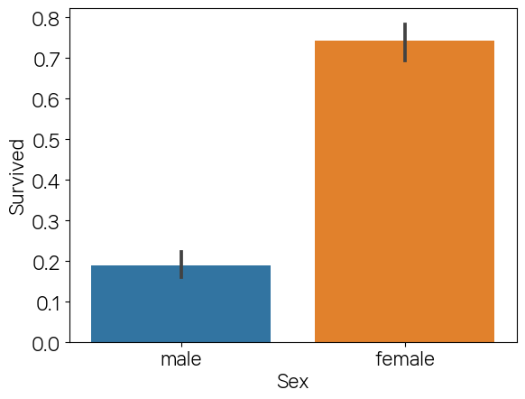

```python
import pandas as pd
import numpy as np
import matplotlib.pyplot as plt
import seaborn as sns
```


```python
pd.read_csv('titanic.csv')
```


<div>
<style scoped>
    .dataframe tbody tr th:only-of-type {
        vertical-align: middle;
    }

    .dataframe tbody tr th {
        vertical-align: top;
    }

    .dataframe thead th {
        text-align: right;
    }
</style>
<table border="1" class="dataframe">
  <thead>
    <tr style="text-align: right;">
      <th></th>
      <th>PassengerId</th>
      <th>Survived</th>
      <th>Pclass</th>
      <th>Name</th>
      <th>Sex</th>
      <th>Age</th>
      <th>SibSp</th>
      <th>Parch</th>
      <th>Ticket</th>
      <th>Fare</th>
      <th>Cabin</th>
      <th>Embarked</th>
    </tr>
  </thead>
  <tbody>
    <tr>
      <th>0</th>
      <td>1</td>
      <td>0</td>
      <td>3</td>
      <td>Braund, Mr. Owen Harris</td>
      <td>male</td>
      <td>22.0</td>
      <td>1</td>
      <td>0</td>
      <td>A/5 21171</td>
      <td>7.2500</td>
      <td>NaN</td>
      <td>S</td>
    </tr>
    <tr>
      <th>1</th>
      <td>2</td>
      <td>1</td>
      <td>1</td>
      <td>Cumings, Mrs. John Bradley (Florence Briggs Th...</td>
      <td>female</td>
      <td>38.0</td>
      <td>1</td>
      <td>0</td>
      <td>PC 17599</td>
      <td>71.2833</td>
      <td>C85</td>
      <td>C</td>
    </tr>
    <tr>
      <th>2</th>
      <td>3</td>
      <td>1</td>
      <td>3</td>
      <td>Heikkinen, Miss. Laina</td>
      <td>female</td>
      <td>26.0</td>
      <td>0</td>
      <td>0</td>
      <td>STON/O2. 3101282</td>
      <td>7.9250</td>
      <td>NaN</td>
      <td>S</td>
    </tr>
    <tr>
      <th>3</th>
      <td>4</td>
      <td>1</td>
      <td>1</td>
      <td>Futrelle, Mrs. Jacques Heath (Lily May Peel)</td>
      <td>female</td>
      <td>35.0</td>
      <td>1</td>
      <td>0</td>
      <td>113803</td>
      <td>53.1000</td>
      <td>C123</td>
      <td>S</td>
    </tr>
    <tr>
      <th>4</th>
      <td>5</td>
      <td>0</td>
      <td>3</td>
      <td>Allen, Mr. William Henry</td>
      <td>male</td>
      <td>35.0</td>
      <td>0</td>
      <td>0</td>
      <td>373450</td>
      <td>8.0500</td>
      <td>NaN</td>
      <td>S</td>
    </tr>
    <tr>
      <th>...</th>
      <td>...</td>
      <td>...</td>
      <td>...</td>
      <td>...</td>
      <td>...</td>
      <td>...</td>
      <td>...</td>
      <td>...</td>
      <td>...</td>
      <td>...</td>
      <td>...</td>
      <td>...</td>
    </tr>
    <tr>
      <th>886</th>
      <td>887</td>
      <td>0</td>
      <td>2</td>
      <td>Montvila, Rev. Juozas</td>
      <td>male</td>
      <td>27.0</td>
      <td>0</td>
      <td>0</td>
      <td>211536</td>
      <td>13.0000</td>
      <td>NaN</td>
      <td>S</td>
    </tr>
    <tr>
      <th>887</th>
      <td>888</td>
      <td>1</td>
      <td>1</td>
      <td>Graham, Miss. Margaret Edith</td>
      <td>female</td>
      <td>19.0</td>
      <td>0</td>
      <td>0</td>
      <td>112053</td>
      <td>30.0000</td>
      <td>B42</td>
      <td>S</td>
    </tr>
    <tr>
      <th>888</th>
      <td>889</td>
      <td>0</td>
      <td>3</td>
      <td>Johnston, Miss. Catherine Helen "Carrie"</td>
      <td>female</td>
      <td>NaN</td>
      <td>1</td>
      <td>2</td>
      <td>W./C. 6607</td>
      <td>23.4500</td>
      <td>NaN</td>
      <td>S</td>
    </tr>
    <tr>
      <th>889</th>
      <td>890</td>
      <td>1</td>
      <td>1</td>
      <td>Behr, Mr. Karl Howell</td>
      <td>male</td>
      <td>26.0</td>
      <td>0</td>
      <td>0</td>
      <td>111369</td>
      <td>30.0000</td>
      <td>C148</td>
      <td>C</td>
    </tr>
    <tr>
      <th>890</th>
      <td>891</td>
      <td>0</td>
      <td>3</td>
      <td>Dooley, Mr. Patrick</td>
      <td>male</td>
      <td>32.0</td>
      <td>0</td>
      <td>0</td>
      <td>370376</td>
      <td>7.7500</td>
      <td>NaN</td>
      <td>Q</td>
    </tr>
  </tbody>
</table>
<p>891 rows × 12 columns</p>
</div>


```python
df = pd.read_csv('titanic.csv')
df.info()
```

    <class 'pandas.core.frame.DataFrame'>
    RangeIndex: 891 entries, 0 to 890
    Data columns (total 12 columns):
     #   Column       Non-Null Count  Dtype  
    ---  ------       --------------  -----  
     0   PassengerId  891 non-null    int64  
     1   Survived     891 non-null    int64  
     2   Pclass       891 non-null    int64  
     3   Name         891 non-null    object 
     4   Sex          891 non-null    object 
     5   Age          714 non-null    float64
     6   SibSp        891 non-null    int64  
     7   Parch        891 non-null    int64  
     8   Ticket       891 non-null    object 
     9   Fare         891 non-null    float64
     10  Cabin        204 non-null    object 
     11  Embarked     889 non-null    object 
    dtypes: float64(2), int64(5), object(5)
    memory usage: 83.7+ KB
    


```python
df.isnull().sum()
```


    PassengerId      0
    Survived         0
    Pclass           0
    Name             0
    Sex              0
    Age            177
    SibSp            0
    Parch            0
    Ticket           0
    Fare             0
    Cabin          687
    Embarked         2
    dtype: int64


```python
df['Age'].fillna(df['Age'].mean(),inplace=True)
df['Cabin'].fillna('N',inplace=True)
df['Embarked'].fillna('N',inplace=True)
```


```python
df.isnull().sum()
```


    PassengerId    0
    Survived       0
    Pclass         0
    Name           0
    Sex            0
    Age            0
    SibSp          0
    Parch          0
    Ticket         0
    Fare           0
    Cabin          0
    Embarked       0
    dtype: int64


```python
df.info()
```

    <class 'pandas.core.frame.DataFrame'>
    RangeIndex: 891 entries, 0 to 890
    Data columns (total 12 columns):
     #   Column       Non-Null Count  Dtype  
    ---  ------       --------------  -----  
     0   PassengerId  891 non-null    int64  
     1   Survived     891 non-null    int64  
     2   Pclass       891 non-null    int64  
     3   Name         891 non-null    object 
     4   Sex          891 non-null    object 
     5   Age          891 non-null    float64
     6   SibSp        891 non-null    int64  
     7   Parch        891 non-null    int64  
     8   Ticket       891 non-null    object 
     9   Fare         891 non-null    float64
     10  Cabin        891 non-null    object 
     11  Embarked     891 non-null    object 
    dtypes: float64(2), int64(5), object(5)
    memory usage: 83.7+ KB
    


```python
df['Sex'].value_counts()
```


    male      577
    female    314
    Name: Sex, dtype: int64


```python
df['Cabin'].value_counts()
```


    N              687
    C23 C25 C27      4
    G6               4
    B96 B98          4
    C22 C26          3
                  ... 
    E34              1
    C7               1
    C54              1
    E36              1
    C148             1
    Name: Cabin, Length: 148, dtype: int64


```python
df['Embarked'].value_counts()
```


    S    644
    C    168
    Q     77
    N      2
    Name: Embarked, dtype: int64


```python
df['Cabin'] = df['Cabin'].str[:1]
```


```python
df['Cabin'].value_counts()
```


    N    687
    C     59
    B     47
    D     33
    E     32
    A     15
    F     13
    G      4
    T      1
    Name: Cabin, dtype: int64


```python
df.groupby(['Sex','Survived'])['Survived'].count()
```


    Sex     Survived
    female  0            81
            1           233
    male    0           468
            1           109
    Name: Survived, dtype: int64


```python
sns.barplot(data=df,x='Sex',y='Survived')
```


    <AxesSubplot:xlabel='Sex', ylabel='Survived'>


    

    


```python
sns.barplot(data=df,x='Pclass',y='Survived',hue='Sex')
```


    <AxesSubplot:xlabel='Pclass', ylabel='Survived'>


    

    


```python
df['Pclass'].value_counts()
```


    3    491
    1    216
    2    184
    Name: Pclass, dtype: int64


```python
df['Age'].value_counts()
```


    29.699118    177
    24.000000     30
    22.000000     27
    18.000000     26
    28.000000     25
                ... 
    36.500000      1
    55.500000      1
    0.920000       1
    23.500000      1
    74.000000      1
    Name: Age, Length: 89, dtype: int64


```python
def get_category(age):
    cat=''
    if age <= -1:cat='Unknown'
    elif age <= 5:cat='Baby'
    elif age <= 12:cat='Child'    
    elif age <= 18:cat='Teenager'
    elif age <= 25:cat='Student'    
    elif age <= 35:cat='Young Adult'    
    elif age <= 60:cat='Adult'
    else: cat = 'Elderly'
    return cat
```


```python
df['Age'].apply(lambda x : get_category(x))
```


    0          Student
    1            Adult
    2      Young Adult
    3      Young Adult
    4      Young Adult
              ...     
    886    Young Adult
    887        Student
    888    Young Adult
    889    Young Adult
    890    Young Adult
    Name: Age, Length: 891, dtype: object


```python
df['Age_cat'] = df['Age'].apply(lambda x : get_category(x))
```


```python
plt.figure(figsize=(10,6))
group_name = ['Unknown','Baby','Child','Teenager','Student','Young Adult','Adult','Elderly']
sns.barplot(data=df,x='Age_cat',y='Survived',hue='Sex',order=group_name)
```


    <AxesSubplot:xlabel='Age_cat', ylabel='Survived'>


    

    


```python
from sklearn.preprocessing import LabelEncoder
```


```python
def encode_features(dataDF):
    features=['Sex', 'Cabin', 'Embarked']
    for feature in features:
        le = LabelEncoder()
        dataDF[feature] = le.fit_transform(dataDF[feature])
    return dataDF
```


```python
df = encode_features(df)
```


```python
df.head(2)
```


<div>
<style scoped>
    .dataframe tbody tr th:only-of-type {
        vertical-align: middle;
    }

    .dataframe tbody tr th {
        vertical-align: top;
    }

    .dataframe thead th {
        text-align: right;
    }
</style>
<table border="1" class="dataframe">
  <thead>
    <tr style="text-align: right;">
      <th></th>
      <th>PassengerId</th>
      <th>Survived</th>
      <th>Pclass</th>
      <th>Name</th>
      <th>Sex</th>
      <th>Age</th>
      <th>SibSp</th>
      <th>Parch</th>
      <th>Ticket</th>
      <th>Fare</th>
      <th>Cabin</th>
      <th>Embarked</th>
      <th>Age_cat</th>
    </tr>
  </thead>
  <tbody>
    <tr>
      <th>0</th>
      <td>1</td>
      <td>0</td>
      <td>3</td>
      <td>Braund, Mr. Owen Harris</td>
      <td>1</td>
      <td>22.0</td>
      <td>1</td>
      <td>0</td>
      <td>A/5 21171</td>
      <td>7.2500</td>
      <td>7</td>
      <td>3</td>
      <td>Student</td>
    </tr>
    <tr>
      <th>1</th>
      <td>2</td>
      <td>1</td>
      <td>1</td>
      <td>Cumings, Mrs. John Bradley (Florence Briggs Th...</td>
      <td>0</td>
      <td>38.0</td>
      <td>1</td>
      <td>0</td>
      <td>PC 17599</td>
      <td>71.2833</td>
      <td>2</td>
      <td>0</td>
      <td>Adult</td>
    </tr>
  </tbody>
</table>
</div>


```python
def encode_features(dataDF):
    features=['Sex', 'Cabin', 'Embarked']
    for feature in features:
        le = LabelEncoder()
        dataDF[feature] = le.fit_transform(dataDF[feature])
        print(le.classes_)
    return dataDF
```


```python
df = encode_features(df)
```

    [0 1]
    [0 1 2 3 4 5 6 7 8]
    [0 1 2 3]
    


```python
def fillna(df):
    df['Age'].fillna(df['Age'].mean(),inplace=True)
    df['Cabin'].fillna('N',inplace=True)
    df['Embarked'].fillna('N',inplace=True)
    df['Fare'].fillna('0',inplace=True)
    return df

def drop_features(df):
    df.drop(columns=['PassengerId','Name','Ticket'],inplace=True)
    return df


def format_features(df):
    from sklearn.preprocessing import LabelEncoder
    df['Cabin'] = df['Cabin'].str[:1]
    features=['Sex', 'Cabin', 'Embarked']
    for feature in features:
        le = LabelEncoder()
        df[feature] = le.fit_transform(df[feature])
        print(le.classes_)
    return df

def transform_features(df):
    df = fillna(df)
    df = drop_features(df)
    df = format_features(df)
    return df

df = pd.read_csv('titanic.csv')
y = df['Survived']
X = df.drop(columns=['Survived'])
X = transform_features(X)
```


```python
X.head(2)
```


<div>
<style scoped>
    .dataframe tbody tr th:only-of-type {
        vertical-align: middle;
    }

    .dataframe tbody tr th {
        vertical-align: top;
    }

    .dataframe thead th {
        text-align: right;
    }
</style>
<table border="1" class="dataframe">
  <thead>
    <tr style="text-align: right;">
      <th></th>
      <th>Pclass</th>
      <th>Sex</th>
      <th>Age</th>
      <th>SibSp</th>
      <th>Parch</th>
      <th>Fare</th>
      <th>Cabin</th>
      <th>Embarked</th>
    </tr>
  </thead>
  <tbody>
    <tr>
      <th>0</th>
      <td>3</td>
      <td>1</td>
      <td>22.0</td>
      <td>1</td>
      <td>0</td>
      <td>7.2500</td>
      <td>7</td>
      <td>3</td>
    </tr>
    <tr>
      <th>1</th>
      <td>1</td>
      <td>0</td>
      <td>38.0</td>
      <td>1</td>
      <td>0</td>
      <td>71.2833</td>
      <td>2</td>
      <td>0</td>
    </tr>
  </tbody>
</table>
</div>


```python
from sklearn.model_selection import train_test_split
```


```python
X_train,X_test,y_train,y_test = train_test_split(X,y,test_size=0.2,random_state=11)
```


```python
from sklearn.tree import DecisionTreeClassifier
from sklearn.ensemble import RandomForestClassifier
from sklearn.linear_model import LogisticRegression
from sklearn.metrics import accuracy_score
```


```python
dt_clf = DecisionTreeClassifier(random_state=11)
rf_clf = RandomForestClassifier(random_state=11)
lr_clf = LogisticRegression(solver='liblinear')
```


```python
dt_clf.fit(X_train,y_train)
dt_pred = dt_clf.predict(X_test)
accuracy_score(y_test,dt_pred)
```


    0.7877094972067039


```python
rf_clf.fit(X_train,y_train)
rf_pred = rf_clf.predict(X_test)
accuracy_score(y_test,rf_pred)
```


    0.8547486033519553


```python
lr_clf.fit(X_train,y_train)
lr_pred = lr_clf.predict(X_test)
accuracy_score(y_test,lr_pred)
```


    0.8659217877094972


```python
from sklearn.model_selection import GridSearchCV
```


```python
param ={
    'max_depth':[2,3,5,10],
    'min_samples_split':[2,3,5],
    'min_samples_leaf':[1,5,8]
}
```


```python
grid = GridSearchCV(dt_clf,param,cv=5,scoring='accuracy')
grid.fit(X_train,y_train)
```


    GridSearchCV(cv=5, estimator=DecisionTreeClassifier(random_state=11),
                 param_grid={'max_depth': [2, 3, 5, 10],
                             'min_samples_leaf': [1, 5, 8],
                             'min_samples_split': [2, 3, 5]},
                 scoring='accuracy')


```python
pred = grid.predict(X_test)
```


```python
accuracy_score(y_test,pred)
```


    0.8715083798882681


```python
grid.best_params_
```


    {'max_depth': 3, 'min_samples_leaf': 5, 'min_samples_split': 2}


```python
list(zip(y_test,pred))
```


    [(1, 1),
     (1, 0),
     (0, 0),
     (0, 0),
     (0, 0),
     (0, 0),
     (0, 0),
     (1, 1),
     (0, 0),
     (1, 1),
     (0, 0),
     (0, 0),
     (0, 0),
     (0, 0),
     (0, 0),
     (0, 0),
     (0, 0),
     (0, 0),
     (0, 0),
     (1, 1),
     (0, 0),
     (0, 0),
     (0, 0),
     (0, 0),
     (0, 0),
     (0, 0),
     (0, 0),
     (0, 0),
     (0, 0),
     (0, 0),
     (1, 1),
     (1, 1),
     (0, 0),
     (1, 1),
     (1, 0),
     (0, 0),
     (0, 0),
     (0, 1),
     (0, 0),
     (1, 0),
     (0, 0),
     (0, 0),
     (1, 1),
     (1, 1),
     (0, 1),
     (1, 1),
     (1, 1),
     (1, 0),
     (1, 1),
     (0, 0),
     (0, 0),
     (0, 0),
     (0, 0),
     (1, 1),
     (0, 0),
     (0, 0),
     (0, 0),
     (0, 0),
     (0, 0),
     (0, 0),
     (0, 0),
     (0, 0),
     (1, 0),
     (0, 0),
     (1, 0),
     (0, 0),
     (1, 1),
     (1, 1),
     (1, 1),
     (0, 0),
     (0, 0),
     (0, 0),
     (0, 0),
     (1, 1),
     (0, 0),
     (0, 0),
     (1, 1),
     (0, 0),
     (1, 1),
     (1, 0),
     (1, 1),
     (1, 1),
     (1, 1),
     (0, 0),
     (1, 1),
     (1, 1),
     (0, 0),
     (1, 0),
     (1, 1),
     (0, 0),
     (0, 0),
     (0, 0),
     (0, 0),
     (0, 0),
     (1, 1),
     (0, 0),
     (1, 1),
     (0, 0),
     (0, 0),
     (1, 1),
     (0, 0),
     (0, 1),
     (1, 1),
     (0, 0),
     (0, 1),
     (1, 0),
     (0, 0),
     (0, 0),
     (0, 0),
     (1, 0),
     (0, 0),
     (0, 0),
     (1, 1),
     (1, 0),
     (0, 0),
     (0, 0),
     (0, 0),
     (0, 0),
     (1, 1),
     (0, 0),
     (0, 0),
     (0, 0),
     (0, 0),
     (0, 0),
     (0, 0),
     (0, 0),
     (0, 0),
     (0, 0),
     (1, 1),
     (0, 0),
     (1, 1),
     (1, 0),
     (1, 1),
     (0, 0),
     (0, 1),
     (0, 0),
     (1, 1),
     (0, 0),
     (0, 0),
     (1, 1),
     (0, 1),
     (0, 0),
     (0, 0),
     (0, 0),
     (0, 0),
     (1, 1),
     (0, 0),
     (0, 0),
     (1, 1),
     (0, 0),
     (0, 0),
     (1, 1),
     (0, 1),
     (0, 0),
     (1, 1),
     (1, 1),
     (0, 0),
     (0, 0),
     (0, 1),
     (1, 1),
     (0, 0),
     (1, 1),
     (0, 0),
     (1, 1),
     (0, 0),
     (0, 1),
     (1, 1),
     (1, 0),
     (0, 0),
     (1, 1),
     (0, 0),
     (1, 1),
     (0, 0),
     (0, 0),
     (0, 0),
     (0, 0),
     (0, 0),
     (0, 0),
     (1, 0)]


