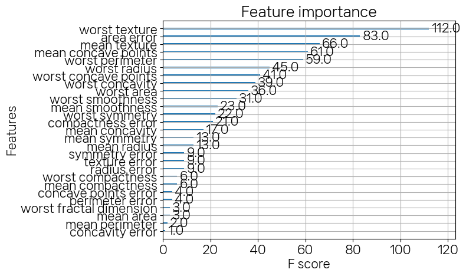
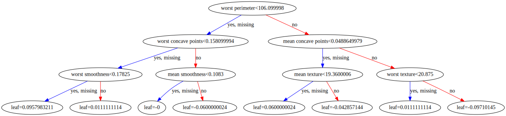
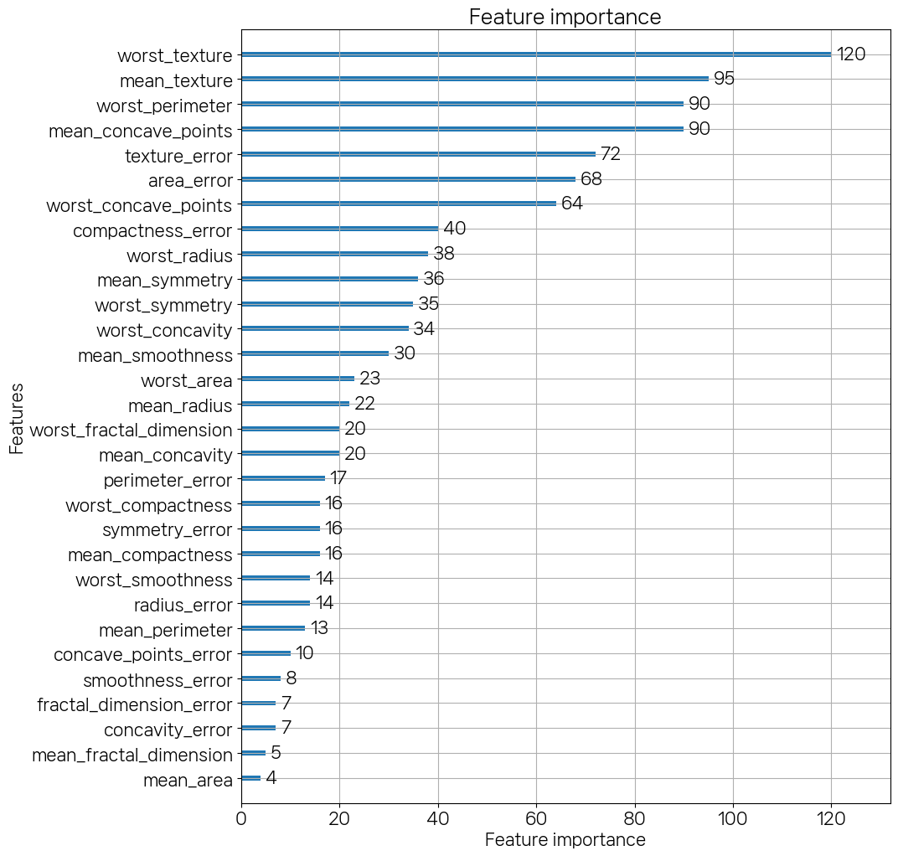
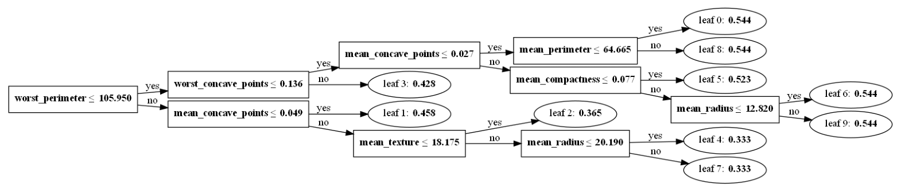

```python
import pandas as pd
from sklearn.ensemble import GradientBoostingClassifier
import warnings
warnings.filterwarnings('ignore')
from sklearn.metrics import accuracy_score
```


```python
def get_new_df(old_df):
    dup_df = pd.DataFrame(data=old_df.groupby('column_name').cumcount(),columns=['dup_cnt'])
    dup_df = dup_df.reset_index()
    new_df = pd.merge(old_df.reset_index(),dup_df,how='outer')
    new_df['column_name'] = new_df[['column_name','dup_cnt']].apply(lambda x: x[0]+'_'+str(x[1]) if x[1]>0 else x[0],axis=1)
    new_df.drop(columns=['index'],inplace=True)
    
    return new_df

def get_human_dataset():
    import pandas as pd
    feature_name_df = pd.read_csv('human_activity/features.txt',
                                sep='\s+',
                                header=None,
                                names=['column_index','column_name'])
    name_df = get_new_df(feature_name_df)
    feature_name = name_df.iloc[:,1].values.tolist()
    X_train = pd.read_csv('human_activity/train/X_train.txt',sep='\s+',names=feature_name)
    X_test = pd.read_csv('human_activity/test/X_test.txt',sep='\s+',names=feature_name)
    y_train = pd.read_csv('human_activity/train/y_train.txt',sep='\s+',names=['action'])
    y_test = pd.read_csv('human_activity/test/y_test.txt',sep='\s+',names=['action'])
    return X_train,X_test,y_train,y_test
```


```python
X_train,X_test,y_train,y_test = get_human_dataset()
```


```python
%%time
gb_clf = GradientBoostingClassifier(random_state=0)
gb_clf.fit(X_train,y_train)
pred = gb_clf.predict(X_test)
accuracy_score(y_test,pred)
```

    Wall time: 8min 26s
    


    0.9389209365456397


```python
import xgboost as xgb
from xgboost import XGBClassifier
from xgboost import plot_importance
import pandas as pd
import numpy as np
from sklearn.datasets import load_breast_cancer
from sklearn.model_selection import train_test_split
```


```python
xgb.__version__
```


    '1.5.0'


```python
dataset = load_breast_cancer(as_frame=True)
```


```python
dataset.data
```


<div>
<style scoped>
    .dataframe tbody tr th:only-of-type {
        vertical-align: middle;
    }

    .dataframe tbody tr th {
        vertical-align: top;
    }

    .dataframe thead th {
        text-align: right;
    }
</style>
<table border="1" class="dataframe">
  <thead>
    <tr style="text-align: right;">
      <th></th>
      <th>mean radius</th>
      <th>mean texture</th>
      <th>mean perimeter</th>
      <th>mean area</th>
      <th>mean smoothness</th>
      <th>mean compactness</th>
      <th>mean concavity</th>
      <th>mean concave points</th>
      <th>mean symmetry</th>
      <th>mean fractal dimension</th>
      <th>...</th>
      <th>worst radius</th>
      <th>worst texture</th>
      <th>worst perimeter</th>
      <th>worst area</th>
      <th>worst smoothness</th>
      <th>worst compactness</th>
      <th>worst concavity</th>
      <th>worst concave points</th>
      <th>worst symmetry</th>
      <th>worst fractal dimension</th>
    </tr>
  </thead>
  <tbody>
    <tr>
      <th>0</th>
      <td>17.99</td>
      <td>10.38</td>
      <td>122.80</td>
      <td>1001.0</td>
      <td>0.11840</td>
      <td>0.27760</td>
      <td>0.30010</td>
      <td>0.14710</td>
      <td>0.2419</td>
      <td>0.07871</td>
      <td>...</td>
      <td>25.380</td>
      <td>17.33</td>
      <td>184.60</td>
      <td>2019.0</td>
      <td>0.16220</td>
      <td>0.66560</td>
      <td>0.7119</td>
      <td>0.2654</td>
      <td>0.4601</td>
      <td>0.11890</td>
    </tr>
    <tr>
      <th>1</th>
      <td>20.57</td>
      <td>17.77</td>
      <td>132.90</td>
      <td>1326.0</td>
      <td>0.08474</td>
      <td>0.07864</td>
      <td>0.08690</td>
      <td>0.07017</td>
      <td>0.1812</td>
      <td>0.05667</td>
      <td>...</td>
      <td>24.990</td>
      <td>23.41</td>
      <td>158.80</td>
      <td>1956.0</td>
      <td>0.12380</td>
      <td>0.18660</td>
      <td>0.2416</td>
      <td>0.1860</td>
      <td>0.2750</td>
      <td>0.08902</td>
    </tr>
    <tr>
      <th>2</th>
      <td>19.69</td>
      <td>21.25</td>
      <td>130.00</td>
      <td>1203.0</td>
      <td>0.10960</td>
      <td>0.15990</td>
      <td>0.19740</td>
      <td>0.12790</td>
      <td>0.2069</td>
      <td>0.05999</td>
      <td>...</td>
      <td>23.570</td>
      <td>25.53</td>
      <td>152.50</td>
      <td>1709.0</td>
      <td>0.14440</td>
      <td>0.42450</td>
      <td>0.4504</td>
      <td>0.2430</td>
      <td>0.3613</td>
      <td>0.08758</td>
    </tr>
    <tr>
      <th>3</th>
      <td>11.42</td>
      <td>20.38</td>
      <td>77.58</td>
      <td>386.1</td>
      <td>0.14250</td>
      <td>0.28390</td>
      <td>0.24140</td>
      <td>0.10520</td>
      <td>0.2597</td>
      <td>0.09744</td>
      <td>...</td>
      <td>14.910</td>
      <td>26.50</td>
      <td>98.87</td>
      <td>567.7</td>
      <td>0.20980</td>
      <td>0.86630</td>
      <td>0.6869</td>
      <td>0.2575</td>
      <td>0.6638</td>
      <td>0.17300</td>
    </tr>
    <tr>
      <th>4</th>
      <td>20.29</td>
      <td>14.34</td>
      <td>135.10</td>
      <td>1297.0</td>
      <td>0.10030</td>
      <td>0.13280</td>
      <td>0.19800</td>
      <td>0.10430</td>
      <td>0.1809</td>
      <td>0.05883</td>
      <td>...</td>
      <td>22.540</td>
      <td>16.67</td>
      <td>152.20</td>
      <td>1575.0</td>
      <td>0.13740</td>
      <td>0.20500</td>
      <td>0.4000</td>
      <td>0.1625</td>
      <td>0.2364</td>
      <td>0.07678</td>
    </tr>
    <tr>
      <th>...</th>
      <td>...</td>
      <td>...</td>
      <td>...</td>
      <td>...</td>
      <td>...</td>
      <td>...</td>
      <td>...</td>
      <td>...</td>
      <td>...</td>
      <td>...</td>
      <td>...</td>
      <td>...</td>
      <td>...</td>
      <td>...</td>
      <td>...</td>
      <td>...</td>
      <td>...</td>
      <td>...</td>
      <td>...</td>
      <td>...</td>
      <td>...</td>
    </tr>
    <tr>
      <th>564</th>
      <td>21.56</td>
      <td>22.39</td>
      <td>142.00</td>
      <td>1479.0</td>
      <td>0.11100</td>
      <td>0.11590</td>
      <td>0.24390</td>
      <td>0.13890</td>
      <td>0.1726</td>
      <td>0.05623</td>
      <td>...</td>
      <td>25.450</td>
      <td>26.40</td>
      <td>166.10</td>
      <td>2027.0</td>
      <td>0.14100</td>
      <td>0.21130</td>
      <td>0.4107</td>
      <td>0.2216</td>
      <td>0.2060</td>
      <td>0.07115</td>
    </tr>
    <tr>
      <th>565</th>
      <td>20.13</td>
      <td>28.25</td>
      <td>131.20</td>
      <td>1261.0</td>
      <td>0.09780</td>
      <td>0.10340</td>
      <td>0.14400</td>
      <td>0.09791</td>
      <td>0.1752</td>
      <td>0.05533</td>
      <td>...</td>
      <td>23.690</td>
      <td>38.25</td>
      <td>155.00</td>
      <td>1731.0</td>
      <td>0.11660</td>
      <td>0.19220</td>
      <td>0.3215</td>
      <td>0.1628</td>
      <td>0.2572</td>
      <td>0.06637</td>
    </tr>
    <tr>
      <th>566</th>
      <td>16.60</td>
      <td>28.08</td>
      <td>108.30</td>
      <td>858.1</td>
      <td>0.08455</td>
      <td>0.10230</td>
      <td>0.09251</td>
      <td>0.05302</td>
      <td>0.1590</td>
      <td>0.05648</td>
      <td>...</td>
      <td>18.980</td>
      <td>34.12</td>
      <td>126.70</td>
      <td>1124.0</td>
      <td>0.11390</td>
      <td>0.30940</td>
      <td>0.3403</td>
      <td>0.1418</td>
      <td>0.2218</td>
      <td>0.07820</td>
    </tr>
    <tr>
      <th>567</th>
      <td>20.60</td>
      <td>29.33</td>
      <td>140.10</td>
      <td>1265.0</td>
      <td>0.11780</td>
      <td>0.27700</td>
      <td>0.35140</td>
      <td>0.15200</td>
      <td>0.2397</td>
      <td>0.07016</td>
      <td>...</td>
      <td>25.740</td>
      <td>39.42</td>
      <td>184.60</td>
      <td>1821.0</td>
      <td>0.16500</td>
      <td>0.86810</td>
      <td>0.9387</td>
      <td>0.2650</td>
      <td>0.4087</td>
      <td>0.12400</td>
    </tr>
    <tr>
      <th>568</th>
      <td>7.76</td>
      <td>24.54</td>
      <td>47.92</td>
      <td>181.0</td>
      <td>0.05263</td>
      <td>0.04362</td>
      <td>0.00000</td>
      <td>0.00000</td>
      <td>0.1587</td>
      <td>0.05884</td>
      <td>...</td>
      <td>9.456</td>
      <td>30.37</td>
      <td>59.16</td>
      <td>268.6</td>
      <td>0.08996</td>
      <td>0.06444</td>
      <td>0.0000</td>
      <td>0.0000</td>
      <td>0.2871</td>
      <td>0.07039</td>
    </tr>
  </tbody>
</table>
<p>569 rows × 30 columns</p>
</div>


```python
dataset.target
```


    0      0
    1      0
    2      0
    3      0
    4      0
          ..
    564    0
    565    0
    566    0
    567    0
    568    1
    Name: target, Length: 569, dtype: int32


```python
dataset.target_names
```


    array(['malignant', 'benign'], dtype='<U9')


```python
dataset.target.value_counts()
```


    1    357
    0    212
    Name: target, dtype: int64


```python
X_train,X_test,y_train,y_test = train_test_split(dataset.data,dataset.target,test_size=0.2,random_state=156)
X_tr,X_val,y_tr,y_val = train_test_split(X_train,y_train,test_size=0.1,random_state=156)
```


```python
X_train.shape,X_test.shape
```


    ((455, 30), (114, 30))


```python
X_tr.shape,X_val.shape
```


    ((409, 30), (46, 30))


```python
y_train.value_counts()
```


    1    280
    0    175
    Name: target, dtype: int64


```python
dtr = xgb.DMatrix(data=X_tr,label=y_tr)
dval = xgb.DMatrix(data=X_val,label=y_val)
dtest = xgb.DMatrix(data=X_test,label=y_test)
```


```python
params = {
    'max_depth' : 3,
    'eta' : 0.05,
    'objective' : 'binary:logistic',
    'eval_metric' : 'logloss'
}
num_rounds = 500
eval_list=[(dtr,'train'),(dval,'eval')]
```


```python
xgb.train(params,dtr,num_rounds,evals=eval_list,early_stopping_rounds=50)
```

    [0]	train-logloss:0.65016	eval-logloss:0.66183
    [1]	train-logloss:0.61131	eval-logloss:0.63609
    [2]	train-logloss:0.57563	eval-logloss:0.61144
    [3]	train-logloss:0.54310	eval-logloss:0.59204
    [4]	train-logloss:0.51323	eval-logloss:0.57329
    [5]	train-logloss:0.48447	eval-logloss:0.55037
    [6]	train-logloss:0.45796	eval-logloss:0.52929
    [7]	train-logloss:0.43436	eval-logloss:0.51534
    [8]	train-logloss:0.41150	eval-logloss:0.49718
    [9]	train-logloss:0.39027	eval-logloss:0.48154
    [10]	train-logloss:0.37128	eval-logloss:0.46990
    [11]	train-logloss:0.35254	eval-logloss:0.45474
    [12]	train-logloss:0.33528	eval-logloss:0.44229
    [13]	train-logloss:0.31893	eval-logloss:0.42961
    [14]	train-logloss:0.30439	eval-logloss:0.42065
    [15]	train-logloss:0.29000	eval-logloss:0.40958
    [16]	train-logloss:0.27651	eval-logloss:0.39887
    [17]	train-logloss:0.26389	eval-logloss:0.39050
    [18]	train-logloss:0.25210	eval-logloss:0.38254
    [19]	train-logloss:0.24123	eval-logloss:0.37393
    [20]	train-logloss:0.23076	eval-logloss:0.36789
    [21]	train-logloss:0.22091	eval-logloss:0.36017
    [22]	train-logloss:0.21155	eval-logloss:0.35421
    [23]	train-logloss:0.20263	eval-logloss:0.34683
    [24]	train-logloss:0.19434	eval-logloss:0.34111
    [25]	train-logloss:0.18637	eval-logloss:0.33634
    [26]	train-logloss:0.17875	eval-logloss:0.33082
    [27]	train-logloss:0.17167	eval-logloss:0.32675
    [28]	train-logloss:0.16481	eval-logloss:0.32099
    [29]	train-logloss:0.15835	eval-logloss:0.31671
    [30]	train-logloss:0.15225	eval-logloss:0.31277
    [31]	train-logloss:0.14650	eval-logloss:0.30882
    [32]	train-logloss:0.14102	eval-logloss:0.30437
    [33]	train-logloss:0.13590	eval-logloss:0.30103
    [34]	train-logloss:0.13109	eval-logloss:0.29794
    [35]	train-logloss:0.12647	eval-logloss:0.29499
    [36]	train-logloss:0.12197	eval-logloss:0.29295
    [37]	train-logloss:0.11784	eval-logloss:0.29043
    [38]	train-logloss:0.11379	eval-logloss:0.28927
    [39]	train-logloss:0.10994	eval-logloss:0.28578
    [40]	train-logloss:0.10638	eval-logloss:0.28364
    [41]	train-logloss:0.10302	eval-logloss:0.28183
    [42]	train-logloss:0.09963	eval-logloss:0.28005
    [43]	train-logloss:0.09649	eval-logloss:0.27972
    [44]	train-logloss:0.09359	eval-logloss:0.27744
    [45]	train-logloss:0.09080	eval-logloss:0.27542
    [46]	train-logloss:0.08807	eval-logloss:0.27504
    [47]	train-logloss:0.08541	eval-logloss:0.27458
    [48]	train-logloss:0.08299	eval-logloss:0.27348
    [49]	train-logloss:0.08035	eval-logloss:0.27247
    [50]	train-logloss:0.07786	eval-logloss:0.27163
    [51]	train-logloss:0.07550	eval-logloss:0.27094
    [52]	train-logloss:0.07344	eval-logloss:0.26967
    [53]	train-logloss:0.07147	eval-logloss:0.27008
    [54]	train-logloss:0.06964	eval-logloss:0.26890
    [55]	train-logloss:0.06766	eval-logloss:0.26854
    [56]	train-logloss:0.06592	eval-logloss:0.26900
    [57]	train-logloss:0.06433	eval-logloss:0.26790
    [58]	train-logloss:0.06259	eval-logloss:0.26663
    [59]	train-logloss:0.06107	eval-logloss:0.26743
    [60]	train-logloss:0.05957	eval-logloss:0.26610
    [61]	train-logloss:0.05817	eval-logloss:0.26644
    [62]	train-logloss:0.05691	eval-logloss:0.26673
    [63]	train-logloss:0.05550	eval-logloss:0.26550
    [64]	train-logloss:0.05422	eval-logloss:0.26443
    [65]	train-logloss:0.05311	eval-logloss:0.26500
    [66]	train-logloss:0.05207	eval-logloss:0.26591
    [67]	train-logloss:0.05093	eval-logloss:0.26501
    [68]	train-logloss:0.04976	eval-logloss:0.26435
    [69]	train-logloss:0.04872	eval-logloss:0.26360
    [70]	train-logloss:0.04776	eval-logloss:0.26319
    [71]	train-logloss:0.04680	eval-logloss:0.26255
    [72]	train-logloss:0.04580	eval-logloss:0.26204
    [73]	train-logloss:0.04484	eval-logloss:0.26254
    [74]	train-logloss:0.04388	eval-logloss:0.26289
    [75]	train-logloss:0.04309	eval-logloss:0.26249
    [76]	train-logloss:0.04224	eval-logloss:0.26217
    [77]	train-logloss:0.04133	eval-logloss:0.26166
    [78]	train-logloss:0.04050	eval-logloss:0.26179
    [79]	train-logloss:0.03967	eval-logloss:0.26103
    [80]	train-logloss:0.03877	eval-logloss:0.26094
    [81]	train-logloss:0.03806	eval-logloss:0.26148
    [82]	train-logloss:0.03740	eval-logloss:0.26054
    [83]	train-logloss:0.03676	eval-logloss:0.25967
    [84]	train-logloss:0.03605	eval-logloss:0.25905
    [85]	train-logloss:0.03545	eval-logloss:0.26007
    [86]	train-logloss:0.03488	eval-logloss:0.25984
    [87]	train-logloss:0.03425	eval-logloss:0.25933
    [88]	train-logloss:0.03361	eval-logloss:0.25932
    [89]	train-logloss:0.03311	eval-logloss:0.26002
    [90]	train-logloss:0.03260	eval-logloss:0.25936
    [91]	train-logloss:0.03202	eval-logloss:0.25886
    [92]	train-logloss:0.03152	eval-logloss:0.25918
    [93]	train-logloss:0.03107	eval-logloss:0.25865
    [94]	train-logloss:0.03049	eval-logloss:0.25951
    [95]	train-logloss:0.03007	eval-logloss:0.26091
    [96]	train-logloss:0.02963	eval-logloss:0.26014
    [97]	train-logloss:0.02913	eval-logloss:0.25974
    [98]	train-logloss:0.02866	eval-logloss:0.25937
    [99]	train-logloss:0.02829	eval-logloss:0.25893
    [100]	train-logloss:0.02789	eval-logloss:0.25928
    [101]	train-logloss:0.02751	eval-logloss:0.25955
    [102]	train-logloss:0.02714	eval-logloss:0.25901
    [103]	train-logloss:0.02668	eval-logloss:0.25991
    [104]	train-logloss:0.02634	eval-logloss:0.25950
    [105]	train-logloss:0.02594	eval-logloss:0.25924
    [106]	train-logloss:0.02556	eval-logloss:0.25901
    [107]	train-logloss:0.02522	eval-logloss:0.25738
    [108]	train-logloss:0.02492	eval-logloss:0.25702
    [109]	train-logloss:0.02453	eval-logloss:0.25789
    [110]	train-logloss:0.02418	eval-logloss:0.25770
    [111]	train-logloss:0.02384	eval-logloss:0.25842
    [112]	train-logloss:0.02356	eval-logloss:0.25810
    [113]	train-logloss:0.02322	eval-logloss:0.25848
    [114]	train-logloss:0.02290	eval-logloss:0.25833
    [115]	train-logloss:0.02260	eval-logloss:0.25820
    [116]	train-logloss:0.02229	eval-logloss:0.25905
    [117]	train-logloss:0.02204	eval-logloss:0.25878
    [118]	train-logloss:0.02176	eval-logloss:0.25728
    [119]	train-logloss:0.02149	eval-logloss:0.25722
    [120]	train-logloss:0.02119	eval-logloss:0.25764
    [121]	train-logloss:0.02095	eval-logloss:0.25761
    [122]	train-logloss:0.02067	eval-logloss:0.25832
    [123]	train-logloss:0.02045	eval-logloss:0.25808
    [124]	train-logloss:0.02023	eval-logloss:0.25855
    [125]	train-logloss:0.01998	eval-logloss:0.25714
    [126]	train-logloss:0.01973	eval-logloss:0.25587
    [127]	train-logloss:0.01946	eval-logloss:0.25640
    [128]	train-logloss:0.01927	eval-logloss:0.25685
    [129]	train-logloss:0.01908	eval-logloss:0.25665
    [130]	train-logloss:0.01886	eval-logloss:0.25712
    [131]	train-logloss:0.01863	eval-logloss:0.25609
    [132]	train-logloss:0.01839	eval-logloss:0.25649
    [133]	train-logloss:0.01816	eval-logloss:0.25789
    [134]	train-logloss:0.01802	eval-logloss:0.25811
    [135]	train-logloss:0.01785	eval-logloss:0.25794
    [136]	train-logloss:0.01763	eval-logloss:0.25876
    [137]	train-logloss:0.01748	eval-logloss:0.25884
    [138]	train-logloss:0.01732	eval-logloss:0.25867
    [139]	train-logloss:0.01719	eval-logloss:0.25876
    [140]	train-logloss:0.01696	eval-logloss:0.25987
    [141]	train-logloss:0.01681	eval-logloss:0.25960
    [142]	train-logloss:0.01669	eval-logloss:0.25982
    [143]	train-logloss:0.01656	eval-logloss:0.25992
    [144]	train-logloss:0.01638	eval-logloss:0.26035
    [145]	train-logloss:0.01623	eval-logloss:0.26055
    [146]	train-logloss:0.01606	eval-logloss:0.26092
    [147]	train-logloss:0.01589	eval-logloss:0.26137
    [148]	train-logloss:0.01572	eval-logloss:0.25999
    [149]	train-logloss:0.01557	eval-logloss:0.26028
    [150]	train-logloss:0.01546	eval-logloss:0.26048
    [151]	train-logloss:0.01531	eval-logloss:0.26142
    [152]	train-logloss:0.01515	eval-logloss:0.26188
    [153]	train-logloss:0.01501	eval-logloss:0.26227
    [154]	train-logloss:0.01486	eval-logloss:0.26287
    [155]	train-logloss:0.01476	eval-logloss:0.26299
    [156]	train-logloss:0.01461	eval-logloss:0.26346
    [157]	train-logloss:0.01448	eval-logloss:0.26379
    [158]	train-logloss:0.01434	eval-logloss:0.26306
    [159]	train-logloss:0.01424	eval-logloss:0.26237
    [160]	train-logloss:0.01410	eval-logloss:0.26251
    [161]	train-logloss:0.01401	eval-logloss:0.26265
    [162]	train-logloss:0.01392	eval-logloss:0.26264
    [163]	train-logloss:0.01380	eval-logloss:0.26250
    [164]	train-logloss:0.01372	eval-logloss:0.26264
    [165]	train-logloss:0.01359	eval-logloss:0.26255
    [166]	train-logloss:0.01350	eval-logloss:0.26188
    [167]	train-logloss:0.01342	eval-logloss:0.26203
    [168]	train-logloss:0.01331	eval-logloss:0.26190
    [169]	train-logloss:0.01319	eval-logloss:0.26184
    [170]	train-logloss:0.01312	eval-logloss:0.26133
    [171]	train-logloss:0.01304	eval-logloss:0.26148
    [172]	train-logloss:0.01297	eval-logloss:0.26157
    [173]	train-logloss:0.01285	eval-logloss:0.26253
    [174]	train-logloss:0.01278	eval-logloss:0.26229
    [175]	train-logloss:0.01267	eval-logloss:0.26086
    [176]	train-logloss:0.01258	eval-logloss:0.26103
    


    <xgboost.core.Booster at 0x1b1f1ee2d30>


```python
model = xgb.train(params,dtr,num_rounds,evals=eval_list,early_stopping_rounds=50)

pred_probs = model.predict(dtest)
```

    [0]	train-logloss:0.65016	eval-logloss:0.66183
    [1]	train-logloss:0.61131	eval-logloss:0.63609
    [2]	train-logloss:0.57563	eval-logloss:0.61144
    [3]	train-logloss:0.54310	eval-logloss:0.59204
    [4]	train-logloss:0.51323	eval-logloss:0.57329
    [5]	train-logloss:0.48447	eval-logloss:0.55037
    [6]	train-logloss:0.45796	eval-logloss:0.52929
    [7]	train-logloss:0.43436	eval-logloss:0.51534
    [8]	train-logloss:0.41150	eval-logloss:0.49718
    [9]	train-logloss:0.39027	eval-logloss:0.48154
    [10]	train-logloss:0.37128	eval-logloss:0.46990
    [11]	train-logloss:0.35254	eval-logloss:0.45474
    [12]	train-logloss:0.33528	eval-logloss:0.44229
    [13]	train-logloss:0.31893	eval-logloss:0.42961
    [14]	train-logloss:0.30439	eval-logloss:0.42065
    [15]	train-logloss:0.29000	eval-logloss:0.40958
    [16]	train-logloss:0.27651	eval-logloss:0.39887
    [17]	train-logloss:0.26389	eval-logloss:0.39050
    [18]	train-logloss:0.25210	eval-logloss:0.38254
    [19]	train-logloss:0.24123	eval-logloss:0.37393
    [20]	train-logloss:0.23076	eval-logloss:0.36789
    [21]	train-logloss:0.22091	eval-logloss:0.36017
    [22]	train-logloss:0.21155	eval-logloss:0.35421
    [23]	train-logloss:0.20263	eval-logloss:0.34683
    [24]	train-logloss:0.19434	eval-logloss:0.34111
    [25]	train-logloss:0.18637	eval-logloss:0.33634
    [26]	train-logloss:0.17875	eval-logloss:0.33082
    [27]	train-logloss:0.17167	eval-logloss:0.32675
    [28]	train-logloss:0.16481	eval-logloss:0.32099
    [29]	train-logloss:0.15835	eval-logloss:0.31671
    [30]	train-logloss:0.15225	eval-logloss:0.31277
    [31]	train-logloss:0.14650	eval-logloss:0.30882
    [32]	train-logloss:0.14102	eval-logloss:0.30437
    [33]	train-logloss:0.13590	eval-logloss:0.30103
    [34]	train-logloss:0.13109	eval-logloss:0.29794
    [35]	train-logloss:0.12647	eval-logloss:0.29499
    [36]	train-logloss:0.12197	eval-logloss:0.29295
    [37]	train-logloss:0.11784	eval-logloss:0.29043
    [38]	train-logloss:0.11379	eval-logloss:0.28927
    [39]	train-logloss:0.10994	eval-logloss:0.28578
    [40]	train-logloss:0.10638	eval-logloss:0.28364
    [41]	train-logloss:0.10302	eval-logloss:0.28183
    [42]	train-logloss:0.09963	eval-logloss:0.28005
    [43]	train-logloss:0.09649	eval-logloss:0.27972
    [44]	train-logloss:0.09359	eval-logloss:0.27744
    [45]	train-logloss:0.09080	eval-logloss:0.27542
    [46]	train-logloss:0.08807	eval-logloss:0.27504
    [47]	train-logloss:0.08541	eval-logloss:0.27458
    [48]	train-logloss:0.08299	eval-logloss:0.27348
    [49]	train-logloss:0.08035	eval-logloss:0.27247
    [50]	train-logloss:0.07786	eval-logloss:0.27163
    [51]	train-logloss:0.07550	eval-logloss:0.27094
    [52]	train-logloss:0.07344	eval-logloss:0.26967
    [53]	train-logloss:0.07147	eval-logloss:0.27008
    [54]	train-logloss:0.06964	eval-logloss:0.26890
    [55]	train-logloss:0.06766	eval-logloss:0.26854
    [56]	train-logloss:0.06592	eval-logloss:0.26900
    [57]	train-logloss:0.06433	eval-logloss:0.26790
    [58]	train-logloss:0.06259	eval-logloss:0.26663
    [59]	train-logloss:0.06107	eval-logloss:0.26743
    [60]	train-logloss:0.05957	eval-logloss:0.26610
    [61]	train-logloss:0.05817	eval-logloss:0.26644
    [62]	train-logloss:0.05691	eval-logloss:0.26673
    [63]	train-logloss:0.05550	eval-logloss:0.26550
    [64]	train-logloss:0.05422	eval-logloss:0.26443
    [65]	train-logloss:0.05311	eval-logloss:0.26500
    [66]	train-logloss:0.05207	eval-logloss:0.26591
    [67]	train-logloss:0.05093	eval-logloss:0.26501
    [68]	train-logloss:0.04976	eval-logloss:0.26435
    [69]	train-logloss:0.04872	eval-logloss:0.26360
    [70]	train-logloss:0.04776	eval-logloss:0.26319
    [71]	train-logloss:0.04680	eval-logloss:0.26255
    [72]	train-logloss:0.04580	eval-logloss:0.26204
    [73]	train-logloss:0.04484	eval-logloss:0.26254
    [74]	train-logloss:0.04388	eval-logloss:0.26289
    [75]	train-logloss:0.04309	eval-logloss:0.26249
    [76]	train-logloss:0.04224	eval-logloss:0.26217
    [77]	train-logloss:0.04133	eval-logloss:0.26166
    [78]	train-logloss:0.04050	eval-logloss:0.26179
    [79]	train-logloss:0.03967	eval-logloss:0.26103
    [80]	train-logloss:0.03877	eval-logloss:0.26094
    [81]	train-logloss:0.03806	eval-logloss:0.26148
    [82]	train-logloss:0.03740	eval-logloss:0.26054
    [83]	train-logloss:0.03676	eval-logloss:0.25967
    [84]	train-logloss:0.03605	eval-logloss:0.25905
    [85]	train-logloss:0.03545	eval-logloss:0.26007
    [86]	train-logloss:0.03488	eval-logloss:0.25984
    [87]	train-logloss:0.03425	eval-logloss:0.25933
    [88]	train-logloss:0.03361	eval-logloss:0.25932
    [89]	train-logloss:0.03311	eval-logloss:0.26002
    [90]	train-logloss:0.03260	eval-logloss:0.25936
    [91]	train-logloss:0.03202	eval-logloss:0.25886
    [92]	train-logloss:0.03152	eval-logloss:0.25918
    [93]	train-logloss:0.03107	eval-logloss:0.25865
    [94]	train-logloss:0.03049	eval-logloss:0.25951
    [95]	train-logloss:0.03007	eval-logloss:0.26091
    [96]	train-logloss:0.02963	eval-logloss:0.26014
    [97]	train-logloss:0.02913	eval-logloss:0.25974
    [98]	train-logloss:0.02866	eval-logloss:0.25937
    [99]	train-logloss:0.02829	eval-logloss:0.25893
    [100]	train-logloss:0.02789	eval-logloss:0.25928
    [101]	train-logloss:0.02751	eval-logloss:0.25955
    [102]	train-logloss:0.02714	eval-logloss:0.25901
    [103]	train-logloss:0.02668	eval-logloss:0.25991
    [104]	train-logloss:0.02634	eval-logloss:0.25950
    [105]	train-logloss:0.02594	eval-logloss:0.25924
    [106]	train-logloss:0.02556	eval-logloss:0.25901
    [107]	train-logloss:0.02522	eval-logloss:0.25738
    [108]	train-logloss:0.02492	eval-logloss:0.25702
    [109]	train-logloss:0.02453	eval-logloss:0.25789
    [110]	train-logloss:0.02418	eval-logloss:0.25770
    [111]	train-logloss:0.02384	eval-logloss:0.25842
    [112]	train-logloss:0.02356	eval-logloss:0.25810
    [113]	train-logloss:0.02322	eval-logloss:0.25848
    [114]	train-logloss:0.02290	eval-logloss:0.25833
    [115]	train-logloss:0.02260	eval-logloss:0.25820
    [116]	train-logloss:0.02229	eval-logloss:0.25905
    [117]	train-logloss:0.02204	eval-logloss:0.25878
    [118]	train-logloss:0.02176	eval-logloss:0.25728
    [119]	train-logloss:0.02149	eval-logloss:0.25722
    [120]	train-logloss:0.02119	eval-logloss:0.25764
    [121]	train-logloss:0.02095	eval-logloss:0.25761
    [122]	train-logloss:0.02067	eval-logloss:0.25832
    [123]	train-logloss:0.02045	eval-logloss:0.25808
    [124]	train-logloss:0.02023	eval-logloss:0.25855
    [125]	train-logloss:0.01998	eval-logloss:0.25714
    [126]	train-logloss:0.01973	eval-logloss:0.25587
    [127]	train-logloss:0.01946	eval-logloss:0.25640
    [128]	train-logloss:0.01927	eval-logloss:0.25685
    [129]	train-logloss:0.01908	eval-logloss:0.25665
    [130]	train-logloss:0.01886	eval-logloss:0.25712
    [131]	train-logloss:0.01863	eval-logloss:0.25609
    [132]	train-logloss:0.01839	eval-logloss:0.25649
    [133]	train-logloss:0.01816	eval-logloss:0.25789
    [134]	train-logloss:0.01802	eval-logloss:0.25811
    [135]	train-logloss:0.01785	eval-logloss:0.25794
    [136]	train-logloss:0.01763	eval-logloss:0.25876
    [137]	train-logloss:0.01748	eval-logloss:0.25884
    [138]	train-logloss:0.01732	eval-logloss:0.25867
    [139]	train-logloss:0.01719	eval-logloss:0.25876
    [140]	train-logloss:0.01696	eval-logloss:0.25987
    [141]	train-logloss:0.01681	eval-logloss:0.25960
    [142]	train-logloss:0.01669	eval-logloss:0.25982
    [143]	train-logloss:0.01656	eval-logloss:0.25992
    [144]	train-logloss:0.01638	eval-logloss:0.26035
    [145]	train-logloss:0.01623	eval-logloss:0.26055
    [146]	train-logloss:0.01606	eval-logloss:0.26092
    [147]	train-logloss:0.01589	eval-logloss:0.26137
    [148]	train-logloss:0.01572	eval-logloss:0.25999
    [149]	train-logloss:0.01557	eval-logloss:0.26028
    [150]	train-logloss:0.01546	eval-logloss:0.26048
    [151]	train-logloss:0.01531	eval-logloss:0.26142
    [152]	train-logloss:0.01515	eval-logloss:0.26188
    [153]	train-logloss:0.01501	eval-logloss:0.26227
    [154]	train-logloss:0.01486	eval-logloss:0.26287
    [155]	train-logloss:0.01476	eval-logloss:0.26299
    [156]	train-logloss:0.01461	eval-logloss:0.26346
    [157]	train-logloss:0.01448	eval-logloss:0.26379
    [158]	train-logloss:0.01434	eval-logloss:0.26306
    [159]	train-logloss:0.01424	eval-logloss:0.26237
    [160]	train-logloss:0.01410	eval-logloss:0.26251
    [161]	train-logloss:0.01401	eval-logloss:0.26265
    [162]	train-logloss:0.01392	eval-logloss:0.26264
    [163]	train-logloss:0.01380	eval-logloss:0.26250
    [164]	train-logloss:0.01372	eval-logloss:0.26264
    [165]	train-logloss:0.01359	eval-logloss:0.26255
    [166]	train-logloss:0.01350	eval-logloss:0.26188
    [167]	train-logloss:0.01342	eval-logloss:0.26203
    [168]	train-logloss:0.01331	eval-logloss:0.26190
    [169]	train-logloss:0.01319	eval-logloss:0.26184
    [170]	train-logloss:0.01312	eval-logloss:0.26133
    [171]	train-logloss:0.01304	eval-logloss:0.26148
    [172]	train-logloss:0.01297	eval-logloss:0.26157
    [173]	train-logloss:0.01285	eval-logloss:0.26253
    [174]	train-logloss:0.01278	eval-logloss:0.26229
    [175]	train-logloss:0.01267	eval-logloss:0.26086
    


```python
np.round(pred_probs[:10],3)
```


    array([0.845, 0.008, 0.68 , 0.081, 0.975, 0.999, 0.998, 0.998, 0.996,
           0.001], dtype=float32)


```python
pred = [1 if x>0.5 else 0 for x in pred_probs]
```


```python
pred
```


    [1,
     0,
     1,
     0,
     1,
     1,
     1,
     1,
     1,
     0,
     0,
     0,
     1,
     1,
     1,
     1,
     1,
     1,
     1,
     1,
     0,
     0,
     0,
     1,
     0,
     1,
     0,
     0,
     1,
     0,
     1,
     0,
     1,
     1,
     0,
     0,
     1,
     1,
     0,
     1,
     0,
     1,
     1,
     1,
     1,
     1,
     0,
     1,
     1,
     1,
     1,
     0,
     1,
     1,
     1,
     1,
     1,
     1,
     1,
     1,
     1,
     1,
     0,
     0,
     1,
     1,
     0,
     1,
     1,
     1,
     0,
     1,
     0,
     1,
     1,
     0,
     1,
     1,
     1,
     0,
     0,
     1,
     1,
     1,
     1,
     1,
     1,
     1,
     1,
     0,
     0,
     1,
     0,
     0,
     1,
     0,
     0,
     1,
     0,
     1,
     0,
     0,
     1,
     1,
     1,
     1,
     1,
     1,
     1,
     1,
     1,
     1,
     1,
     1]


```python
def get_clf_eval(y_test, pred, pred_proba_1):
    from sklearn.metrics import accuracy_score, precision_score, recall_score, confusion_matrix, f1_score, roc_auc_score
    confusion = confusion_matrix(y_test,pred)
    accuracy = accuracy_score(y_test,pred)
    precision = precision_score(y_test,pred)
    recall = recall_score(y_test,pred)
    f1 = f1_score(y_test,pred)
    auc = roc_auc_score(y_test,pred_proba_1)
    print('오차행렬')
    print(confusion)
    print(f'정확도:{accuracy:.4f}, 정밀도:{precision:.4f}, 재현율{recall:.4f}, F1:{f1:.4f}, AUC:{auc:.4f}')
```


```python
get_clf_eval(y_test,pred,pred_probs)
```

    오차행렬
    [[34  3]
     [ 2 75]]
    정확도:0.9561, 정밀도:0.9615, 재현율0.9740, F1:0.9677, AUC:0.9937
    


```python
plot_importance(model)
```


    <AxesSubplot:title={'center':'Feature importance'}, xlabel='F score', ylabel='Features'>


    

    


```python
from xgboost import to_graphviz
to_graphviz(model)
```


    

    


```python
from xgboost import XGBClassifier
```


```python
model = XGBClassifier(n_estimators=500,learning_rate=0.05,max_depth=3,eval_metric='logloss')
```


```python
model.fit(X_train,y_train,verbose=True)
```


    XGBClassifier(base_score=0.5, booster='gbtree', colsample_bylevel=1,
                  colsample_bynode=1, colsample_bytree=1, enable_categorical=False,
                  eval_metric='logloss', gamma=0, gpu_id=-1, importance_type=None,
                  interaction_constraints='', learning_rate=0.05, max_delta_step=0,
                  max_depth=3, min_child_weight=1, missing=nan,
                  monotone_constraints='()', n_estimators=500, n_jobs=8,
                  num_parallel_tree=1, predictor='auto', random_state=0,
                  reg_alpha=0, reg_lambda=1, scale_pos_weight=1, subsample=1,
                  tree_method='exact', validate_parameters=1, verbosity=None)


```python
pred = model.predict(X_test)
```


```python
pred
```


    array([1, 0, 1, 0, 1, 1, 1, 1, 1, 0, 0, 0, 1, 1, 1, 1, 1, 1, 1, 1, 0, 1,
           0, 1, 0, 1, 0, 0, 1, 0, 1, 0, 1, 1, 0, 0, 1, 1, 0, 1, 0, 1, 1, 1,
           1, 1, 0, 1, 1, 1, 1, 0, 1, 1, 1, 1, 1, 1, 1, 1, 1, 1, 0, 0, 1, 1,
           0, 1, 1, 1, 0, 1, 0, 1, 1, 0, 1, 1, 1, 0, 0, 1, 1, 1, 1, 1, 1, 1,
           1, 0, 0, 1, 0, 0, 1, 0, 0, 1, 0, 1, 0, 0, 1, 1, 1, 1, 1, 1, 1, 1,
           1, 1, 1, 1])


```python
pred_proba = model.predict_proba(X_test)
```


```python
pred_proba[:,1]
```


    array([9.12188411e-01, 3.26777250e-03, 9.18584466e-01, 1.12425499e-01,
           9.91267264e-01, 9.99935985e-01, 9.99622345e-01, 9.99181807e-01,
           9.95988905e-01, 1.21930876e-04, 3.26498965e-04, 2.35663480e-04,
           9.99827325e-01, 9.99892950e-01, 9.98326719e-01, 9.92636442e-01,
           9.93933976e-01, 9.99863386e-01, 9.99317884e-01, 9.99371588e-01,
           7.17270304e-04, 6.14884675e-01, 2.00337556e-04, 9.99950290e-01,
           2.73418846e-04, 8.82554293e-01, 3.71223688e-03, 3.85174004e-04,
           9.98981297e-01, 4.70896214e-02, 9.98191297e-01, 4.11191548e-04,
           9.89034534e-01, 7.66591251e-01, 3.31286481e-03, 1.45611324e-04,
           9.98210073e-01, 9.98775661e-01, 2.10140735e-01, 9.99862194e-01,
           2.12053820e-01, 9.97596204e-01, 9.99571860e-01, 9.99598920e-01,
           9.99083996e-01, 9.84561980e-01, 1.25431782e-02, 9.99352515e-01,
           9.98489738e-01, 9.99605715e-01, 9.97448742e-01, 4.12069174e-04,
           9.99003828e-01, 9.99744356e-01, 9.99462426e-01, 9.99344289e-01,
           9.99861002e-01, 9.91916835e-01, 9.99539137e-01, 9.61040139e-01,
           9.98758674e-01, 9.77937937e-01, 8.05007468e-04, 4.46018035e-04,
           9.99605358e-01, 9.99295592e-01, 9.03019914e-04, 9.89207387e-01,
           9.99782741e-01, 9.99626398e-01, 4.78562928e-04, 9.98247385e-01,
           2.28664241e-04, 9.98528004e-01, 9.98889625e-01, 1.68968734e-04,
           9.99672890e-01, 9.99839902e-01, 9.99839544e-01, 1.16767813e-04,
           1.85251178e-04, 9.83601868e-01, 9.99406099e-01, 9.99420047e-01,
           9.99271572e-01, 9.93693352e-01, 9.98360932e-01, 9.99571860e-01,
           9.89574730e-01, 2.23127907e-04, 1.61858186e-01, 9.99864578e-01,
           7.57402275e-04, 1.90093089e-03, 9.99784172e-01, 4.20990912e-03,
           8.70510284e-03, 9.97238755e-01, 3.27697693e-04, 7.22961247e-01,
           4.12358483e-03, 7.13363173e-04, 9.98041272e-01, 9.96626973e-01,
           5.29846489e-01, 9.99231815e-01, 9.99245286e-01, 9.91033375e-01,
           9.98749495e-01, 9.99877691e-01, 6.45176947e-01, 9.99190748e-01,
           9.98065531e-01, 9.98803973e-01], dtype=float32)


```python
get_clf_eval(y_test,pred,pred_proba[:,1])
# 오차행렬
# [[34  3]
#  [ 2 75]]
# 정확도:0.9561, 정밀도:0.9615, 재현율0.9740, F1:0.9677, AUC:0.9937
```

    오차행렬
    [[34  3]
     [ 1 76]]
    정확도:0.9649, 정밀도:0.9620, 재현율0.9870, F1:0.9744, AUC:0.9951
    


```python
model = XGBClassifier(n_estimators=500,learning_rate=0.05,max_depth=3)
evals=[(X_tr,y_tr),(X_val,y_val)]
model.fit(X_tr,
          y_tr,
          verbose=True,
          eval_set=evals,
          early_stopping_rounds=50,
          eval_metric='logloss')
pred = model.predict(X_test)
pred_proba = model.predict_proba(X_test)
get_clf_eval(y_test,pred,pred_proba[:,1])
```

    [0]	validation_0-logloss:0.65016	validation_1-logloss:0.66183
    [1]	validation_0-logloss:0.61131	validation_1-logloss:0.63609
    [2]	validation_0-logloss:0.57563	validation_1-logloss:0.61144
    [3]	validation_0-logloss:0.54310	validation_1-logloss:0.59204
    [4]	validation_0-logloss:0.51323	validation_1-logloss:0.57329
    [5]	validation_0-logloss:0.48447	validation_1-logloss:0.55037
    [6]	validation_0-logloss:0.45796	validation_1-logloss:0.52929
    [7]	validation_0-logloss:0.43436	validation_1-logloss:0.51534
    [8]	validation_0-logloss:0.41150	validation_1-logloss:0.49718
    [9]	validation_0-logloss:0.39027	validation_1-logloss:0.48154
    [10]	validation_0-logloss:0.37128	validation_1-logloss:0.46990
    [11]	validation_0-logloss:0.35254	validation_1-logloss:0.45474
    [12]	validation_0-logloss:0.33528	validation_1-logloss:0.44229
    [13]	validation_0-logloss:0.31893	validation_1-logloss:0.42961
    [14]	validation_0-logloss:0.30439	validation_1-logloss:0.42065
    [15]	validation_0-logloss:0.29000	validation_1-logloss:0.40958
    [16]	validation_0-logloss:0.27651	validation_1-logloss:0.39887
    [17]	validation_0-logloss:0.26389	validation_1-logloss:0.39050
    [18]	validation_0-logloss:0.25210	validation_1-logloss:0.38254
    [19]	validation_0-logloss:0.24123	validation_1-logloss:0.37393
    [20]	validation_0-logloss:0.23076	validation_1-logloss:0.36789
    [21]	validation_0-logloss:0.22091	validation_1-logloss:0.36017
    [22]	validation_0-logloss:0.21155	validation_1-logloss:0.35421
    [23]	validation_0-logloss:0.20263	validation_1-logloss:0.34683
    [24]	validation_0-logloss:0.19434	validation_1-logloss:0.34111
    [25]	validation_0-logloss:0.18637	validation_1-logloss:0.33634
    [26]	validation_0-logloss:0.17875	validation_1-logloss:0.33082
    [27]	validation_0-logloss:0.17167	validation_1-logloss:0.32675
    [28]	validation_0-logloss:0.16481	validation_1-logloss:0.32099
    [29]	validation_0-logloss:0.15835	validation_1-logloss:0.31671
    [30]	validation_0-logloss:0.15225	validation_1-logloss:0.31277
    [31]	validation_0-logloss:0.14650	validation_1-logloss:0.30882
    [32]	validation_0-logloss:0.14102	validation_1-logloss:0.30437
    [33]	validation_0-logloss:0.13590	validation_1-logloss:0.30103
    [34]	validation_0-logloss:0.13109	validation_1-logloss:0.29794
    [35]	validation_0-logloss:0.12647	validation_1-logloss:0.29499
    [36]	validation_0-logloss:0.12197	validation_1-logloss:0.29295
    [37]	validation_0-logloss:0.11784	validation_1-logloss:0.29043
    [38]	validation_0-logloss:0.11379	validation_1-logloss:0.28927
    [39]	validation_0-logloss:0.10994	validation_1-logloss:0.28578
    [40]	validation_0-logloss:0.10638	validation_1-logloss:0.28364
    [41]	validation_0-logloss:0.10302	validation_1-logloss:0.28183
    [42]	validation_0-logloss:0.09963	validation_1-logloss:0.28005
    [43]	validation_0-logloss:0.09649	validation_1-logloss:0.27972
    [44]	validation_0-logloss:0.09359	validation_1-logloss:0.27744
    [45]	validation_0-logloss:0.09080	validation_1-logloss:0.27542
    [46]	validation_0-logloss:0.08807	validation_1-logloss:0.27504
    [47]	validation_0-logloss:0.08541	validation_1-logloss:0.27458
    [48]	validation_0-logloss:0.08299	validation_1-logloss:0.27348
    [49]	validation_0-logloss:0.08035	validation_1-logloss:0.27247
    [50]	validation_0-logloss:0.07786	validation_1-logloss:0.27163
    [51]	validation_0-logloss:0.07550	validation_1-logloss:0.27094
    [52]	validation_0-logloss:0.07344	validation_1-logloss:0.26967
    [53]	validation_0-logloss:0.07147	validation_1-logloss:0.27008
    [54]	validation_0-logloss:0.06964	validation_1-logloss:0.26890
    [55]	validation_0-logloss:0.06766	validation_1-logloss:0.26854
    [56]	validation_0-logloss:0.06592	validation_1-logloss:0.26900
    [57]	validation_0-logloss:0.06433	validation_1-logloss:0.26790
    [58]	validation_0-logloss:0.06259	validation_1-logloss:0.26663
    [59]	validation_0-logloss:0.06107	validation_1-logloss:0.26743
    [60]	validation_0-logloss:0.05957	validation_1-logloss:0.26610
    [61]	validation_0-logloss:0.05817	validation_1-logloss:0.26644
    [62]	validation_0-logloss:0.05691	validation_1-logloss:0.26673
    [63]	validation_0-logloss:0.05550	validation_1-logloss:0.26550
    [64]	validation_0-logloss:0.05422	validation_1-logloss:0.26443
    [65]	validation_0-logloss:0.05311	validation_1-logloss:0.26500
    [66]	validation_0-logloss:0.05207	validation_1-logloss:0.26591
    [67]	validation_0-logloss:0.05093	validation_1-logloss:0.26501
    [68]	validation_0-logloss:0.04976	validation_1-logloss:0.26435
    [69]	validation_0-logloss:0.04872	validation_1-logloss:0.26360
    [70]	validation_0-logloss:0.04776	validation_1-logloss:0.26319
    [71]	validation_0-logloss:0.04680	validation_1-logloss:0.26255
    [72]	validation_0-logloss:0.04580	validation_1-logloss:0.26204
    [73]	validation_0-logloss:0.04484	validation_1-logloss:0.26254
    [74]	validation_0-logloss:0.04388	validation_1-logloss:0.26289
    [75]	validation_0-logloss:0.04309	validation_1-logloss:0.26249
    [76]	validation_0-logloss:0.04224	validation_1-logloss:0.26217
    [77]	validation_0-logloss:0.04133	validation_1-logloss:0.26166
    [78]	validation_0-logloss:0.04050	validation_1-logloss:0.26179
    [79]	validation_0-logloss:0.03967	validation_1-logloss:0.26103
    [80]	validation_0-logloss:0.03877	validation_1-logloss:0.26094
    [81]	validation_0-logloss:0.03806	validation_1-logloss:0.26148
    [82]	validation_0-logloss:0.03740	validation_1-logloss:0.26054
    [83]	validation_0-logloss:0.03676	validation_1-logloss:0.25967
    [84]	validation_0-logloss:0.03605	validation_1-logloss:0.25905
    [85]	validation_0-logloss:0.03545	validation_1-logloss:0.26007
    [86]	validation_0-logloss:0.03488	validation_1-logloss:0.25984
    [87]	validation_0-logloss:0.03425	validation_1-logloss:0.25933
    [88]	validation_0-logloss:0.03361	validation_1-logloss:0.25932
    [89]	validation_0-logloss:0.03311	validation_1-logloss:0.26002
    [90]	validation_0-logloss:0.03260	validation_1-logloss:0.25936
    [91]	validation_0-logloss:0.03202	validation_1-logloss:0.25886
    [92]	validation_0-logloss:0.03152	validation_1-logloss:0.25918
    [93]	validation_0-logloss:0.03107	validation_1-logloss:0.25865
    [94]	validation_0-logloss:0.03049	validation_1-logloss:0.25951
    [95]	validation_0-logloss:0.03007	validation_1-logloss:0.26091
    [96]	validation_0-logloss:0.02963	validation_1-logloss:0.26014
    [97]	validation_0-logloss:0.02913	validation_1-logloss:0.25974
    [98]	validation_0-logloss:0.02866	validation_1-logloss:0.25937
    [99]	validation_0-logloss:0.02829	validation_1-logloss:0.25893
    [100]	validation_0-logloss:0.02789	validation_1-logloss:0.25928
    [101]	validation_0-logloss:0.02751	validation_1-logloss:0.25955
    [102]	validation_0-logloss:0.02714	validation_1-logloss:0.25901
    [103]	validation_0-logloss:0.02668	validation_1-logloss:0.25991
    [104]	validation_0-logloss:0.02634	validation_1-logloss:0.25950
    [105]	validation_0-logloss:0.02594	validation_1-logloss:0.25924
    [106]	validation_0-logloss:0.02556	validation_1-logloss:0.25901
    [107]	validation_0-logloss:0.02522	validation_1-logloss:0.25738
    [108]	validation_0-logloss:0.02492	validation_1-logloss:0.25702
    [109]	validation_0-logloss:0.02453	validation_1-logloss:0.25789
    [110]	validation_0-logloss:0.02418	validation_1-logloss:0.25770
    [111]	validation_0-logloss:0.02384	validation_1-logloss:0.25842
    [112]	validation_0-logloss:0.02356	validation_1-logloss:0.25810
    [113]	validation_0-logloss:0.02322	validation_1-logloss:0.25848
    [114]	validation_0-logloss:0.02290	validation_1-logloss:0.25833
    [115]	validation_0-logloss:0.02260	validation_1-logloss:0.25820
    [116]	validation_0-logloss:0.02229	validation_1-logloss:0.25905
    [117]	validation_0-logloss:0.02204	validation_1-logloss:0.25878
    [118]	validation_0-logloss:0.02176	validation_1-logloss:0.25728
    [119]	validation_0-logloss:0.02149	validation_1-logloss:0.25722
    [120]	validation_0-logloss:0.02119	validation_1-logloss:0.25764
    [121]	validation_0-logloss:0.02095	validation_1-logloss:0.25761
    [122]	validation_0-logloss:0.02067	validation_1-logloss:0.25832
    [123]	validation_0-logloss:0.02045	validation_1-logloss:0.25808
    [124]	validation_0-logloss:0.02023	validation_1-logloss:0.25855
    [125]	validation_0-logloss:0.01998	validation_1-logloss:0.25714
    [126]	validation_0-logloss:0.01973	validation_1-logloss:0.25587
    [127]	validation_0-logloss:0.01946	validation_1-logloss:0.25640
    [128]	validation_0-logloss:0.01927	validation_1-logloss:0.25685
    [129]	validation_0-logloss:0.01908	validation_1-logloss:0.25665
    [130]	validation_0-logloss:0.01886	validation_1-logloss:0.25712
    [131]	validation_0-logloss:0.01863	validation_1-logloss:0.25609
    [132]	validation_0-logloss:0.01839	validation_1-logloss:0.25649
    [133]	validation_0-logloss:0.01816	validation_1-logloss:0.25789
    [134]	validation_0-logloss:0.01802	validation_1-logloss:0.25811
    [135]	validation_0-logloss:0.01785	validation_1-logloss:0.25794
    [136]	validation_0-logloss:0.01763	validation_1-logloss:0.25876
    [137]	validation_0-logloss:0.01748	validation_1-logloss:0.25884
    [138]	validation_0-logloss:0.01732	validation_1-logloss:0.25867
    [139]	validation_0-logloss:0.01719	validation_1-logloss:0.25876
    [140]	validation_0-logloss:0.01696	validation_1-logloss:0.25987
    [141]	validation_0-logloss:0.01681	validation_1-logloss:0.25960
    [142]	validation_0-logloss:0.01669	validation_1-logloss:0.25982
    [143]	validation_0-logloss:0.01656	validation_1-logloss:0.25992
    [144]	validation_0-logloss:0.01638	validation_1-logloss:0.26035
    [145]	validation_0-logloss:0.01623	validation_1-logloss:0.26055
    [146]	validation_0-logloss:0.01606	validation_1-logloss:0.26092
    [147]	validation_0-logloss:0.01589	validation_1-logloss:0.26137
    [148]	validation_0-logloss:0.01572	validation_1-logloss:0.25999
    [149]	validation_0-logloss:0.01557	validation_1-logloss:0.26028
    [150]	validation_0-logloss:0.01546	validation_1-logloss:0.26048
    [151]	validation_0-logloss:0.01531	validation_1-logloss:0.26142
    [152]	validation_0-logloss:0.01515	validation_1-logloss:0.26188
    [153]	validation_0-logloss:0.01501	validation_1-logloss:0.26227
    [154]	validation_0-logloss:0.01486	validation_1-logloss:0.26287
    [155]	validation_0-logloss:0.01476	validation_1-logloss:0.26299
    [156]	validation_0-logloss:0.01461	validation_1-logloss:0.26346
    [157]	validation_0-logloss:0.01448	validation_1-logloss:0.26379
    [158]	validation_0-logloss:0.01434	validation_1-logloss:0.26306
    [159]	validation_0-logloss:0.01424	validation_1-logloss:0.26237
    [160]	validation_0-logloss:0.01410	validation_1-logloss:0.26251
    [161]	validation_0-logloss:0.01401	validation_1-logloss:0.26265
    [162]	validation_0-logloss:0.01392	validation_1-logloss:0.26264
    [163]	validation_0-logloss:0.01380	validation_1-logloss:0.26250
    [164]	validation_0-logloss:0.01372	validation_1-logloss:0.26264
    [165]	validation_0-logloss:0.01359	validation_1-logloss:0.26255
    [166]	validation_0-logloss:0.01350	validation_1-logloss:0.26188
    [167]	validation_0-logloss:0.01342	validation_1-logloss:0.26203
    [168]	validation_0-logloss:0.01331	validation_1-logloss:0.26190
    [169]	validation_0-logloss:0.01319	validation_1-logloss:0.26184
    [170]	validation_0-logloss:0.01312	validation_1-logloss:0.26133
    [171]	validation_0-logloss:0.01304	validation_1-logloss:0.26148
    [172]	validation_0-logloss:0.01297	validation_1-logloss:0.26157
    [173]	validation_0-logloss:0.01285	validation_1-logloss:0.26253
    [174]	validation_0-logloss:0.01278	validation_1-logloss:0.26229
    [175]	validation_0-logloss:0.01267	validation_1-logloss:0.26086
    오차행렬
    [[34  3]
     [ 2 75]]
    정확도:0.9561, 정밀도:0.9615, 재현율0.9740, F1:0.9677, AUC:0.9933
    


```python
from xgboost import to_graphviz
to_graphviz(model)
```


    

    


```python
import lightgbm
```


```python
lightgbm.__version__
```


    '3.2.1'


```python
from lightgbm import LGBMClassifier
import pandas as pd
from sklearn.datasets import load_breast_cancer
from sklearn.model_selection import train_test_split
```


```python
dataset = load_breast_cancer(as_frame=True)
```


```python
X = dataset.data
y = dataset.target
X_train,X_test,y_train,y_test = train_test_split(X,y,test_size=0.2,random_state=156)
X_tr,X_val,y_tr,y_val = train_test_split(X_train,y_train,test_size=0.1,random_state=156)
```


```python
lgbm = LGBMClassifier(n_estimators=400,learning_rate=0.05)
evals = [(X_tr,y_tr),(X_val,y_val)]
lgbm.fit(X_tr,y_tr,early_stopping_rounds=50,eval_metric='logloss',eval_set=evals,verbose=True)
# valid 최적인 61라운드 이후 +50인 111번에서 학습을 멈춤
```

    [1]	training's binary_logloss: 0.625671	valid_1's binary_logloss: 0.628248
    Training until validation scores don't improve for 50 rounds
    [2]	training's binary_logloss: 0.588173	valid_1's binary_logloss: 0.601106
    [3]	training's binary_logloss: 0.554518	valid_1's binary_logloss: 0.577587
    [4]	training's binary_logloss: 0.523972	valid_1's binary_logloss: 0.556324
    [5]	training's binary_logloss: 0.49615	valid_1's binary_logloss: 0.537407
    [6]	training's binary_logloss: 0.470108	valid_1's binary_logloss: 0.519401
    [7]	training's binary_logloss: 0.446647	valid_1's binary_logloss: 0.502637
    [8]	training's binary_logloss: 0.425055	valid_1's binary_logloss: 0.488311
    [9]	training's binary_logloss: 0.405125	valid_1's binary_logloss: 0.474664
    [10]	training's binary_logloss: 0.386526	valid_1's binary_logloss: 0.461267
    [11]	training's binary_logloss: 0.367027	valid_1's binary_logloss: 0.444274
    [12]	training's binary_logloss: 0.350713	valid_1's binary_logloss: 0.432755
    [13]	training's binary_logloss: 0.334601	valid_1's binary_logloss: 0.421371
    [14]	training's binary_logloss: 0.319854	valid_1's binary_logloss: 0.411418
    [15]	training's binary_logloss: 0.306374	valid_1's binary_logloss: 0.402989
    [16]	training's binary_logloss: 0.293116	valid_1's binary_logloss: 0.393973
    [17]	training's binary_logloss: 0.280812	valid_1's binary_logloss: 0.384801
    [18]	training's binary_logloss: 0.268352	valid_1's binary_logloss: 0.376191
    [19]	training's binary_logloss: 0.256942	valid_1's binary_logloss: 0.368378
    [20]	training's binary_logloss: 0.246443	valid_1's binary_logloss: 0.362062
    [21]	training's binary_logloss: 0.236874	valid_1's binary_logloss: 0.355162
    [22]	training's binary_logloss: 0.227501	valid_1's binary_logloss: 0.348933
    [23]	training's binary_logloss: 0.218988	valid_1's binary_logloss: 0.342819
    [24]	training's binary_logloss: 0.210621	valid_1's binary_logloss: 0.337386
    [25]	training's binary_logloss: 0.202076	valid_1's binary_logloss: 0.331523
    [26]	training's binary_logloss: 0.194199	valid_1's binary_logloss: 0.326349
    [27]	training's binary_logloss: 0.187107	valid_1's binary_logloss: 0.322785
    [28]	training's binary_logloss: 0.180535	valid_1's binary_logloss: 0.317877
    [29]	training's binary_logloss: 0.173834	valid_1's binary_logloss: 0.313928
    [30]	training's binary_logloss: 0.167198	valid_1's binary_logloss: 0.310105
    [31]	training's binary_logloss: 0.161229	valid_1's binary_logloss: 0.307107
    [32]	training's binary_logloss: 0.155494	valid_1's binary_logloss: 0.303837
    [33]	training's binary_logloss: 0.149125	valid_1's binary_logloss: 0.300315
    [34]	training's binary_logloss: 0.144045	valid_1's binary_logloss: 0.297816
    [35]	training's binary_logloss: 0.139341	valid_1's binary_logloss: 0.295387
    [36]	training's binary_logloss: 0.134625	valid_1's binary_logloss: 0.293063
    [37]	training's binary_logloss: 0.129167	valid_1's binary_logloss: 0.289127
    [38]	training's binary_logloss: 0.12472	valid_1's binary_logloss: 0.288697
    [39]	training's binary_logloss: 0.11974	valid_1's binary_logloss: 0.28576
    [40]	training's binary_logloss: 0.115054	valid_1's binary_logloss: 0.282853
    [41]	training's binary_logloss: 0.110662	valid_1's binary_logloss: 0.279441
    [42]	training's binary_logloss: 0.106358	valid_1's binary_logloss: 0.28113
    [43]	training's binary_logloss: 0.102324	valid_1's binary_logloss: 0.279139
    [44]	training's binary_logloss: 0.0985699	valid_1's binary_logloss: 0.276465
    [45]	training's binary_logloss: 0.094858	valid_1's binary_logloss: 0.275946
    [46]	training's binary_logloss: 0.0912486	valid_1's binary_logloss: 0.272819
    [47]	training's binary_logloss: 0.0883115	valid_1's binary_logloss: 0.272306
    [48]	training's binary_logloss: 0.0849963	valid_1's binary_logloss: 0.270452
    [49]	training's binary_logloss: 0.0821742	valid_1's binary_logloss: 0.268671
    [50]	training's binary_logloss: 0.0789991	valid_1's binary_logloss: 0.267587
    [51]	training's binary_logloss: 0.0761072	valid_1's binary_logloss: 0.26626
    [52]	training's binary_logloss: 0.0732567	valid_1's binary_logloss: 0.265542
    [53]	training's binary_logloss: 0.0706388	valid_1's binary_logloss: 0.264547
    [54]	training's binary_logloss: 0.0683911	valid_1's binary_logloss: 0.26502
    [55]	training's binary_logloss: 0.0659347	valid_1's binary_logloss: 0.264388
    [56]	training's binary_logloss: 0.0636873	valid_1's binary_logloss: 0.263128
    [57]	training's binary_logloss: 0.0613354	valid_1's binary_logloss: 0.26231
    [58]	training's binary_logloss: 0.0591944	valid_1's binary_logloss: 0.262011
    [59]	training's binary_logloss: 0.057033	valid_1's binary_logloss: 0.261454
    [60]	training's binary_logloss: 0.0550801	valid_1's binary_logloss: 0.260746
    [61]	training's binary_logloss: 0.0532381	valid_1's binary_logloss: 0.260236
    [62]	training's binary_logloss: 0.0514074	valid_1's binary_logloss: 0.261586
    [63]	training's binary_logloss: 0.0494837	valid_1's binary_logloss: 0.261797
    [64]	training's binary_logloss: 0.0477826	valid_1's binary_logloss: 0.262533
    [65]	training's binary_logloss: 0.0460364	valid_1's binary_logloss: 0.263305
    [66]	training's binary_logloss: 0.0444552	valid_1's binary_logloss: 0.264072
    [67]	training's binary_logloss: 0.0427638	valid_1's binary_logloss: 0.266223
    [68]	training's binary_logloss: 0.0412449	valid_1's binary_logloss: 0.266817
    [69]	training's binary_logloss: 0.0398589	valid_1's binary_logloss: 0.267819
    [70]	training's binary_logloss: 0.0383095	valid_1's binary_logloss: 0.267484
    [71]	training's binary_logloss: 0.0368803	valid_1's binary_logloss: 0.270233
    [72]	training's binary_logloss: 0.0355637	valid_1's binary_logloss: 0.268442
    [73]	training's binary_logloss: 0.0341747	valid_1's binary_logloss: 0.26895
    [74]	training's binary_logloss: 0.0328302	valid_1's binary_logloss: 0.266958
    [75]	training's binary_logloss: 0.0317853	valid_1's binary_logloss: 0.268091
    [76]	training's binary_logloss: 0.0305626	valid_1's binary_logloss: 0.266419
    [77]	training's binary_logloss: 0.0295001	valid_1's binary_logloss: 0.268588
    [78]	training's binary_logloss: 0.0284699	valid_1's binary_logloss: 0.270964
    [79]	training's binary_logloss: 0.0273953	valid_1's binary_logloss: 0.270293
    [80]	training's binary_logloss: 0.0264668	valid_1's binary_logloss: 0.270523
    [81]	training's binary_logloss: 0.0254636	valid_1's binary_logloss: 0.270683
    [82]	training's binary_logloss: 0.0245911	valid_1's binary_logloss: 0.273187
    [83]	training's binary_logloss: 0.0236486	valid_1's binary_logloss: 0.275994
    [84]	training's binary_logloss: 0.0228047	valid_1's binary_logloss: 0.274053
    [85]	training's binary_logloss: 0.0221693	valid_1's binary_logloss: 0.273211
    [86]	training's binary_logloss: 0.0213043	valid_1's binary_logloss: 0.272626
    [87]	training's binary_logloss: 0.0203934	valid_1's binary_logloss: 0.27534
    [88]	training's binary_logloss: 0.0195552	valid_1's binary_logloss: 0.276228
    [89]	training's binary_logloss: 0.0188623	valid_1's binary_logloss: 0.27525
    [90]	training's binary_logloss: 0.0183664	valid_1's binary_logloss: 0.276485
    [91]	training's binary_logloss: 0.0176788	valid_1's binary_logloss: 0.277052
    [92]	training's binary_logloss: 0.0170059	valid_1's binary_logloss: 0.277686
    [93]	training's binary_logloss: 0.0164317	valid_1's binary_logloss: 0.275332
    [94]	training's binary_logloss: 0.015878	valid_1's binary_logloss: 0.276236
    [95]	training's binary_logloss: 0.0152959	valid_1's binary_logloss: 0.274538
    [96]	training's binary_logloss: 0.0147216	valid_1's binary_logloss: 0.275244
    [97]	training's binary_logloss: 0.0141758	valid_1's binary_logloss: 0.275829
    [98]	training's binary_logloss: 0.0136551	valid_1's binary_logloss: 0.276654
    [99]	training's binary_logloss: 0.0131585	valid_1's binary_logloss: 0.277859
    [100]	training's binary_logloss: 0.0126961	valid_1's binary_logloss: 0.279265
    [101]	training's binary_logloss: 0.0122421	valid_1's binary_logloss: 0.276695
    [102]	training's binary_logloss: 0.0118067	valid_1's binary_logloss: 0.278488
    [103]	training's binary_logloss: 0.0113994	valid_1's binary_logloss: 0.278932
    [104]	training's binary_logloss: 0.0109799	valid_1's binary_logloss: 0.280997
    [105]	training's binary_logloss: 0.0105953	valid_1's binary_logloss: 0.281454
    [106]	training's binary_logloss: 0.0102381	valid_1's binary_logloss: 0.282058
    [107]	training's binary_logloss: 0.00986714	valid_1's binary_logloss: 0.279275
    [108]	training's binary_logloss: 0.00950998	valid_1's binary_logloss: 0.281427
    [109]	training's binary_logloss: 0.00915965	valid_1's binary_logloss: 0.280752
    [110]	training's binary_logloss: 0.00882581	valid_1's binary_logloss: 0.282152
    [111]	training's binary_logloss: 0.00850714	valid_1's binary_logloss: 0.280894
    Early stopping, best iteration is:
    [61]	training's binary_logloss: 0.0532381	valid_1's binary_logloss: 0.260236
    


    LGBMClassifier(learning_rate=0.05, n_estimators=400)


```python
pred = lgbm.predict(X_test)
pred_proba = lgbm.predict_proba(X_test)[:,1]
```


```python
get_clf_eval(y_test,pred,pred_proba)
# 오차행렬
# [[34  3]
#  [ 2 75]]
# 정확도:0.9561, 정밀도:0.9615, 재현율0.9740, F1:0.9677, AUC:0.9937
```

    오차행렬
    [[34  3]
     [ 2 75]]
    정확도:0.9561, 정밀도:0.9615, 재현율0.9740, F1:0.9677, AUC:0.9877
    


```python
lightgbm.plot_importance(lgbm, figsize=(10,12))
```


    <AxesSubplot:title={'center':'Feature importance'}, xlabel='Feature importance', ylabel='Features'>


    

    


```python
lightgbm.plot_tree(lgbm, figsize=(20,24))
```


    <AxesSubplot:>


    

    


```python
import hyperopt
```


```python
hyperopt.__version__
```


    '0.2.7'


```python
dataset = load_breast_cancer(as_frame=True)
X = dataset.data
y = dataset.target
X_train,X_test,y_train,y_test = train_test_split(X,y,test_size=0.2,random_state=156)
X_tr,X_val,y_tr,y_val = train_test_split(X_train,y_train,test_size=0.1,random_state=156)
```


```python
from hyperopt import hp
from sklearn.model_selection import cross_val_score
from xgboost import XGBClassifier
from hyperopt import STATUS_OK
```


```python
search_space = {
    'max_depth' : hp.quniform('max_depth',5,20,1),
    'min_child_weight' : hp.quniform('min_child_weight',1,2,1),
    'learning_rate' : hp.uniform('learning_rate',0.01,0.2),
    'colsample_bytree' : hp.uniform('colsample_bytree',0.5,1),
}
```


```python
# def objective_func(search_space):
#     xgb_clf = XGBClassifier(n_estimators=100,
#                             max_depth=int(search_space['max_depth'],
#                             min_child_weight=int(search_space['min_child_weight']),
#                             learning_rate=search_space['learning_rate'],
#                             colsample_bytree=search_space['colsample_bytree'],
#                             eval_metric='logloss')
#     accuracy = cross_val_score(xgb_clf,X_train,y_train,scoring='accuracy',cv=3)
#     return {'loss':-1 * np.mean(accuracy),'status':STATUS_OK}

def objective_func(search_space):
    xgb_clf = XGBClassifier(n_estimators=100,
                            max_depth=int(search_space['max_depth']),
                            min_child_weight=int(search_space['min_child_weight']),
                            learning_rate=search_space['learning_rate'],
                            colsample_bytree=search_space['colsample_bytree'],
                            eval_metric='logloss'
                           )

    accuracy = cross_val_score(xgb_clf,X_train,y_train,scoring='accuracy',cv=3)
    return {'loss': -1 * np.mean(accuracy),'status':STATUS_OK}
```


```python
from hyperopt import fmin,tpe,Trials
```


```python
trial_val = Trials()
best = fmin(fn=objective_func,
            space=search_space,
            algo=tpe.suggest,
            max_evals=50,
            trials=trial_val,
            rstate=np.random.default_rng(seed=9)
           )
```

    100%|███████████████████████████████████████████████| 50/50 [00:27<00:00,  1.82trial/s, best loss: -0.9670616939700244]
    


```python
best
```


    {'colsample_bytree': 0.5424149213362504,
     'learning_rate': 0.12601372924444681,
     'max_depth': 17.0,
     'min_child_weight': 2.0}


```python
model = XGBClassifier(n_estimators=400,
                      learning_rate=round(best['learning_rate'],5),
                      max_depth=int(best['max_depth']),
                      colsample_bytree=round(best['colsample_bytree'],5)
                     )
evals=[(X_tr,y_tr),(X_val,y_val)]
model.fit(X_tr,
          y_tr,
          verbose=True,
          eval_set=evals,
          early_stopping_rounds=50,
          eval_metric='logloss')
pred = model.predict(X_test)
pred_proba = model.predict_proba(X_test)
get_clf_eval(y_test,pred,pred_proba[:,1])
```

    [0]	validation_0-logloss:0.58790	validation_1-logloss:0.61868
    [1]	validation_0-logloss:0.50508	validation_1-logloss:0.55851
    [2]	validation_0-logloss:0.43765	validation_1-logloss:0.50619
    [3]	validation_0-logloss:0.38217	validation_1-logloss:0.46605
    [4]	validation_0-logloss:0.33580	validation_1-logloss:0.42885
    [5]	validation_0-logloss:0.29670	validation_1-logloss:0.39902
    [6]	validation_0-logloss:0.26380	validation_1-logloss:0.37296
    [7]	validation_0-logloss:0.23558	validation_1-logloss:0.35666
    [8]	validation_0-logloss:0.20966	validation_1-logloss:0.33804
    [9]	validation_0-logloss:0.18713	validation_1-logloss:0.32276
    [10]	validation_0-logloss:0.16775	validation_1-logloss:0.31127
    [11]	validation_0-logloss:0.15202	validation_1-logloss:0.30293
    [12]	validation_0-logloss:0.13778	validation_1-logloss:0.29834
    [13]	validation_0-logloss:0.12497	validation_1-logloss:0.28576
    [14]	validation_0-logloss:0.11423	validation_1-logloss:0.27825
    [15]	validation_0-logloss:0.10463	validation_1-logloss:0.27220
    [16]	validation_0-logloss:0.09516	validation_1-logloss:0.27093
    [17]	validation_0-logloss:0.08743	validation_1-logloss:0.27057
    [18]	validation_0-logloss:0.07972	validation_1-logloss:0.26596
    [19]	validation_0-logloss:0.07365	validation_1-logloss:0.26565
    [20]	validation_0-logloss:0.06814	validation_1-logloss:0.26198
    [21]	validation_0-logloss:0.06371	validation_1-logloss:0.26119
    [22]	validation_0-logloss:0.05880	validation_1-logloss:0.25854
    [23]	validation_0-logloss:0.05529	validation_1-logloss:0.25734
    [24]	validation_0-logloss:0.05187	validation_1-logloss:0.25330
    [25]	validation_0-logloss:0.04833	validation_1-logloss:0.25359
    [26]	validation_0-logloss:0.04552	validation_1-logloss:0.25237
    [27]	validation_0-logloss:0.04295	validation_1-logloss:0.25609
    [28]	validation_0-logloss:0.04063	validation_1-logloss:0.25919
    [29]	validation_0-logloss:0.03821	validation_1-logloss:0.25908
    [30]	validation_0-logloss:0.03615	validation_1-logloss:0.25943
    [31]	validation_0-logloss:0.03422	validation_1-logloss:0.26096
    [32]	validation_0-logloss:0.03241	validation_1-logloss:0.26072
    [33]	validation_0-logloss:0.03117	validation_1-logloss:0.26283
    [34]	validation_0-logloss:0.02953	validation_1-logloss:0.26460
    [35]	validation_0-logloss:0.02809	validation_1-logloss:0.26650
    [36]	validation_0-logloss:0.02689	validation_1-logloss:0.26701
    [37]	validation_0-logloss:0.02573	validation_1-logloss:0.26496
    [38]	validation_0-logloss:0.02466	validation_1-logloss:0.26396
    [39]	validation_0-logloss:0.02361	validation_1-logloss:0.26690
    [40]	validation_0-logloss:0.02276	validation_1-logloss:0.26593
    [41]	validation_0-logloss:0.02204	validation_1-logloss:0.26334
    [42]	validation_0-logloss:0.02132	validation_1-logloss:0.26546
    [43]	validation_0-logloss:0.02046	validation_1-logloss:0.26653
    [44]	validation_0-logloss:0.01974	validation_1-logloss:0.26633
    [45]	validation_0-logloss:0.01905	validation_1-logloss:0.26728
    [46]	validation_0-logloss:0.01859	validation_1-logloss:0.26421
    [47]	validation_0-logloss:0.01808	validation_1-logloss:0.26579
    [48]	validation_0-logloss:0.01755	validation_1-logloss:0.26687
    [49]	validation_0-logloss:0.01712	validation_1-logloss:0.26795
    [50]	validation_0-logloss:0.01668	validation_1-logloss:0.26988
    [51]	validation_0-logloss:0.01601	validation_1-logloss:0.26720
    [52]	validation_0-logloss:0.01555	validation_1-logloss:0.27026
    [53]	validation_0-logloss:0.01517	validation_1-logloss:0.27005
    [54]	validation_0-logloss:0.01485	validation_1-logloss:0.26930
    [55]	validation_0-logloss:0.01458	validation_1-logloss:0.26992
    [56]	validation_0-logloss:0.01437	validation_1-logloss:0.27048
    [57]	validation_0-logloss:0.01410	validation_1-logloss:0.27132
    [58]	validation_0-logloss:0.01388	validation_1-logloss:0.27194
    [59]	validation_0-logloss:0.01349	validation_1-logloss:0.27346
    [60]	validation_0-logloss:0.01307	validation_1-logloss:0.26871
    [61]	validation_0-logloss:0.01288	validation_1-logloss:0.26754
    [62]	validation_0-logloss:0.01267	validation_1-logloss:0.26841
    [63]	validation_0-logloss:0.01247	validation_1-logloss:0.26795
    [64]	validation_0-logloss:0.01230	validation_1-logloss:0.26995
    [65]	validation_0-logloss:0.01205	validation_1-logloss:0.27063
    [66]	validation_0-logloss:0.01188	validation_1-logloss:0.27146
    [67]	validation_0-logloss:0.01171	validation_1-logloss:0.27133
    [68]	validation_0-logloss:0.01152	validation_1-logloss:0.26995
    [69]	validation_0-logloss:0.01137	validation_1-logloss:0.26829
    [70]	validation_0-logloss:0.01123	validation_1-logloss:0.26727
    [71]	validation_0-logloss:0.01108	validation_1-logloss:0.26811
    [72]	validation_0-logloss:0.01093	validation_1-logloss:0.26845
    [73]	validation_0-logloss:0.01079	validation_1-logloss:0.26901
    [74]	validation_0-logloss:0.01067	validation_1-logloss:0.26842
    [75]	validation_0-logloss:0.01055	validation_1-logloss:0.26738
    [76]	validation_0-logloss:0.01042	validation_1-logloss:0.26814
    오차행렬
    [[34  3]
     [ 3 74]]
    정확도:0.9474, 정밀도:0.9610, 재현율0.9610, F1:0.9610, AUC:0.9916
    


```python
# 오차행렬
# [[34  3]
#  [ 2 75]]
# 정확도:0.9561, 정밀도:0.9615, 재현율0.9740, F1:0.9677, AUC:0.9937
```
