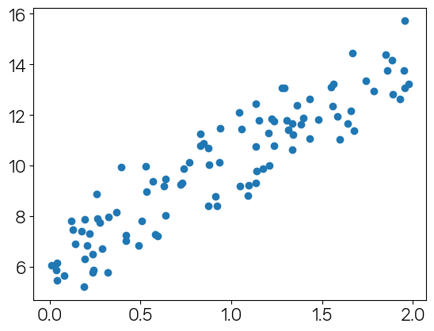

```python
import numpy as np
import matplotlib.pyplot as plt
```


```python
np.random.seed(0)
```


```python
X = 2 * np.random.rand(100,1)
X
```


    array([[1.09762701],
           [1.43037873],
           [1.20552675],
           [1.08976637],
           [0.8473096 ],
           [1.29178823],
           [0.87517442],
           [1.783546  ],
           [1.92732552],
           [0.76688304],
           [1.58345008],
           [1.05778984],
           [1.13608912],
           [1.85119328],
           [0.14207212],
           [0.1742586 ],
           [0.04043679],
           [1.66523969],
           [1.5563135 ],
           [1.7400243 ],
           [1.95723668],
           [1.59831713],
           [0.92295872],
           [1.56105835],
           [0.23654885],
           [1.27984204],
           [0.28670657],
           [1.88933783],
           [1.04369664],
           [0.82932388],
           [0.52911122],
           [1.54846738],
           [0.91230066],
           [1.1368679 ],
           [0.0375796 ],
           [1.23527099],
           [1.22419145],
           [1.23386799],
           [1.88749616],
           [1.3636406 ],
           [0.7190158 ],
           [0.87406391],
           [1.39526239],
           [0.12045094],
           [1.33353343],
           [1.34127574],
           [0.42076512],
           [0.2578526 ],
           [0.6308567 ],
           [0.72742154],
           [1.14039354],
           [0.87720303],
           [1.97674768],
           [0.20408962],
           [0.41775351],
           [0.32261904],
           [1.30621665],
           [0.50658321],
           [0.93262155],
           [0.48885118],
           [0.31793917],
           [0.22075028],
           [1.31265918],
           [0.2763659 ],
           [0.39316472],
           [0.73745034],
           [1.64198646],
           [0.19420255],
           [1.67588981],
           [0.19219682],
           [1.95291893],
           [0.9373024 ],
           [1.95352218],
           [1.20969104],
           [1.47852716],
           [0.07837558],
           [0.56561393],
           [0.24039312],
           [0.5922804 ],
           [0.23745544],
           [0.63596636],
           [0.82852599],
           [0.12829499],
           [1.38494424],
           [1.13320291],
           [0.53077898],
           [1.04649611],
           [0.18788102],
           [1.15189299],
           [1.8585924 ],
           [0.6371379 ],
           [1.33482076],
           [0.26359572],
           [1.43265441],
           [0.57881219],
           [0.36638272],
           [1.17302587],
           [0.04021509],
           [1.65788006],
           [0.00939095]])


```python
y = 6 + 4 * X
plt.scatter(X, y)
```


    <matplotlib.collections.PathCollection at 0x1ec570c5ac0>


    

    


```python
y = 6 + 4 * X + np.random.randn(100,1)
```


```python
plt.scatter(X, y)
```


    <matplotlib.collections.PathCollection at 0x1ec577d0370>


    

    


```python
def get_weight_updates(w1,w0,X,y,learning_rate=0.01):
    N = len(y)
    w1_update = np.zeros_like(w1)
    w0_update = np.zeros_like(w0)
    y_pred = np.dot(X,w1.T) + w0
    diff = y - y_pred
    w0_factors = np.ones((N,1))
    w1_update = -(2/N)*learning_rate*(np.dot(X.T,diff))
    w0_update = -(2/N)*learning_rate*(np.dot(w0_factors.T,diff))
    
    return w1_update, w0_update
```


```python
def gradient_descent_steps(X,y,iters=10000):
    w0 = np.zeros((1,1))
    w1 = np.zeros((1,1))
    for ind in range(iters):
        w1_update, w0_update = get_weight_updates(w1,w0,X,y)
        w1 = w1 - w1_update
        w0 = w0 - w0_update
        
    return w1, w0
```


```python
def get_cost(y,y_pred):
    N = len(y)
    cost = np.sum(np.square(y-y_pred))/N
    return cost
```


```python
w1, w0 = gradient_descent_steps(X,y,iters=1000)
```


```python
print(w1,w0)
```

    [[4.02181364]] [[6.16203122]]
    


```python
y_pred = w1[0,0]*X+w0
get_cost(y,y_pred)
```


    0.9934784315632568


