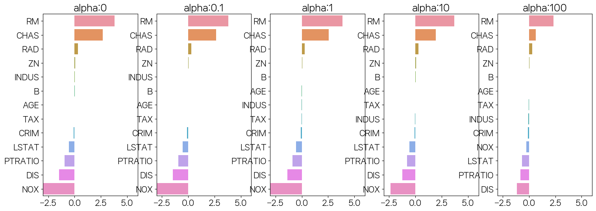

```python
import numpy as np
import pandas as pd
import matplotlib.pyplot as plt
import seaborn as sns
from sklearn.datasets import load_boston
import warnings
warnings.filterwarnings('ignore')
```


```python
boston = load_boston()
```


```python
pd.DataFrame(boston.data,columns=boston.feature_names)
```


<div>
<style scoped>
    .dataframe tbody tr th:only-of-type {
        vertical-align: middle;
    }

    .dataframe tbody tr th {
        vertical-align: top;
    }

    .dataframe thead th {
        text-align: right;
    }
</style>
<table border="1" class="dataframe">
  <thead>
    <tr style="text-align: right;">
      <th></th>
      <th>CRIM</th>
      <th>ZN</th>
      <th>INDUS</th>
      <th>CHAS</th>
      <th>NOX</th>
      <th>RM</th>
      <th>AGE</th>
      <th>DIS</th>
      <th>RAD</th>
      <th>TAX</th>
      <th>PTRATIO</th>
      <th>B</th>
      <th>LSTAT</th>
    </tr>
  </thead>
  <tbody>
    <tr>
      <th>0</th>
      <td>0.00632</td>
      <td>18.0</td>
      <td>2.31</td>
      <td>0.0</td>
      <td>0.538</td>
      <td>6.575</td>
      <td>65.2</td>
      <td>4.0900</td>
      <td>1.0</td>
      <td>296.0</td>
      <td>15.3</td>
      <td>396.90</td>
      <td>4.98</td>
    </tr>
    <tr>
      <th>1</th>
      <td>0.02731</td>
      <td>0.0</td>
      <td>7.07</td>
      <td>0.0</td>
      <td>0.469</td>
      <td>6.421</td>
      <td>78.9</td>
      <td>4.9671</td>
      <td>2.0</td>
      <td>242.0</td>
      <td>17.8</td>
      <td>396.90</td>
      <td>9.14</td>
    </tr>
    <tr>
      <th>2</th>
      <td>0.02729</td>
      <td>0.0</td>
      <td>7.07</td>
      <td>0.0</td>
      <td>0.469</td>
      <td>7.185</td>
      <td>61.1</td>
      <td>4.9671</td>
      <td>2.0</td>
      <td>242.0</td>
      <td>17.8</td>
      <td>392.83</td>
      <td>4.03</td>
    </tr>
    <tr>
      <th>3</th>
      <td>0.03237</td>
      <td>0.0</td>
      <td>2.18</td>
      <td>0.0</td>
      <td>0.458</td>
      <td>6.998</td>
      <td>45.8</td>
      <td>6.0622</td>
      <td>3.0</td>
      <td>222.0</td>
      <td>18.7</td>
      <td>394.63</td>
      <td>2.94</td>
    </tr>
    <tr>
      <th>4</th>
      <td>0.06905</td>
      <td>0.0</td>
      <td>2.18</td>
      <td>0.0</td>
      <td>0.458</td>
      <td>7.147</td>
      <td>54.2</td>
      <td>6.0622</td>
      <td>3.0</td>
      <td>222.0</td>
      <td>18.7</td>
      <td>396.90</td>
      <td>5.33</td>
    </tr>
    <tr>
      <th>...</th>
      <td>...</td>
      <td>...</td>
      <td>...</td>
      <td>...</td>
      <td>...</td>
      <td>...</td>
      <td>...</td>
      <td>...</td>
      <td>...</td>
      <td>...</td>
      <td>...</td>
      <td>...</td>
      <td>...</td>
    </tr>
    <tr>
      <th>501</th>
      <td>0.06263</td>
      <td>0.0</td>
      <td>11.93</td>
      <td>0.0</td>
      <td>0.573</td>
      <td>6.593</td>
      <td>69.1</td>
      <td>2.4786</td>
      <td>1.0</td>
      <td>273.0</td>
      <td>21.0</td>
      <td>391.99</td>
      <td>9.67</td>
    </tr>
    <tr>
      <th>502</th>
      <td>0.04527</td>
      <td>0.0</td>
      <td>11.93</td>
      <td>0.0</td>
      <td>0.573</td>
      <td>6.120</td>
      <td>76.7</td>
      <td>2.2875</td>
      <td>1.0</td>
      <td>273.0</td>
      <td>21.0</td>
      <td>396.90</td>
      <td>9.08</td>
    </tr>
    <tr>
      <th>503</th>
      <td>0.06076</td>
      <td>0.0</td>
      <td>11.93</td>
      <td>0.0</td>
      <td>0.573</td>
      <td>6.976</td>
      <td>91.0</td>
      <td>2.1675</td>
      <td>1.0</td>
      <td>273.0</td>
      <td>21.0</td>
      <td>396.90</td>
      <td>5.64</td>
    </tr>
    <tr>
      <th>504</th>
      <td>0.10959</td>
      <td>0.0</td>
      <td>11.93</td>
      <td>0.0</td>
      <td>0.573</td>
      <td>6.794</td>
      <td>89.3</td>
      <td>2.3889</td>
      <td>1.0</td>
      <td>273.0</td>
      <td>21.0</td>
      <td>393.45</td>
      <td>6.48</td>
    </tr>
    <tr>
      <th>505</th>
      <td>0.04741</td>
      <td>0.0</td>
      <td>11.93</td>
      <td>0.0</td>
      <td>0.573</td>
      <td>6.030</td>
      <td>80.8</td>
      <td>2.5050</td>
      <td>1.0</td>
      <td>273.0</td>
      <td>21.0</td>
      <td>396.90</td>
      <td>7.88</td>
    </tr>
  </tbody>
</table>
<p>506 rows × 13 columns</p>
</div>


```python
df = pd.DataFrame(boston.data,columns=boston.feature_names)
df['PRICE'] = boston.target
```


```python
df.head(2)
```


<div>
<style scoped>
    .dataframe tbody tr th:only-of-type {
        vertical-align: middle;
    }

    .dataframe tbody tr th {
        vertical-align: top;
    }

    .dataframe thead th {
        text-align: right;
    }
</style>
<table border="1" class="dataframe">
  <thead>
    <tr style="text-align: right;">
      <th></th>
      <th>CRIM</th>
      <th>ZN</th>
      <th>INDUS</th>
      <th>CHAS</th>
      <th>NOX</th>
      <th>RM</th>
      <th>AGE</th>
      <th>DIS</th>
      <th>RAD</th>
      <th>TAX</th>
      <th>PTRATIO</th>
      <th>B</th>
      <th>LSTAT</th>
      <th>PRICE</th>
    </tr>
  </thead>
  <tbody>
    <tr>
      <th>0</th>
      <td>0.00632</td>
      <td>18.0</td>
      <td>2.31</td>
      <td>0.0</td>
      <td>0.538</td>
      <td>6.575</td>
      <td>65.2</td>
      <td>4.0900</td>
      <td>1.0</td>
      <td>296.0</td>
      <td>15.3</td>
      <td>396.9</td>
      <td>4.98</td>
      <td>24.0</td>
    </tr>
    <tr>
      <th>1</th>
      <td>0.02731</td>
      <td>0.0</td>
      <td>7.07</td>
      <td>0.0</td>
      <td>0.469</td>
      <td>6.421</td>
      <td>78.9</td>
      <td>4.9671</td>
      <td>2.0</td>
      <td>242.0</td>
      <td>17.8</td>
      <td>396.9</td>
      <td>9.14</td>
      <td>21.6</td>
    </tr>
  </tbody>
</table>
</div>


```python
df.info()
```

    <class 'pandas.core.frame.DataFrame'>
    RangeIndex: 506 entries, 0 to 505
    Data columns (total 14 columns):
     #   Column   Non-Null Count  Dtype  
    ---  ------   --------------  -----  
     0   CRIM     506 non-null    float64
     1   ZN       506 non-null    float64
     2   INDUS    506 non-null    float64
     3   CHAS     506 non-null    float64
     4   NOX      506 non-null    float64
     5   RM       506 non-null    float64
     6   AGE      506 non-null    float64
     7   DIS      506 non-null    float64
     8   RAD      506 non-null    float64
     9   TAX      506 non-null    float64
     10  PTRATIO  506 non-null    float64
     11  B        506 non-null    float64
     12  LSTAT    506 non-null    float64
     13  PRICE    506 non-null    float64
    dtypes: float64(14)
    memory usage: 55.5 KB
    


```python
df.columns
```


    Index(['CRIM', 'ZN', 'INDUS', 'CHAS', 'NOX', 'RM', 'AGE', 'DIS', 'RAD', 'TAX',
           'PTRATIO', 'B', 'LSTAT', 'PRICE'],
          dtype='object')


```python
lm_features = ['ZN', 'INDUS', 'NOX', 'RM', 'AGE', 'RAD', 'PTRATIO', 'LSTAT']
fig,axs = plt.subplots(figsize=(16,8),ncols=4,nrows=2)
for i, feature in enumerate(lm_features):
    row = int(i/4)
    col = i % 4
    sns.regplot(x=feature,y="PRICE",data=df,ax=axs[row][col])
```


    

    


```python
from sklearn.model_selection import train_test_split
from sklearn.linear_model import LinearRegression
from sklearn.metrics import mean_squared_error,r2_score
```


```python
y = df['PRICE']
X = df.drop(columns=['PRICE'])
X_train,X_test,y_train,y_test = train_test_split(X,y,test_size=0.3,random_state=156)
lr = LinearRegression()
lr.fit(X_train,y_train)
pred = lr.predict(X_test)
mse = mean_squared_error(y_test,pred)
rmse = np.sqrt(mse)
print(f'MSE:{mse}, RMSE:{rmse}, R2:{r2_score(y_test,pred)}')
```

    MSE:17.296915907901973, RMSE:4.158956107955694, R2:0.7572263323138947
    


```python
lr.coef_,1
```


    (array([-1.12979614e-01,  6.55124002e-02,  3.44366694e-02,  3.04589777e+00,
            -1.97958320e+01,  3.35496880e+00,  5.93713290e-03, -1.74185354e+00,
             3.55884364e-01, -1.42954516e-02, -9.20180066e-01,  1.03966156e-02,
            -5.66182106e-01]),
     1)


```python
np.round(lr.coef_,1)
```


    array([ -0.1,   0.1,   0. ,   3. , -19.8,   3.4,   0. ,  -1.7,   0.4,
            -0. ,  -0.9,   0. ,  -0.6])


```python
pd.Series(np.round(lr.coef_,1),index=X.columns).sort_values(ascending=False)
```


    RM          3.4
    CHAS        3.0
    RAD         0.4
    ZN          0.1
    INDUS       0.0
    AGE         0.0
    TAX        -0.0
    B           0.0
    CRIM       -0.1
    LSTAT      -0.6
    PTRATIO    -0.9
    DIS        -1.7
    NOX       -19.8
    dtype: float64


```python
lr.intercept_
```


    40.995595172164585


```python
from sklearn.model_selection import cross_val_score
```


```python
X
```


<div>
<style scoped>
    .dataframe tbody tr th:only-of-type {
        vertical-align: middle;
    }

    .dataframe tbody tr th {
        vertical-align: top;
    }

    .dataframe thead th {
        text-align: right;
    }
</style>
<table border="1" class="dataframe">
  <thead>
    <tr style="text-align: right;">
      <th></th>
      <th>CRIM</th>
      <th>ZN</th>
      <th>INDUS</th>
      <th>CHAS</th>
      <th>NOX</th>
      <th>RM</th>
      <th>AGE</th>
      <th>DIS</th>
      <th>RAD</th>
      <th>TAX</th>
      <th>PTRATIO</th>
      <th>B</th>
      <th>LSTAT</th>
    </tr>
  </thead>
  <tbody>
    <tr>
      <th>0</th>
      <td>0.00632</td>
      <td>18.0</td>
      <td>2.31</td>
      <td>0.0</td>
      <td>0.538</td>
      <td>6.575</td>
      <td>65.2</td>
      <td>4.0900</td>
      <td>1.0</td>
      <td>296.0</td>
      <td>15.3</td>
      <td>396.90</td>
      <td>4.98</td>
    </tr>
    <tr>
      <th>1</th>
      <td>0.02731</td>
      <td>0.0</td>
      <td>7.07</td>
      <td>0.0</td>
      <td>0.469</td>
      <td>6.421</td>
      <td>78.9</td>
      <td>4.9671</td>
      <td>2.0</td>
      <td>242.0</td>
      <td>17.8</td>
      <td>396.90</td>
      <td>9.14</td>
    </tr>
    <tr>
      <th>2</th>
      <td>0.02729</td>
      <td>0.0</td>
      <td>7.07</td>
      <td>0.0</td>
      <td>0.469</td>
      <td>7.185</td>
      <td>61.1</td>
      <td>4.9671</td>
      <td>2.0</td>
      <td>242.0</td>
      <td>17.8</td>
      <td>392.83</td>
      <td>4.03</td>
    </tr>
    <tr>
      <th>3</th>
      <td>0.03237</td>
      <td>0.0</td>
      <td>2.18</td>
      <td>0.0</td>
      <td>0.458</td>
      <td>6.998</td>
      <td>45.8</td>
      <td>6.0622</td>
      <td>3.0</td>
      <td>222.0</td>
      <td>18.7</td>
      <td>394.63</td>
      <td>2.94</td>
    </tr>
    <tr>
      <th>4</th>
      <td>0.06905</td>
      <td>0.0</td>
      <td>2.18</td>
      <td>0.0</td>
      <td>0.458</td>
      <td>7.147</td>
      <td>54.2</td>
      <td>6.0622</td>
      <td>3.0</td>
      <td>222.0</td>
      <td>18.7</td>
      <td>396.90</td>
      <td>5.33</td>
    </tr>
    <tr>
      <th>...</th>
      <td>...</td>
      <td>...</td>
      <td>...</td>
      <td>...</td>
      <td>...</td>
      <td>...</td>
      <td>...</td>
      <td>...</td>
      <td>...</td>
      <td>...</td>
      <td>...</td>
      <td>...</td>
      <td>...</td>
    </tr>
    <tr>
      <th>501</th>
      <td>0.06263</td>
      <td>0.0</td>
      <td>11.93</td>
      <td>0.0</td>
      <td>0.573</td>
      <td>6.593</td>
      <td>69.1</td>
      <td>2.4786</td>
      <td>1.0</td>
      <td>273.0</td>
      <td>21.0</td>
      <td>391.99</td>
      <td>9.67</td>
    </tr>
    <tr>
      <th>502</th>
      <td>0.04527</td>
      <td>0.0</td>
      <td>11.93</td>
      <td>0.0</td>
      <td>0.573</td>
      <td>6.120</td>
      <td>76.7</td>
      <td>2.2875</td>
      <td>1.0</td>
      <td>273.0</td>
      <td>21.0</td>
      <td>396.90</td>
      <td>9.08</td>
    </tr>
    <tr>
      <th>503</th>
      <td>0.06076</td>
      <td>0.0</td>
      <td>11.93</td>
      <td>0.0</td>
      <td>0.573</td>
      <td>6.976</td>
      <td>91.0</td>
      <td>2.1675</td>
      <td>1.0</td>
      <td>273.0</td>
      <td>21.0</td>
      <td>396.90</td>
      <td>5.64</td>
    </tr>
    <tr>
      <th>504</th>
      <td>0.10959</td>
      <td>0.0</td>
      <td>11.93</td>
      <td>0.0</td>
      <td>0.573</td>
      <td>6.794</td>
      <td>89.3</td>
      <td>2.3889</td>
      <td>1.0</td>
      <td>273.0</td>
      <td>21.0</td>
      <td>393.45</td>
      <td>6.48</td>
    </tr>
    <tr>
      <th>505</th>
      <td>0.04741</td>
      <td>0.0</td>
      <td>11.93</td>
      <td>0.0</td>
      <td>0.573</td>
      <td>6.030</td>
      <td>80.8</td>
      <td>2.5050</td>
      <td>1.0</td>
      <td>273.0</td>
      <td>21.0</td>
      <td>396.90</td>
      <td>7.88</td>
    </tr>
  </tbody>
</table>
<p>506 rows × 13 columns</p>
</div>


```python
neg_mse_scores = cross_val_score(lr,X,y,scoring='neg_mean_squared_error',cv=5)
```


```python
neg_mse_scores
```


    array([-12.46030057, -26.04862111, -33.07413798, -80.76237112,
           -33.31360656])


```python
np.mean(np.sqrt(neg_mse_scores * -1))
```


    5.828658946215817


```python
from sklearn.linear_model import Ridge
from sklearn.model_selection import cross_val_score
```


```python
ridge = Ridge(alpha=10)
neg_mse_scores = cross_val_score(ridge,X,y,scoring='neg_mean_squared_error',cv=5)
```


```python
np.mean(np.sqrt(neg_mse_scores * -1))
```


    5.518166280868971


```python
alphas=[0,0.1,1,10,100]
for alpha in alphas:
    ridge = Ridge(alpha=alpha)
    neg_mse_scores = cross_val_score(ridge,X,y,scoring='neg_mean_squared_error',cv=5)
    print(np.mean(np.sqrt(neg_mse_scores * -1)))
```

    5.828658946215802
    5.788486627032408
    5.652570965613541
    5.518166280868971
    5.329589628472145
    


```python
fig, axs = plt.subplots(figsize=(18,6),nrows=1,ncols=5)
coeff_df = pd.DataFrame()
for pos, alpha in enumerate(alphas):
    ridge = Ridge(alpha=alpha)
    ridge.fit(X,y)
    coeff = pd.Series(ridge.coef_,index=X.columns)
    colname = 'alpha:'+str(alpha)
    coeff_df[colname] = coeff
    coeff = coeff.sort_values(ascending=False)
    axs[pos].set_title(colname)
    axs[pos].set_xlim(-3,6)
    sns.barplot(x=coeff.values,y=coeff.index,ax=axs[pos])
plt.show()
```


    

    


```python
ridge_alphas = [0, 0.1, 1, 10, 100]
sort_column = 'alpha:'+str(ridge_alphas[0])
coeff_df.sort_values(by=sort_column, ascending=False)
```


<div>
<style scoped>
    .dataframe tbody tr th:only-of-type {
        vertical-align: middle;
    }

    .dataframe tbody tr th {
        vertical-align: top;
    }

    .dataframe thead th {
        text-align: right;
    }
</style>
<table border="1" class="dataframe">
  <thead>
    <tr style="text-align: right;">
      <th></th>
      <th>alpha:0</th>
      <th>alpha:0.1</th>
      <th>alpha:1</th>
      <th>alpha:10</th>
      <th>alpha:100</th>
    </tr>
  </thead>
  <tbody>
    <tr>
      <th>RM</th>
      <td>3.809865</td>
      <td>3.818233</td>
      <td>3.854000</td>
      <td>3.702272</td>
      <td>2.334536</td>
    </tr>
    <tr>
      <th>CHAS</th>
      <td>2.686734</td>
      <td>2.670019</td>
      <td>2.552393</td>
      <td>1.952021</td>
      <td>0.638335</td>
    </tr>
    <tr>
      <th>RAD</th>
      <td>0.306049</td>
      <td>0.303515</td>
      <td>0.290142</td>
      <td>0.279596</td>
      <td>0.315358</td>
    </tr>
    <tr>
      <th>ZN</th>
      <td>0.046420</td>
      <td>0.046572</td>
      <td>0.047443</td>
      <td>0.049579</td>
      <td>0.054496</td>
    </tr>
    <tr>
      <th>INDUS</th>
      <td>0.020559</td>
      <td>0.015999</td>
      <td>-0.008805</td>
      <td>-0.042962</td>
      <td>-0.052826</td>
    </tr>
    <tr>
      <th>B</th>
      <td>0.009312</td>
      <td>0.009368</td>
      <td>0.009673</td>
      <td>0.010037</td>
      <td>0.009393</td>
    </tr>
    <tr>
      <th>AGE</th>
      <td>0.000692</td>
      <td>-0.000269</td>
      <td>-0.005415</td>
      <td>-0.010707</td>
      <td>0.001212</td>
    </tr>
    <tr>
      <th>TAX</th>
      <td>-0.012335</td>
      <td>-0.012421</td>
      <td>-0.012912</td>
      <td>-0.013993</td>
      <td>-0.015856</td>
    </tr>
    <tr>
      <th>CRIM</th>
      <td>-0.108011</td>
      <td>-0.107474</td>
      <td>-0.104595</td>
      <td>-0.101435</td>
      <td>-0.102202</td>
    </tr>
    <tr>
      <th>LSTAT</th>
      <td>-0.524758</td>
      <td>-0.525966</td>
      <td>-0.533343</td>
      <td>-0.559366</td>
      <td>-0.660764</td>
    </tr>
    <tr>
      <th>PTRATIO</th>
      <td>-0.952747</td>
      <td>-0.940759</td>
      <td>-0.876074</td>
      <td>-0.797945</td>
      <td>-0.829218</td>
    </tr>
    <tr>
      <th>DIS</th>
      <td>-1.475567</td>
      <td>-1.459626</td>
      <td>-1.372654</td>
      <td>-1.248808</td>
      <td>-1.153390</td>
    </tr>
    <tr>
      <th>NOX</th>
      <td>-17.766611</td>
      <td>-16.684645</td>
      <td>-10.777015</td>
      <td>-2.371619</td>
      <td>-0.262847</td>
    </tr>
  </tbody>
</table>
</div>


```python
from sklearn.linear_model import Lasso, ElasticNet

# alpha값에 따른 회귀 모델의 폴드 평균 RMSE를 출력하고 회귀 계수값들을 DataFrame으로 반환 
def get_linear_reg_eval(model_name, params=None, X_data_n=None, y_target_n=None, 
                        verbose=True, return_coeff=True):
    coeff_df = pd.DataFrame()
    if verbose : print('####### ', model_name , '#######')
    for param in params:
        if model_name =='Ridge': model = Ridge(alpha=param)
        elif model_name =='Lasso': model = Lasso(alpha=param)
        elif model_name =='ElasticNet': model = ElasticNet(alpha=param, l1_ratio=0.7)
        neg_mse_scores = cross_val_score(model, X_data_n, 
                                             y_target_n, scoring="neg_mean_squared_error", cv = 5)
        avg_rmse = np.mean(np.sqrt(-1 * neg_mse_scores))
        print('alpha {0}일 때 5 폴드 세트의 평균 RMSE: {1:.3f} '.format(param, avg_rmse))
        # cross_val_score는 evaluation metric만 반환하므로 모델을 다시 학습하여 회귀 계수 추출

        model.fit(X_data_n , y_target_n)
        if return_coeff:
            # alpha에 따른 피처별 회귀 계수를 Series로 변환하고 이를 DataFrame의 컬럼으로 추가. 
            coeff = pd.Series(data=model.coef_ , index=X_data_n.columns )
            colname='alpha:'+str(param)
            coeff_df[colname] = coeff

    return coeff_df
# end of get_linear_regre_eval
```


```python
# 라쏘에 사용될 alpha 파라미터의 값을 정의하고 get_linear_reg_eval() 함수 호출
lasso_alphas = [0.05,0.07,0.1,0.5,1,3]
coeff_lasso_df = get_linear_reg_eval('Lasso',
                                    params=lasso_alphas,
                                    X_data_n=X,
                                    y_target_n=y)
```

    #######  Lasso #######
    alpha 0.05일 때 5 폴드 세트의 평균 RMSE: 5.628 
    alpha 0.07일 때 5 폴드 세트의 평균 RMSE: 5.612 
    alpha 0.1일 때 5 폴드 세트의 평균 RMSE: 5.615 
    alpha 0.5일 때 5 폴드 세트의 평균 RMSE: 5.669 
    alpha 1일 때 5 폴드 세트의 평균 RMSE: 5.776 
    alpha 3일 때 5 폴드 세트의 평균 RMSE: 6.189 
    


```python
coeff_lasso_df
```


<div>
<style scoped>
    .dataframe tbody tr th:only-of-type {
        vertical-align: middle;
    }

    .dataframe tbody tr th {
        vertical-align: top;
    }

    .dataframe thead th {
        text-align: right;
    }
</style>
<table border="1" class="dataframe">
  <thead>
    <tr style="text-align: right;">
      <th></th>
      <th>alpha:0.05</th>
      <th>alpha:0.07</th>
      <th>alpha:0.1</th>
      <th>alpha:0.5</th>
      <th>alpha:1</th>
      <th>alpha:3</th>
    </tr>
  </thead>
  <tbody>
    <tr>
      <th>CRIM</th>
      <td>-0.098935</td>
      <td>-0.098193</td>
      <td>-0.097894</td>
      <td>-0.083289</td>
      <td>-0.063437</td>
      <td>-0.000000</td>
    </tr>
    <tr>
      <th>ZN</th>
      <td>0.048826</td>
      <td>0.049059</td>
      <td>0.049211</td>
      <td>0.049544</td>
      <td>0.049165</td>
      <td>0.037231</td>
    </tr>
    <tr>
      <th>INDUS</th>
      <td>-0.041355</td>
      <td>-0.042120</td>
      <td>-0.036619</td>
      <td>-0.005253</td>
      <td>-0.000000</td>
      <td>-0.000000</td>
    </tr>
    <tr>
      <th>CHAS</th>
      <td>1.761631</td>
      <td>1.434343</td>
      <td>0.955190</td>
      <td>0.000000</td>
      <td>0.000000</td>
      <td>0.000000</td>
    </tr>
    <tr>
      <th>NOX</th>
      <td>-1.044929</td>
      <td>-0.000000</td>
      <td>-0.000000</td>
      <td>-0.000000</td>
      <td>-0.000000</td>
      <td>0.000000</td>
    </tr>
    <tr>
      <th>RM</th>
      <td>3.836618</td>
      <td>3.789725</td>
      <td>3.703202</td>
      <td>2.498212</td>
      <td>0.949811</td>
      <td>0.000000</td>
    </tr>
    <tr>
      <th>AGE</th>
      <td>-0.011858</td>
      <td>-0.011706</td>
      <td>-0.010037</td>
      <td>0.003604</td>
      <td>0.020910</td>
      <td>0.042495</td>
    </tr>
    <tr>
      <th>DIS</th>
      <td>-1.202690</td>
      <td>-1.176583</td>
      <td>-1.160538</td>
      <td>-0.936605</td>
      <td>-0.668790</td>
      <td>-0.000000</td>
    </tr>
    <tr>
      <th>RAD</th>
      <td>0.271034</td>
      <td>0.270936</td>
      <td>0.274707</td>
      <td>0.277451</td>
      <td>0.264206</td>
      <td>0.061864</td>
    </tr>
    <tr>
      <th>TAX</th>
      <td>-0.014028</td>
      <td>-0.014290</td>
      <td>-0.014570</td>
      <td>-0.015442</td>
      <td>-0.015212</td>
      <td>-0.008602</td>
    </tr>
    <tr>
      <th>PTRATIO</th>
      <td>-0.773205</td>
      <td>-0.765107</td>
      <td>-0.770654</td>
      <td>-0.758752</td>
      <td>-0.722966</td>
      <td>-0.265072</td>
    </tr>
    <tr>
      <th>B</th>
      <td>0.010193</td>
      <td>0.010248</td>
      <td>0.010249</td>
      <td>0.009469</td>
      <td>0.008247</td>
      <td>0.006510</td>
    </tr>
    <tr>
      <th>LSTAT</th>
      <td>-0.553925</td>
      <td>-0.560431</td>
      <td>-0.568769</td>
      <td>-0.656290</td>
      <td>-0.761115</td>
      <td>-0.807679</td>
    </tr>
  </tbody>
</table>
</div>


```python
elastic_alphas = [0.05,0.07,0.1,0.5,1,3]
coeff_elastic_df = get_linear_reg_eval('ElasticNet',
                                       params=elastic_alphas,
                                       X_data_n=X,
                                       y_target_n=y)
```

    #######  ElasticNet #######
    alpha 0.05일 때 5 폴드 세트의 평균 RMSE: 5.555 
    alpha 0.07일 때 5 폴드 세트의 평균 RMSE: 5.542 
    alpha 0.1일 때 5 폴드 세트의 평균 RMSE: 5.526 
    alpha 0.5일 때 5 폴드 세트의 평균 RMSE: 5.467 
    alpha 1일 때 5 폴드 세트의 평균 RMSE: 5.597 
    alpha 3일 때 5 폴드 세트의 평균 RMSE: 6.068 
    


```python
coeff_elastic_df
```


<div>
<style scoped>
    .dataframe tbody tr th:only-of-type {
        vertical-align: middle;
    }

    .dataframe tbody tr th {
        vertical-align: top;
    }

    .dataframe thead th {
        text-align: right;
    }
</style>
<table border="1" class="dataframe">
  <thead>
    <tr style="text-align: right;">
      <th></th>
      <th>alpha:0.05</th>
      <th>alpha:0.07</th>
      <th>alpha:0.1</th>
      <th>alpha:0.5</th>
      <th>alpha:1</th>
      <th>alpha:3</th>
    </tr>
  </thead>
  <tbody>
    <tr>
      <th>CRIM</th>
      <td>-0.099912</td>
      <td>-0.099468</td>
      <td>-0.099213</td>
      <td>-0.089070</td>
      <td>-0.073577</td>
      <td>-0.019058</td>
    </tr>
    <tr>
      <th>ZN</th>
      <td>0.049631</td>
      <td>0.050107</td>
      <td>0.050617</td>
      <td>0.052878</td>
      <td>0.052136</td>
      <td>0.038268</td>
    </tr>
    <tr>
      <th>INDUS</th>
      <td>-0.043435</td>
      <td>-0.044855</td>
      <td>-0.042719</td>
      <td>-0.023252</td>
      <td>-0.000000</td>
      <td>-0.000000</td>
    </tr>
    <tr>
      <th>CHAS</th>
      <td>1.615711</td>
      <td>1.330724</td>
      <td>0.979706</td>
      <td>0.000000</td>
      <td>0.000000</td>
      <td>0.000000</td>
    </tr>
    <tr>
      <th>NOX</th>
      <td>-1.023177</td>
      <td>-0.175072</td>
      <td>-0.000000</td>
      <td>-0.000000</td>
      <td>-0.000000</td>
      <td>-0.000000</td>
    </tr>
    <tr>
      <th>RM</th>
      <td>3.679112</td>
      <td>3.574162</td>
      <td>3.414154</td>
      <td>1.918419</td>
      <td>0.938789</td>
      <td>0.000000</td>
    </tr>
    <tr>
      <th>AGE</th>
      <td>-0.010750</td>
      <td>-0.010116</td>
      <td>-0.008276</td>
      <td>0.007760</td>
      <td>0.020348</td>
      <td>0.043446</td>
    </tr>
    <tr>
      <th>DIS</th>
      <td>-1.210164</td>
      <td>-1.189438</td>
      <td>-1.173647</td>
      <td>-0.975902</td>
      <td>-0.725174</td>
      <td>-0.031208</td>
    </tr>
    <tr>
      <th>RAD</th>
      <td>0.277089</td>
      <td>0.278880</td>
      <td>0.283443</td>
      <td>0.300761</td>
      <td>0.289299</td>
      <td>0.146846</td>
    </tr>
    <tr>
      <th>TAX</th>
      <td>-0.014245</td>
      <td>-0.014522</td>
      <td>-0.014814</td>
      <td>-0.016046</td>
      <td>-0.016218</td>
      <td>-0.011417</td>
    </tr>
    <tr>
      <th>PTRATIO</th>
      <td>-0.783228</td>
      <td>-0.779498</td>
      <td>-0.784725</td>
      <td>-0.790969</td>
      <td>-0.738672</td>
      <td>-0.423065</td>
    </tr>
    <tr>
      <th>B</th>
      <td>0.010117</td>
      <td>0.010122</td>
      <td>0.010067</td>
      <td>0.009114</td>
      <td>0.008320</td>
      <td>0.007020</td>
    </tr>
    <tr>
      <th>LSTAT</th>
      <td>-0.564988</td>
      <td>-0.574822</td>
      <td>-0.587702</td>
      <td>-0.693861</td>
      <td>-0.760457</td>
      <td>-0.800368</td>
    </tr>
  </tbody>
</table>
</div>


```python
from sklearn.preprocessing import StandardScaler, MinMaxScaler, PolynomialFeatures

# method는 표준 정규 분포 변환(Standard), 최대값/최소값 정규화(MinMax), 로그변환(Log) 결정
# p_degree는 다향식 특성을 추가할 때 적용. p_degree는 2이상 부여하지 않음. 
def get_scaled_data(method='None', p_degree=None, input_data=None):
    if method == 'Standard':
        scaled_data = StandardScaler().fit_transform(input_data)
    elif method == 'MinMax':
        scaled_data = MinMaxScaler().fit_transform(input_data)
    elif method == 'Log':
        scaled_data = np.log1p(input_data)
    else:
        scaled_data = input_data

    if p_degree != None:
        scaled_data = PolynomialFeatures(degree=p_degree, 
                                         include_bias=False).fit_transform(scaled_data)

    return scaled_data
```


```python
alphas=[0.1,1,10,100]
scale_methods=[(None,None),
               ('Standard',None),
               ('Standard',2),
               ('MinMax',None),
               ('MinMax',2),
               ('Log',None)]
for scale_method in scale_methods:
    X_scaled_data = get_scaled_data(method=scale_method[0], p_degree=scale_method[1], input_data=X)
    print(f'{scale_method[0]} {scale_method[1]}')
    coeff_elastic_df = get_linear_reg_eval('Ridge',
                                           params=alphas,
                                           X_data_n=X_scaled_data,
                                           y_target_n=y,
                                           return_coeff=False)
```

    None None
    #######  Ridge #######
    alpha 0.1일 때 5 폴드 세트의 평균 RMSE: 5.788 
    alpha 1일 때 5 폴드 세트의 평균 RMSE: 5.653 
    alpha 10일 때 5 폴드 세트의 평균 RMSE: 5.518 
    alpha 100일 때 5 폴드 세트의 평균 RMSE: 5.330 
    Standard None
    #######  Ridge #######
    alpha 0.1일 때 5 폴드 세트의 평균 RMSE: 5.826 
    alpha 1일 때 5 폴드 세트의 평균 RMSE: 5.803 
    alpha 10일 때 5 폴드 세트의 평균 RMSE: 5.637 
    alpha 100일 때 5 폴드 세트의 평균 RMSE: 5.421 
    Standard 2
    #######  Ridge #######
    alpha 0.1일 때 5 폴드 세트의 평균 RMSE: 8.827 
    alpha 1일 때 5 폴드 세트의 평균 RMSE: 6.871 
    alpha 10일 때 5 폴드 세트의 평균 RMSE: 5.485 
    alpha 100일 때 5 폴드 세트의 평균 RMSE: 4.634 
    MinMax None
    #######  Ridge #######
    alpha 0.1일 때 5 폴드 세트의 평균 RMSE: 5.764 
    alpha 1일 때 5 폴드 세트의 평균 RMSE: 5.465 
    alpha 10일 때 5 폴드 세트의 평균 RMSE: 5.754 
    alpha 100일 때 5 폴드 세트의 평균 RMSE: 7.635 
    MinMax 2
    #######  Ridge #######
    alpha 0.1일 때 5 폴드 세트의 평균 RMSE: 5.298 
    alpha 1일 때 5 폴드 세트의 평균 RMSE: 4.323 
    alpha 10일 때 5 폴드 세트의 평균 RMSE: 5.185 
    alpha 100일 때 5 폴드 세트의 평균 RMSE: 6.538 
    Log None
    #######  Ridge #######
    alpha 0.1일 때 5 폴드 세트의 평균 RMSE: 4.770 
    alpha 1일 때 5 폴드 세트의 평균 RMSE: 4.676 
    alpha 10일 때 5 폴드 세트의 평균 RMSE: 4.836 
    alpha 100일 때 5 폴드 세트의 평균 RMSE: 6.241 
    
